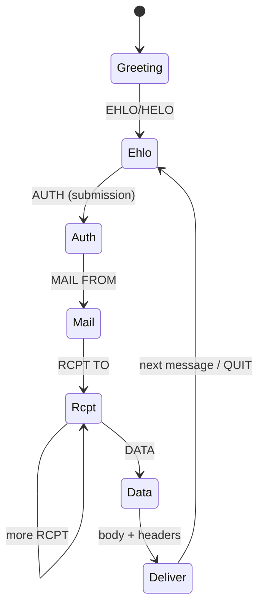

# SMTP Server Implementation

**Implementation:** `crates/chatmail-smtp` (`server`, `session`, `protocol`). PGP gate: `chatmail-pgp`. Auth/JIT: `chatmail-auth`. Local delivery and remote handoff: `chatmail-storage` + `chatmail-delivery`. Message size: `chatmail-state::MessageSizeLimit` + DB `__MAX_MESSAGE_SIZE__` / `__APPENDLIMIT__`. Wired from `chatmail::supervisor`.

**Operator CLI:** [`../guide/cli/port.md`](../guide/cli/port.md) (SMTP/submission ports) · [`message-size.md`](../guide/cli/message-size.md).

## Responsibilities

- Accept **incoming** mail on port 25 (federation fallback + external MTAs)
- Accept **authenticated submission** on ports **465** (SMTPS) and **587** (STARTTLS)
- Enforce **PGP-only** on submission (and aligned paths: IMAP APPEND, `/mxdeliv`)
- Integrate with **local storage** and **remote delivery** (`target.remote` / HTTP `/mxdeliv`)
- Apply **federation policy** on inbound `MAIL FROM` (ACCEPT/REJECT)
- Support **JIT** account creation on first authenticated login / delivery
- Enforce **quota** and **blocklist** on hot paths

Non-goals for madmail-v2 Phase 1 (present in Stalwart, not required for Madmail parity):

- Full MTA queue spool with DSN generation at Dovecot scale
- Milter, ARC sealing, inbound DKIM/DMARC pipeline (Madmail defers DKIM signing; inbound auth is policy + PGP)
- BDAT/CHUNKING bulk ingest
- LMTP (cmdeploy uses Dovecot LMTP; Madmail delivers in-process to imapsql)

---

## Reference codebases

| Source | Path | Use for |
|--------|------|---------|
| **Madmail (target behaviour)** | `context/madmail/internal/endpoint/smtp/` | PGP gate, federation check, submission, blocklist, metrics |
| **Stalwart (protocol/engine)** | `context/stalwart/crates/smtp` | Session loop, EHLO, AUTH, MAIL/RCPT/DATA, outbound client |
| **Stalwart protocol crate** | `smtp-proto` (crates.io `0.2`, used by Stalwart) | Line/command parsing, DATA/BDAT receivers |
| **cmdeploy (black-box tests)** | `context/cmdeploy/src/cmdeploy/tests/online/` | Login, capabilities, Delta Chat E2E on live Dovecot stack |

### Stalwart `crates/smtp` layout (AGPL — study, do not vendor blindly)

```
crates/smtp/
├── inbound/          # Per-connection session: EHLO, AUTH, MAIL, RCPT, DATA, BDAT
│   ├── session.rs    # State machine + ingest loop (uses smtp_proto::Request)
│   ├── mail.rs       # MAIL FROM handling
│   ├── rcpt.rs       # RCPT TO + routing hooks
│   ├── data.rs       # DATA / message assembly
│   ├── auth.rs       # SASL
│   ├── ehlo.rs       # Capabilities
│   ├── spam.rs       # Spam filter integration (replace with PGP policy for chatmail)
│   ├── milter.rs     # Optional milter (skip for madmail-v2 MVP)
│   └── hooks/        # Script hooks (skip or simplify)
├── outbound/         # Remote delivery: SMTP client, DANE, MTA-STS, LMTP local
├── queue/            # Persistent queue, throttle, quota, DSN
├── reporting/        # DMARC/TLS/SPF report scheduling (skip MVP)
└── scripts/          # Sieve-like scripting (skip MVP)
```

**Important:** Stalwart SMTP is wired to `common::Server`, `store`, `registry`, and `spam-filter`. You cannot drop in `crates/smtp` as a library without those dependencies. Treat it as a **design reference** for session structure and `smtp-proto` usage.

### `smtp-proto` (recommended building block)

Used by Stalwart for:

- `Request::{Ehlo, Mail, Rcpt, Data, Auth, Bdat, ...}`
- `LineReceiver` / `DataReceiver` / `BdatReceiver` with size limits
- Response encoding

madmail-v2 should likely depend on **`smtp-proto`** (or equivalent) plus a thin **Chatmail session** layer (PGP, federation, storage).

---

## Madmail SMTP pipeline (behaviour to replicate)

Key files:

- `internal/endpoint/smtp/smtp.go` — listeners, TLS, `require_pgp`, blocklist hook on reload
- `internal/endpoint/smtp/session.go` — MAIL / RCPT / DATA state machine
- `internal/endpoint/smtp/submission.go` — authenticated submission + `submissionCheckBody`

### Session flow



### Inbound (port 25)

| Step | Madmail behaviour |
|------|-------------------|
| `MAIL FROM` | Parse domain → `federationtracker.CheckFederationPolicy` → `554 5.7.1` if rejected |
| `RCPT TO` | Resolve local recipients; JIT create mailbox if enabled |
| `DATA` | Optional `require_pgp` on relay paths; always store + trigger delivery |
| Post-receive | Log federation receive; touch tracker stats |

### Submission (465 / 587)

| Step | Madmail behaviour |
|------|-------------------|
| `AUTH` | `pass_table` / SASL; map to storage user; `UpdateFirstLogin` |
| `MAIL FROM` | Must match authenticated identity (enforced in pipeline) |
| `DATA` | **`pgp_verify.EnforceEncryption`** — shared with `/mxdeliv`, IMAP APPEND |
| Headers | Require `From`; auto-add `Message-ID` if missing |
| Envelope | **`From` header must match `MAIL FROM`** → `554` if mismatch |
| Delivery | Local `storage.deliver` or `target.remote` per recipient |

### PGP enforcement module

Location: `context/madmail/internal/pgp_verify/`

Single function: `EnforceEncryption(header, body, Options{From, ...})`

Must implement deep OpenPGP packet inspection (New Format packets, PKESK/SKESK + SEIPD, partial body lengths, armor stripping). See `12-security.md` (when written) and Madmail tests.

### Error codes (Chatmail-specific)

| Code | When |
|------|------|
| `523 Encryption Needed` | Unencrypted submission |
| `554 From header does not match envelope sender` | Submission From ≠ MAIL FROM |
| `552 Quota exceeded` | Storage quota |
| `554 5.7.1 Policy Rejection` | Federation blocked |
| `535` / `530` | Auth failure |

### Operational hooks (Madmail)

- **Blocklist**: After `SIGUSR2` reload, close authenticated SMTP sessions for banned users (mirror IMAP)
- **Proxy protocol**: Optional HAProxy PROXY v1/v2 on listeners
- **SMTPUTF8**: Supported in Madmail tests (`smtputf8_test.go`)
- **Metrics**: MAIL/RCPT/DATA failure counters (`metrics.go`)

---

## madmail-v2 proposed crate split

Mirror Stalwart’s separation, but keep Chatmail policy in your code:

| Crate / module | Responsibility |
|----------------|----------------|
| `smtp-proto` (dependency) | Parse/serialize SMTP |
| `chatmail-smtp` | Listeners, TLS, session, link to auth + storage + federation |
| `chatmail-pgp` | `EnforceEncryption` (port from Madmail) |
| `chatmail-delivery` | Local deliver + HTTP `/mxdeliv` + SMTP fallback outbound |

### Minimum SMTP command set (MVP)

| Command | Inbound 25 | Submission |
|---------|------------|------------|
| `EHLO` / `HELO` | Yes | Yes |
| `STARTTLS` | Optional | Yes (587) |
| `AUTH` | No* | Yes (`PLAIN`) |
| `MAIL` | Yes | Yes |
| `RCPT` | Yes | Yes |
| `DATA` | Yes | Yes |
| `RSET` | Yes | Yes |
| `QUIT` | Yes | Yes |
| `NOOP` | Yes | Yes |
| `VRFY` / `EXPN` | **No** (privacy) | **No** |
| `BDAT` | No (Phase 1) | No |

\*Inbound port 25 typically does not authenticate users; federation uses envelope + policy.

### Outbound delivery (not the same as inbound session)

Madmail uses `target.remote` with HTTP `/mxdeliv` first, SMTP MX fallback. Stalwart’s `outbound/` implements full SMTP client (DANE, MTA-STS, LMTP). For madmail-v2:

- **Phase 1**: HTTP client + minimal SMTP client for fallback (study Stalwart `outbound/delivery.rs`, `client.rs`)
- **Do not** port queue/reporting unless you need deferred delivery at scale

---

## Stalwart vs Chatmail feature matrix (SMTP)

| Feature | Stalwart `smtp` | Madmail | madmail-v2 MVP |
|---------|-----------------|---------|-----------------|
| Inbound SMTP | Yes | Yes | Yes |
| Submission AUTH | Yes | Yes | Yes |
| PGP-only submission | No (spam filter) | **Yes** | **Yes** |
| Federation policy on MAIL FROM | Generic rules | **Chatmail tracker** | **Yes** |
| HTTP `/mxdeliv` ingest | No | **Yes** | **Yes** |
| Queue + DSN | Yes | Partial | Later |
| Milter | Yes | No | No |
| ARC/DKIM inbound verify | Yes | Limited | No (Phase 1) |
| LMTP | Yes | No | No |
| BDAT | Yes | No | No |
| JIT mailboxes | Directory | **imapsql** | **Yes** |

---

## Testing

### Madmail / madmail-v2 E2E (primary)

`context/madmail/tests/deltachat-test/` — must pass after Rust server:

- `test_02_unencrypted_rejection.py` — `523` on cleartext submit
- `test_07_federation.py` — SMTP + HTTP paths
- `test_11_jit_registration.py`
- `test_12_smtp_imap_idle.py` — delivery triggers IMAP IDLE

### cmdeploy online tests (`context/cmdeploy`)

Runs against a **deployed** Chatmail instance (historically **Dovecot + Postfix**, not Madmail). Still valuable for **protocol-level** checks before/after migrating to madmail-v2:

| Test file | SMTP-related coverage |
|-----------|------------------------|
| `test_0_login.py` | SMTP + IMAP login, JIT user creation, wrong password, concurrent logins |
| `test_0_login.py::test_capabilities` | IMAP `XCHATMAIL`, `XDELTAPUSH` (not SMTP) |
| `test_1_basic.py` | Remote `swaks`/SMTP send via SSH, deliverability |
| `test_2_deltachat.py` | Delta Chat account send/receive (uses SMTP submission + IMAP) |

**How to run** (from cmdeploy docs / plugin):

- Set `CHATMAIL_DOMAIN` (and optional `chatmail.ini` in parent dir)
- `pytest context/cmdeploy/src/cmdeploy/tests/online/ -k login`
- For madmail-v2: point DNS/config at your Rust server instead of Dovecot; keep same tests as black-box spec

**Gap:** cmdeploy does **not** assert `523` or federation policy — rely on `deltachat-test` for those. Add Rust integration tests for SMTP policy unit logic.

### madmail-v2 unit tests (SMTP)

| Test | Validates |
|------|-----------|
| `starttls_ehlo_advertises_starttls_before_tls` | EHLO on 587 advertises `STARTTLS`; no `AUTH` before TLS |
| `submission_starttls_upgrade_then_auth_allowed` | RFC 3207 / Postfix `smtpd_tls_auth_only` parity: AUTH after STARTTLS |

Supervisor loads PEM when **only** STARTTLS listeners are bound (143 / 587 without 993 / 465) — see `listeners_need_tls_cert` in `chatmail-config`.

## Configuration

Ports and TLS from:

- Config file at startup
- Settings DB: `__SMTP_PORT__`, `__SUBMISSION_PORT__` (restart required for bind changes)
- `require_pgp` / federation flags via settings (see Madmail `settings_db.md`)

---

## Rust dependencies (suggested)

| Crate | Role |
|-------|------|
| `smtp-proto` | SMTP framing (same family as Stalwart) |
| `mail-parser` / `mailparse` | Header + body parsing |
| `tokio` + `tokio-rustls` | Async TLS |
| Internal `pgp_verify` port | Policy |

---

## Open questions

- **SIZE / LIMITS**: Advertise `SIZE=` in EHLO from `max_message_size`; reject before DATA
- **RATE LIMIT**: Per-IP MAIL/RCPT limits (Stalwart has throttle; Madmail has partial metrics)
- **Outbound**: Single shared SMTP client pool vs per-message connect (see Stalwart outbound)

---

## Implementation references

Index: [`CONTEXT.md`](CONTEXT.md).

| Concern | madmail (behaviour) | cmrelay | cmdeploy | stalwart (protocol) |
|---------|---------------------|---------|----------|---------------------|
| Inbound session | [`session.go`](../../context/madmail/internal/endpoint/smtp/session.go), [`smtp.go`](../../context/madmail/internal/endpoint/smtp/smtp.go) | [`inbound.rs`](../../context/cmrelay/src/filtermail/src/inbound.rs), [`smtp_server.rs`](../../context/cmrelay/src/filtermail/src/smtp_server.rs) | [`main.cf.j2`](../../context/cmdeploy/src/cmdeploy/postfix/main.cf.j2) | [`inbound/session.rs`](../../context/stalwart/crates/smtp/src/inbound/session.rs), [`mail.rs`](../../context/stalwart/crates/smtp/src/inbound/mail.rs), [`data.rs`](../../context/stalwart/crates/smtp/src/inbound/data.rs) |
| Submission + PGP | [`submission.go`](../../context/madmail/internal/endpoint/smtp/submission.go) | [`openpgp.rs`](../../context/cmrelay/src/filtermail/src/openpgp.rs) | — | [`inbound/auth.rs`](../../context/stalwart/crates/smtp/src/inbound/auth.rs) |
| PGP verify | [`internal/pgp_verify/`](../../context/madmail/internal/pgp_verify/) | [`openpgp.rs`](../../context/cmrelay/src/filtermail/src/openpgp.rs) | — | — (use spam filter hooks in Stalwart only as anti-pattern) |
| Federation on MAIL FROM | [`federationtracker/policy.go`](../../context/madmail/internal/federationtracker/policy.go) | — | — | — |
| Tests | [`tests/deltachat-test/scenarios/test_02_unencrypted_rejection.py`](../../context/madmail/tests/deltachat-test/scenarios/test_02_unencrypted_rejection.py), [`test_07_federation.py`](../../context/madmail/tests/deltachat-test/scenarios/test_07_federation.py) | — | [`tests/online/test_0_login.py`](../../context/cmdeploy/src/cmdeploy/tests/online/test_0_login.py), [`test_1_basic.py`](../../context/cmdeploy/src/cmdeploy/tests/online/test_1_basic.py) | — |
| Outbound SMTP client | — (HTTP `/mxdeliv` first) | [`smtp_client.rs`](../../context/cmrelay/src/filtermail/src/smtp_client.rs), [`transport.rs`](../../context/cmrelay/src/filtermail/src/transport.rs) | Postfix | [`outbound/delivery.rs`](../../context/stalwart/crates/smtp/src/outbound/delivery.rs), [`client.rs`](../../context/stalwart/crates/smtp/src/outbound/client.rs) |

## Related RFCs

SMTP, submission, message format, and PGP policy. Full index: [`RFC/README.md`](RFC/README.md).

| RFC | Topic | Local |
|-----|-------|-------|
| [5321](https://datatracker.ietf.org/doc/html/rfc5321) | SMTP protocol | [rfc5321.txt](RFC/rfc5321.txt) |
| [6409](https://datatracker.ietf.org/doc/html/rfc6409) | Message submission (port 587) | [rfc6409.txt](RFC/rfc6409.txt) |
| [8314](https://datatracker.ietf.org/doc/html/rfc8314) | TLS for submission (465/587) | [rfc8314.txt](RFC/rfc8314.txt) |
| [3207](https://datatracker.ietf.org/doc/html/rfc3207) | SMTP STARTTLS extension | [rfc3207.txt](RFC/rfc3207.txt) |
| [4954](https://datatracker.ietf.org/doc/html/rfc4954) | SMTP AUTH extension | [rfc4954.txt](RFC/rfc4954.txt) |
| [6531](https://datatracker.ietf.org/doc/html/rfc6531) | SMTPUTF8 | [rfc6531.txt](RFC/rfc6531.txt) |
| [5322](https://datatracker.ietf.org/doc/html/rfc5322) | Internet Message Format | [rfc5322.txt](RFC/rfc5322.txt) |
| [2045](https://datatracker.ietf.org/doc/html/rfc2045)–[2049](https://datatracker.ietf.org/doc/html/rfc2049) | MIME | [rfc2045.txt](RFC/rfc2045.txt) … [rfc2049.txt](RFC/rfc2049.txt) |
| [3156](https://datatracker.ietf.org/doc/html/rfc3156) | PGP/MIME | [rfc3156.txt](RFC/rfc3156.txt) |
| [4880](https://datatracker.ietf.org/doc/html/rfc4880) | OpenPGP (reference) | [rfc4880.txt](RFC/rfc4880.txt) |
| [9580](https://datatracker.ietf.org/doc/html/rfc9580) | OpenPGP (current) | [rfc9580.txt](RFC/rfc9580.txt) |

## Related sections

- `03-imap-server.md` — IDLE triggered by SMTP delivery
- `05-authentication.md` — JIT, `pass_table`
- `07-federation.md` — `/mxdeliv` + SMTP fallback
- `07-federation.md` — federation policy (`chatmail-state::policy`)
- `12-security.md` — PGP-only
- `16-testing.md` — E2E + cmdeploy matrix
