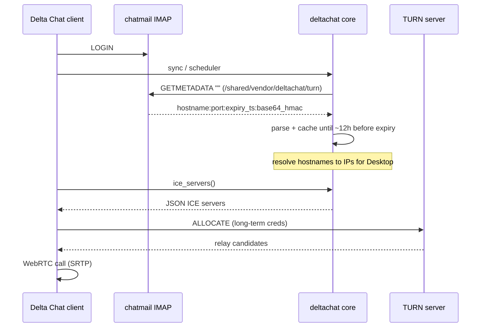
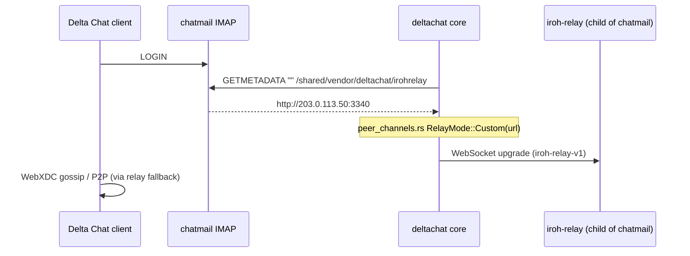

# Proxy Services — TURN/STUN for Delta Chat Calls

**Operator CLI:** [`../guide/cli/port.md`](../guide/cli/port.md) — per-service port overrides (`turn`, `iroh`, `shadowsocks`, `sasl`). Install: [`../guide/cli/install.md`](../guide/cli/install.md) (`--enable-ss`).

This document specifies how **madmail-v2** provides a **TURN/STUN relay** so Delta Chat clients can complete **WebRTC audio/video calls** behind NAT. It ties together:

- **Delta Chat core** (IMAP client + ICE JSON for UI)
- **Madmail** (reference discovery + `pion/turn` server)
- **turn-rs** (Rust TURN implementation to integrate or run alongside)

**TURN** (calls) is the main focus below. **Iroh relay** (WebXDC realtime) is documented in [§ Iroh relay](#iroh-relay-webxdc-realtime); implementation: `crates/chatmail-iroh`, [docs/plans/b6/P6-S07-metadata-iroh.md](../plans/b6/P6-S07-metadata-iroh.md).

**Implementation plan (TURN):** [docs/plans/b9/](../plans/b9/README.md) (unit, smoke, E2E with relay-ping-style IMAP/SMTP and Core).

---

## Normative RFC map

Offline copies live under [`RFC/`](RFC/README.md). Regenerate: `./RFC/download-rfcs.sh`.

| Layer | Spec | Local file | What we implement |
|-------|------|------------|-------------------|
| Discovery | [RFC 5464](RFC/rfc5464.txt) — IMAP METADATA | `rfc5464.txt` | `GETMETADATA "" /shared/vendor/deltachat/turn`; capability `METADATA` |
| Credentials | [TURN REST draft](RFC/draft-uberti-behave-turn-rest-00.txt) §2.2 | `draft-uberti-behave-turn-rest-00.txt` | `username` = expiry timestamp; `password` = `base64(HMAC-SHA1(secret, username))` |
| STUN | [RFC 8489](RFC/rfc8489.txt) (obsoletes [5389](RFC/rfc5389.txt)) | `rfc8489.txt` | Binding request/response, MESSAGE-INTEGRITY, FINGERPRINT |
| TURN | [RFC 8656](RFC/rfc8656.txt) (obsoletes [5766](RFC/rfc5766.txt)) | `rfc8656.txt` | Allocate, Refresh, CreatePermission, ChannelBind, Send/Data indications |
| TURN TCP | [RFC 6062](RFC/rfc6062.txt) | `rfc6062.txt` | Phase 2 — Madmail pion TCP relay is limited today |
| TURN IPv6 | [RFC 6156](RFC/rfc6156.txt) | `rfc6156.txt` | Phase 2 — if relay advertises v6 |
| ICE usage | [RFC 8445](RFC/rfc8445.txt) | `rfc8445.txt` | How Delta Chat feeds `RTCPeerConnection` ICE servers (Core JSON) |
| STUN tests | [RFC 5769](RFC/rfc5769.txt) | `rfc5769.txt` | Codec/unit test vectors (turn-rs) |
| Historic | [RFC 3489](RFC/rfc3489.txt) | `rfc3489.txt` | Background only |

---

## Problem statement

Delta Chat calls use WebRTC. Peers often cannot connect directly (symmetric NAT, firewalls). A **TURN server** relays media; **STUN** helps discover reflexive addresses. Chatmail operators run TURN on the same host as mail so clients discover it automatically—no manual ICE configuration.

**Success criteria:**

1. Authenticated IMAP session can `GETMETADATA` TURN credentials.
2. Credentials work against the operator’s TURN server (UDP and TCP on the configured port).
3. `ice_servers()` in core returns resolved JSON usable by Android/iOS/Desktop.
4. Two Delta Chat clients on the same chatmail instance can establish a call (E2E test).

---

## End-to-end flow



---

## Delta Chat core (`context/core`)

### IMAP METADATA consumption

On connect / periodic refresh, core updates `ServerMetadata` via [`update_metadata()`](../../context/core/src/imap.rs):

| Key | Purpose |
|-----|---------|
| `/shared/vendor/deltachat/turn` | TURN host, port, time-limited username/password |
| `/shared/vendor/deltachat/irohrelay` | WebXDC realtime (out of scope here) |
| `/shared/comment`, `/shared/admin` | Server info |

Requires IMAP `METADATA` capability. Initial fetch requests all keys in one `GETMETADATA`; refresh requests only `/shared/vendor/deltachat/turn` when credentials expire within **12 hours**.

### Metadata format (contract)

Per [RFC 5464](RFC/rfc5464.txt) §6 shared metadata and the de-facto Chatmail key `/shared/vendor/deltachat/turn`. Credential shape follows [TURN REST draft §2.2](RFC/draft-uberti-behave-turn-rest-00.txt).

Single ASCII line (no spaces inside fields beyond delimiter):

```text
<hostname>:<port>:<username>:<password>
```

| Field | Meaning |
|-------|---------|
| `hostname` | TURN hostname or IP advertised to clients |
| `port` | TURN port (typically `3478`; TURNS often `5349` or `443`) |
| `username` | **Unix timestamp** = credential expiry (seconds) |
| `password` | `base64(HMAC-SHA1(turn_secret, username))` |

Parser: [`create_ice_servers_from_metadata()`](../../context/core/src/calls.rs). The timestamp is stored as `ice_servers_expiration_timestamp` and used for refresh logic.

### ICE JSON output

[`ice_servers()`](../../context/core/src/calls.rs) resolves hostnames to IP addresses and returns JSON array:

```json
[
  {
    "urls": ["turn:203.0.113.50:3478"],
    "username": "1758650868",
    "credential": "8Dqkyyu11MVESBqjbIylmB06rv8="
  }
]
```

- URL scheme: `turn:` (not `turns:`) from metadata today; Desktop relies on **IPs** in URLs ([issue #5447](https://github.com/deltachat/deltachat-desktop/issues/5447)).
- Default STUN port constant: `3478` (`STUN_PORT` in `calls.rs`).

### Fallback behavior

If metadata is missing, unparsable, or server has no `METADATA`:

- Core sets expiry **7 days** ahead and uses [`create_fallback_ice_servers()`](../../context/core/src/calls.rs): STUN `nine.testrun.org:3478` + TURN `turn.delta.chat` with public demo credentials.
- If valid TURN metadata was received once, fallbacks are **not** mixed in (see core CHANGELOG).

**Implication for madmail-v2:** Production Chatmail should always advertise working metadata when TURN is enabled; otherwise clients silently use public infrastructure.

### RPC surface

- JSON-RPC: `ice_servers(account_id)` → [`deltachat-jsonrpc`](../../context/core/deltachat-jsonrpc/src/api.rs)
- FFI: equivalent in `deltachat.h`

### Core does *not* implement TURN

Core only parses metadata and resolves DNS. No STUN/TURN protocol stack in application code (`stun-rs` appears only as a transitive dependency in `Cargo.lock`, not in call path).

### `turns` metadata key

Madmail’s IMAP handler responds to both `/shared/vendor/deltachat/turn` and `/shared/vendor/deltachat/turns` with the **same** value. Core today only reads **`/shared/vendor/deltachat/turn`**. TURNS discovery is forward-compatible if core adds `turns:` URLs later.

---

## Madmail reference (`context/madmail`)

### IMAP advertisement

[`internal/endpoint/imap/imap.go`](../../context/madmail/internal/endpoint/imap/imap.go) — `GETMETADATA` handler:

- Global gate: `turn_enable` **and** auth layer `IsTurnEnabled()` (admin can disable per deployment).
- Authenticated session, empty mailbox (`""`).
- Credential generation:

```go
username := strconv.FormatInt(time.Now().Unix()+int64(turnTTL), 10)
password := base64.StdEncoding.EncodeToString(hmacSha1(turnSecret, username))
value := fmt.Sprintf("%s:%d:%s:%s", turnServer, turnPort, username, password)
```

Config on `imap { }` block ([`maddy.conf`](../../context/madmail/maddy.conf)):

| Directive | Default | Role |
|-----------|---------|------|
| `turn_enable` | off | Master switch |
| `turn_server` | — | Hostname/IP in metadata |
| `turn_port` | `3478` | Port in metadata |
| `turn_secret` | — | HMAC key; must match TURN `secret` |
| `turn_ttl` | `86400` | Seconds added to `now` for username expiry |
| `turn_prefer_tls` | `yes` | **Stored but not used** in GETMETADATA today |

Capability `METADATA` is advertised when TURN and/or Iroh URL is configured ([`03-imap-server.md`](03-imap-server.md)).

### Integrated TURN server

[`internal/endpoint/turn/turn.go`](../../context/madmail/internal/endpoint/turn/turn.go) — **pion/turn**:

| Feature | Madmail (pion) | Notes |
|---------|----------------|-------|
| STUN Binding | Yes | UDP |
| TURN Allocate / Refresh / Permission / Channel | Yes | UDP relay |
| TCP relay | Listener present | `MinimalRelayGenerator.AllocateConn` returns **error** — TCP relay not supported |
| TURNS (TLS) | Yes | `tls://` listen + `tls { }` block |
| Auth | Long-term | `turn.GenerateAuthKey(username, realm, base64_hmac_password)` |
| Relay address | `relay_ip` or derived from bind address | Must be **public** routable IP |
| Port range | OS ephemeral on `0.0.0.0` | Real sockets per allocation |

`turn { }` block: `realm`, `secret`, `relay_ip`, optional `tls`, `debug`. Listens `udp://` and `tcp://` (e.g. `0.0.0.0:3478`).

Operator doc: [`context/madmail/docs/chatmail/turn.md`](../../context/madmail/docs/chatmail/turn.md).

### Legacy stack (`context/cmrelay`)

Dovecot era: [`metadata.rs`](../../context/cmrelay/src/filtermail/src/metadata.rs) + Unix socket to `turnserver.py` for credential line—same **four-field** format. Useful for parity tests, not the Rust target architecture.

---

## turn-rs reference (`context/turn-rs`)

Pure Rust TURN/STUN server aimed at WebRTC workloads. See [`AGENTS.md`](../../context/turn-rs/AGENTS.md).

### Protocol support (relevant to Delta Chat)

| Method / feature | Supported |
|------------------|-----------|
| STUN Binding | Yes |
| TURN Allocate, Refresh, CreatePermission, ChannelBind | Yes |
| Send/Data indications, ChannelData | Yes |
| Long-term credentials | Yes |
| **TURN REST** shared secret (`auth.static-auth-secret`) | Yes — **matches Madmail HMAC** |
| UDP + TCP transport | Yes |
| TLS on data plane (`server.interfaces.ssl`) | Yes (TCP TURNS) |
| Virtual relay ports (no real bind per allocation) | Yes — differs from pion |
| TCP relay (RFC 6062) | Unclear / not focus |
| gRPC hooks / Prometheus | Optional features |

Auth priority in [`handler.rs`](../../context/turn-rs/src/handler.rs): static user map → `static-auth-secret` → optional gRPC hooks.

`static_auth_secret()` implements:

```text
password = base64(HMAC-SHA1(secret, username))
key = MD5(username ":" realm ":" password)   // or SHA-256 per algorithm
```

This is **wire-compatible** with Madmail’s metadata password + pion `GenerateAuthKey` for MD5.

### Integration options for madmail-v2

| Option | Pros | Cons |
|--------|------|------|
| **A. Crate dependency** (`turn-server` / path `context/turn-rs`) | Single binary, shared Tokio runtime | Version pinning, feature flags, API stability |
| **B. Sidecar binary** | Isolation, reuse upstream releases | Two processes, shared config discipline |
| **C. Reimplement minimal TURN** | Full control | High risk; avoid |

**Recommendation:** **Option A or B** with **turn-rs** configured with:

```toml
[auth]
static-auth-secret = "<same as imap turn_secret>"

[server]
realm = "<public hostname or IP>"
port-range = "49152..65535"
```

`external` on each interface must be the **public** IP (`$(public_ip)`). Realm must match what clients use (Madmail uses realm ≈ public IP).

### Gaps vs Madmail to close

| Gap | Action |
|-----|--------|
| Metadata only on IMAP | Implement `GETMETADATA` in `chatmail-imap` (see [`03-imap-server.md`](03-imap-server.md)) |
| Shared secret alignment | Single `turn_secret` in config → IMAP HMAC + turn-rs `static-auth-secret` |
| `turn_enable` + admin toggle | DB `turn_enabled` + Madmail-compatible admin API |
| Relay reachability | Firewall docs: TURN port UDP+TCP **and** relay UDP range |
| TCP relay | Phase 2 unless Desktop requires it (Madmail also limited) |
| `turn_prefer_tls` / `turns` key | Phase 2: separate port in metadata or second key with `turns:` URLs |
| WebRTC relay datapath on turn-rs | **Fixed:** real UDP bind per relay port + IP-based CreatePermission — see [20-deltachat-calls.md](20-deltachat-calls.md) |

---

## madmail-v2 design

### Crates

| Crate | Responsibility |
|-------|----------------|
| `chatmail-imap` | `METADATA` capability; `GETMETADATA` for `/shared/vendor/deltachat/turn` (+ optional `turns`) |
| `chatmail-config` | Parse `imap { turn_* }` and `turn udp://… tcp://… { }` from `maddy.conf` |
| `chatmail-turn` (new) | Credential helper `turn_credential_line(server, port, secret, ttl) -> String`; optional embedded `turn-rs` runner |
| `chatmail` binary | Start TURN listener when `turn { }` block present; graceful shutdown with IMAP/SMTP |

### Configuration (Madmail parity)

**IMAP block:**

```hcl
imap tls://0.0.0.0:993 {
    turn_enable yes
    turn_server $(public_ip)    # or DNS name
    turn_port 3478
    turn_secret "…"
    turn_ttl 86400
}
```

**TURN block:**

```hcl
turn udp://0.0.0.0:3478 tcp://0.0.0.0:3478 {
    realm $(public_ip)
    secret "…"                  # same as turn_secret
    relay_ip $(public_ip)       # for turn-rs: server.interfaces[].external
}
```

Environment placeholders (`__TURN_*__`) from installer templates match Madmail ([`maddy.conf.j2`](../../context/madmail/internal/cli/ctl/maddy.conf.j2)).

### Credential generation (normative)

```rust
// Pseudocode — must match Madmail imap.go and core parser
fn turn_metadata_value(server: &str, port: u16, secret: &str, ttl_secs: u64) -> String {
    let username = (now_unix() + ttl_secs).to_string();
    let password = base64::encode(hmac_sha1(secret.as_bytes(), username.as_bytes()));
    format!("{server}:{port}:{username}:{password}")
}
```

### Process model

```
chatmail (single process)
├── chatmail-imap     ── GETMETADATA turn line
├── chatmail-turn     ── turn-rs Service (UDP/TCP 3478)
└── … smtp, http, fed
```

Alternatively `chatmail-turn` spawns `turn-server` subprocess with generated `turn-server.toml` on SIGHUP/reload.

### Security

- `turn_secret` ≥ 32 random bytes; never returned by Admin API ([`09-admin-api.md`](09-admin-api.md)).
- Short-lived usernames (expiry in username) limit replay window.
- No credential storage in DB—derived on each `GETMETADATA`.
- Rate-limit `GETMETADATA` per session if abused (optional).
- TURN allocation: restrict relay to public interface; consider max sessions per IP (turn-rs session tables).

### Admin API

Extend `/admin/services/turn` (Madmail: GET/POST toggle) to reflect **running** relay count when turn-rs Prometheus/session API is wired (phase 2).

---

## Testing

Full step-by-step plan: **[`docs/plans/b9/`](../plans/b9/README.md)**.

### Test pyramid

| Tier | Scope | Harness | Gate |
|------|--------|---------|------|
| **Unit** | HMAC line, parser, config | `cargo test -p chatmail-turn` | Every PR |
| **Smoke** | STUN Binding, TURN Allocate with issued creds | `cargo test -p chatmail-integration turn_smoke` | Every PR |
| **Integration** | IMAP `GETMETADATA` + cred validates on TURN | `tests/turn_e2e.rs` + `spawn_mail_servers` | Every PR |
| **E2E (relay-ping style)** | Raw TCP IMAP dialog like [`tests/support/imap_client.rs`](../../tests/support/imap_client.rs); SMTP optional | `cargo test -p chatmail-integration turn_imap` | Every PR |
| **E2E (Core)** | `update_metadata` → `ice_servers()` JSON | `scripts/core-e2e-turn.sh` + [`context/core` `chatmail_transport`](../../context/core/src/tests/chatmail_transport.rs) | Nightly or manual |

### Unit ([RFC 5464](RFC/rfc5464.txt) + [TURN REST draft](RFC/draft-uberti-behave-turn-rest-00.txt))

- `turn_metadata_value` matches Madmail fixed vectors (shared secret + frozen timestamp).
- Parser round-trip compatible with core [`create_ice_servers_from_metadata`](../../context/core/src/calls.rs).
- [RFC 5769](RFC/rfc5769.txt) vectors delegated to turn-rs codec tests where applicable.

### Smoke ([RFC 8489](RFC/rfc8489.txt), [RFC 8656](RFC/rfc8656.txt))

- STUN Binding against ephemeral turn-rs listener.
- TURN Allocate with username/password from `turn_metadata_value` (long-term creds per [RFC 8656](RFC/rfc8656.txt) §4).
- Optional: `coturn` `turnutils_uclient` if `COTURN_UCLIENT_PATH` set (parity with [`context/turn-rs/tests/turn.rs`](../../context/turn-rs/tests/turn.rs)).

### Integration + E2E (madmail-v2 + relay-ping patterns)

1. Extend [`tests/support/mod.rs`](../../tests/support/mod.rs) `spawn_mail_servers` with TURN listener + `turn_enable` settings.
2. Replace stub in [`tests/imap_e2e.rs`](../../tests/imap_e2e.rs): `GETMETADATA "" /shared/vendor/deltachat/turn` (not `/private/turn/relay`).
3. Verify returned line authenticates on embedded turn-rs.
4. Optional: [`context/relay-ping`](../../context/relay-ping) `imapcheck` against running `make run-bg` with TURN enabled.

### E2E (Delta Chat Core)

From [`16-testing.md`](16-testing.md) and [`context/core/src/tests/chatmail_rs_p2p.rs`](../../context/core/src/tests/chatmail_rs_p2p.rs):

- Spawn `chatmail` with TURN + IMAP metadata; Core `update_metadata` + `ice_servers()` returns local `turn:` URL with credentials (no fallback to `turn.delta.chat`).
- **Calls:** two accounts place/accept video call (manual/nightly until automated in CI).

---

## Implementation phases

| Phase | Deliverable |
|-------|-------------|
| **P0** | Config parsing (`turn_*`, `turn { }`); shared-secret credential helper |
| **P1** | IMAP `GETMETADATA` + `METADATA` capability when TURN enabled |
| **P2** | Embed or exec **turn-rs** with `static-auth-secret` + `external` = `public_ip` |
| **P3** | Installer firewall hints; admin turn toggle + metrics |
| **P4** | TURNS (`tls://` listener, `turns` metadata key, `turns:` URLs in core—coordinate with core) |

---

## RFC and draft references

See the [**Normative RFC map**](#normative-rfc-map) above and [`RFC/README.md`](RFC/README.md).

---

---

## Iroh relay (WebXDC realtime)

### Version pin

| Component | Version | Source |
|-----------|---------|--------|
| Delta Chat core (`iroh` crate) | **0.35** | [`context/core/Cargo.toml`](../../context/core/Cargo.toml) |
| cmdeploy / Madmail `iroh-relay` binary | **v0.35.0** | [n0-computer/iroh release](https://github.com/n0-computer/iroh/releases/tag/v0.35.0) |
| Vendored sources (reference) | **v0.35.0** tag | [`context/iroh`](../../context/iroh) |

### Problem statement

WebXDC apps use **iroh gossip** for realtime channels. Clients behind NAT need a **home relay URL**. Chatmail must:

1. Run **iroh-relay v0.35.0** on the operator host (same protocol as core).
2. Advertise the relay URL via IMAP `GETMETADATA`.
3. Allow operators to enable/disable relay and override URL/port via Admin API (Madmail parity).

### End-to-end flow



### Delta Chat core (`context/core`)

On connect, core fetches shared metadata ([`update_metadata()`](../../context/core/src/imap.rs)):

| Key | Purpose |
|-----|---------|
| `/shared/vendor/deltachat/irohrelay` | Full relay URL (`http://host:3340` or `https://…`) |

Core parses with `url::Url::parse` and passes to [`RelayMode::Custom`](../../context/core/src/peer_channels.rs) when initializing gossip.

Initial `GETMETADATA` request (with TURN keys):

```text
(/shared/comment /shared/admin /shared/vendor/deltachat/irohrelay /shared/vendor/deltachat/turn)
```

### IMAP advertisement (madmail-v2)

| Requirement | Implementation |
|-------------|----------------|
| Capability `METADATA` | When TURN **or** Iroh discovery is active ([`ImapSessionConfig::advertise_metadata`](../../crates/chatmail-imap/src/session.rs)) |
| Key `/shared/vendor/deltachat/irohrelay` | Value = configured URL string (quoted) |
| Authenticated, mailbox `""` | Same as TURN GETMETADATA |

Madmail reference: [`context/madmail/internal/endpoint/imap/imap.go`](../../context/madmail/internal/endpoint/imap/imap.go) (`irohRelayURL`).

### Single-binary deployment model

Unlike legacy Madmail/cmdeploy (separate `iroh-relay.service`), **madmail-v2** ships one operator binary:

```
chatmail (one process)
├── SMTP / IMAP / HTTP / Admin / …
├── chatmail-turn     — turn-rs in-process (calls)
└── chatmail-iroh     — spawns embedded iroh-relay v0.35.0 child
        ↑ binary included at compile time (build.rs / assets/)
```

- **Binary:** `crates/chatmail-iroh/assets/iroh-relay` (musl build from GitHub release, same URLs as [`cmdeploy`](../../context/cmdeploy/src/cmdeploy/deployers.py)).
- **Config:** `{state_dir}/iroh-relay.toml` — `enable_relay`, `http_bind_addr`, `enable_stun = false` (TURN handles STUN; cmdeploy parity).
- **Supervisor:** [`chatmail/src/iroh_boot.rs`](../../crates/chatmail/src/iroh_boot.rs) + [`supervisor.rs`](../../crates/chatmail/src/supervisor.rs); soft reload on `/admin/services/iroh` POST.

Override binary path: `CHATMAIL_IROH_RELAY_PATH` (for dev / custom builds).

### Static configuration (`maddy.conf`)

Inside the `imap { }` block (Madmail parity):

```hcl
imap tls://0.0.0.0:993 {
    iroh_relay_url http://$(public_ip):3340
}
```

Parsed into `AppConfig.iroh_relay_url` / `iroh_enable` ([`chatmail-config`](../../crates/chatmail-config/src/maddy.rs)).

If only `iroh_enable` is set without URL, madmail-v2 derives `http://{public_ip|hostname}:{port}` (default port **3340**).

### Admin API / database settings

| Resource / key | Role |
|----------------|------|
| `/admin/services/iroh` | `__IROH_ENABLED__` — enable relay + discovery (default **on** when configured); POST triggers **soft reload** |
| `/admin/settings/iroh_port` | `__IROH_PORT__` — listen port (default 3340) |
| `/admin/settings/iroh_local_only` | `__IROH_LOCAL_ONLY__` — bind `127.0.0.1` vs `[::]` |
| `/admin/settings/iroh_relay_url` | `__IROH_RELAY_URL__` — overrides URL in IMAP metadata |

See [`09-admin-api.md`](09-admin-api.md), [`context/madmail/docs/chatmail/settings_db.md`](../../context/madmail/docs/chatmail/settings_db.md).

### Reverse proxy (production)

cmdeploy/nginx terminates TLS and proxies WebSocket to port 3340 ([`nginx.conf.j2`](../../context/cmdeploy/src/cmdeploy/nginx/nginx.conf.j2)). Operators may expose `https://mail.example/…` while metadata still uses the URL clients can reach (often `http://public_ip:3340` behind nginx — match Madmail install templates).

### Testing

| Tier | Command / doc |
|------|----------------|
| Unit (metadata) | `cargo test -p chatmail-imap p6_s07` |
| Unit (boot URL) | `cargo test -p chatmail iroh_boot` |
| E2E (core) | [`16-testing.md`](16-testing.md) — Iroh discovery + WebXDC (relay-ping / deltachat-test) |

---

## Reference index

| Component | Path |
|-----------|------|
| Core IMAP metadata | [`context/core/src/imap.rs`](../../context/core/src/imap.rs) |
| Core peer channels / relay | [`context/core/src/peer_channels.rs`](../../context/core/src/peer_channels.rs) |
| Core ICE / calls | [`context/core/src/calls.rs`](../../context/core/src/calls.rs) |
| chatmail-iroh crate | [`crates/chatmail-iroh/`](../../crates/chatmail-iroh/) |
| Madmail IMAP GETMETADATA | [`context/madmail/internal/endpoint/imap/imap.go`](../../context/madmail/internal/endpoint/imap/imap.go) |
| Madmail Iroh doc | [`context/madmail/docs/chatmail/iroh.md`](../../context/madmail/docs/chatmail/iroh.md) |
| Madmail TURN server | [`context/madmail/internal/endpoint/turn/turn.go`](../../context/madmail/internal/endpoint/turn/turn.go) |
| Madmail operator doc | [`context/madmail/docs/chatmail/turn.md`](../../context/madmail/docs/chatmail/turn.md) |
| cmdeploy iroh-relay | [`context/cmdeploy/src/cmdeploy/iroh-relay.toml`](../../context/cmdeploy/src/cmdeploy/iroh-relay.toml) |
| turn-rs | [`context/turn-rs/`](../../context/turn-rs/) |
| IMAP TDD | [`03-imap-server.md`](03-imap-server.md) |
