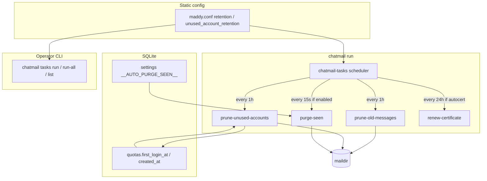

# Scheduled maintenance tasks

Background and on-demand jobs for **message retention**, **unused account cleanup**, and **seen-message purge** — aligned with Madmail `storage.imapsql` loops and the admin queue API.

**Operator guide:** [`../guide/cli/tasks.md`](../guide/cli/tasks.md) · [`tasks-run.md`](../guide/cli/tasks-run.md) · [`tasks-run-all.md`](../guide/cli/tasks-run-all.md) · [`tasks-list.md`](../guide/cli/tasks-list.md).

**Madmail reference:**

| Behavior | Go location |
|----------|-------------|
| Hourly message retention | `internal/storage/imapsql/imapsql.go` — `cleanupLoop` → `PruneMessages` |
| Hourly unused accounts | `cleanupUnusedAccountsLoop` → `PruneUnusedAccounts` |
| Auto-purge seen (15s) | `internal/endpoint/chatmail/chatmail.go` — `PurgeReadIMAPMsgs` when `__AUTO_PURGE_SEEN__` |
| Operator purge | `internal/api/admin/resources/queue.go`, `maddy imap-acct prune-unused` |

madmail-v2 stores mail on **maildir** under `{state_dir}/mail/` (not go-imap-sql `msgs`), so retention jobs call `chatmail-storage::purge_*` helpers instead of SQL `DELETE FROM msgs`.

---

## Configuration (`maddy.conf`)

In `storage.imapsql local_mailboxes { … }` (see [`13-configuration.md`](13-configuration.md)):

| Directive | Field | Job |
|-----------|-------|-----|
| `retention 24h` | `AppConfig.retention` | Parsed for install/docs parity; **runtime** `prune-old-messages` uses DB settings below |
| `unused_account_retention 720h` | `AppConfig.unused_account_retention` | `prune-unused-accounts` — delete accounts with `first_login_at = 1` and `created_at` before cutoff |
| `0` or omitted | — | Job disabled |

Durations use Go-style suffixes: `s`, `m`, `h`, `d` (parsed by `chatmail_config::parse_duration`).

**Database toggles (runtime):**

| Setting key | Admin API | Job |
|-------------|-----------|-----|
| `__MESSAGE_RETENTION_ENABLED__` | `/admin/settings` (`message_retention_enabled`) | Hourly `prune-old-messages` when enabled |
| `__MESSAGE_RETENTION__` | `/admin/settings` (`message_retention`, e.g. `30d`) | Retention duration for file purge (`chatmail-db::message_retention`) |
| `__AUTO_PURGE_SEEN__` | `POST /admin/services/auto_purge_seen` | In-process every **15s** when value is `enabled` — deletes maildir `cur/` (seen messages) |

Madmail also documents `auth_db` for unused-account cleanup when auth and storage are separate modules. madmail-v2 uses a single `chatmail.db` / `credentials.db`; no extra `auth_db` directive is required.

Example (`context/madmail/maddy.conf` parity):

```text
storage.imapsql local_mailboxes {
    driver sqlite3
    dsn imapsql.db
    retention 24h
    unused_account_retention 720h
    default_quota 1G
}
```

---

## Architecture



| Crate | Role |
|-------|------|
| `chatmail-tasks` | `MaintenanceConfig`, `TaskId`, `run_task`, `spawn_maintenance_scheduler`, `cert_renew` |
| `chatmail` (`supervisor/cert_renew.rs`) | `CertificateRenewer` impl — stops port 80, renews via `chatmail-acme`, reloads TLS |
| `chatmail-db::maintenance` | Dormant account query + delete without blocklist |
| `chatmail-storage::purge` | Maildir file deletion |
| `chatmail` supervisor | Starts scheduler with `chatmail run` |
| `chatmail::ctl::tasks` | CLI `chatmail tasks` |

---

## Task catalog

| Task ID | CLI aliases | Config / trigger | Effect |
|---------|-------------|------------------|--------|
| `prune-old-messages` | `retention`, `prune-messages` | `__MESSAGE_RETENTION_ENABLED__` + `__MESSAGE_RETENTION__` in DB | `purge_mail_blobs_older` |
| `prune-unused-accounts` | `prune-unused`, `unused-accounts` | `unused_account_retention` | Remove credentials + quota + maildir; **no** blocklist |
| `purge-seen` | `purge-read`, `auto-purge-seen` | Manual CLI; or DB + 15s loop | `purge_read_messages` (`cur/`) |
| `prune-unread-older` | `purge-unread-older` | `--retention` required if not in config | `prune_unread_older` (`new/`) |
| `renew-certificate` | `renew-cert`, `certificate-renew`, `cert-renew` | `tls_mode = autocert` in `maddy.conf` + server running | HTTP-01 renewal via supervisor; IP certs when &lt;4d left, DNS when &lt;30d |

Admin HTTP parity for maildir purge remains [`09-admin-api.md`](09-admin-api.md) `POST /admin/queue` (`purge_older`, `purge_read`, …) via `chatmail-admin::resources::queue`.

---

## CLI

```bash
# List jobs and whether config enables them
chatmail tasks list

# Run jobs enabled in maddy.conf
chatmail tasks run-all

# Run one job (override retention)
chatmail tasks run prune-unused-accounts --retention 720h
chatmail tasks run prune-old-messages
chatmail tasks run prune-unread-older --retention 48h
chatmail tasks run renew-certificate   # manual renewal when tls_mode = autocert
```

Global flags: `--config`, `--state-dir` (same as other ctl commands). Requires `chatmail.db` / migrated state dir.

**systemd timer (optional):** run `chatmail tasks run-all` on a timer instead of relying on the in-process scheduler when using `chatmail run` only for protocol listeners — both are safe; jobs are idempotent.

---

## Scheduling defaults

| Loop | Interval | When skipped |
|------|----------|--------------|
| Periodic (retention + unused accounts) | 1 hour | Message retention disabled in DB and no `unused_account_retention` in config |
| Auto-purge seen | 15 seconds | `__AUTO_PURGE_SEEN__` not `enabled` |
| Certificate renewal | 24 hours | `tls_mode` ≠ `autocert` or cert still valid (≥30d DNS / ≥4d IP) |

First tick runs after one full interval (Madmail ticker behavior). Renewal temporarily stops the plain HTTP listener on port 80 for HTTP-01, then reloads TLS listeners — see [`19-certificates.md`](19-certificates.md).

---

## Implementation references

| Component | Path |
|-----------|------|
| Scheduler | `crates/chatmail-tasks/src/scheduler.rs` |
| Jobs | `crates/chatmail-tasks/src/jobs.rs` |
| Config | `crates/chatmail-tasks/src/config.rs` |
| Cert renewal trait | `crates/chatmail-tasks/src/cert_renew.rs` |
| Supervisor renewer | `crates/chatmail/src/supervisor/cert_renew.rs` |
| DB helpers | `crates/chatmail-db/src/maintenance.rs` |
| CLI | `crates/chatmail/src/ctl/tasks.rs` |
| Supervisor hook | `crates/chatmail/src/supervisor.rs` |
| Duration parser | `crates/chatmail-config/src/maddy.rs` — `parse_duration` |

---

## Deviations from Madmail

- Message retention operates on **maildir files**, not IMAP SQL `msgs` rows (madmail-v2 has no go-imap-sql message table).
- Unused-account deletion does not require `auth_db` module name — single DB holds `passwords` + `quotas`.
- `maddy imap-acct prune-unused` → use `chatmail tasks run prune-unused-accounts` (or `run-all`).
- `maddy queue purge` → still **planned** as top-level CLI; same storage helpers are available via `tasks` and `/admin/queue`.

## Related RFCs

Maintenance jobs affect maildir files and IMAP-visible message state. Index: [`RFC/README.md`](RFC/README.md).

| RFC | Topic | Local file |
|-----|-------|------------|
| [3501](https://datatracker.ietf.org/doc/html/rfc3501) | Message flags, mailboxes (purge seen / retention) | [rfc3501.txt](RFC/rfc3501.txt) |
| [5322](https://datatracker.ietf.org/doc/html/rfc5322) | Message format stored on disk | [rfc5322.txt](RFC/rfc5322.txt) |
| [2087](https://datatracker.ietf.org/doc/html/rfc2087) | Quota rows updated on account delete | [rfc2087.txt](RFC/rfc2087.txt) |
