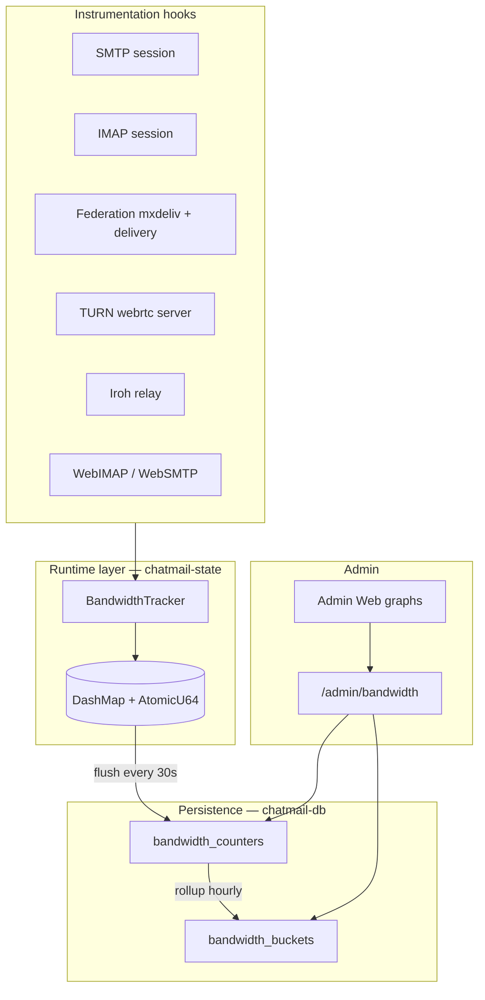

# Bandwidth monitoring and management

This document specifies how **madmail-v2** measures, stores, exposes, and optionally limits **network bandwidth** for the whole installation and per user. The goal is to help operators control VPS costs and detect abuse (heavy file sync, TURN voice/video calls, federation traffic).

**Related:**

- [09-admin-api.md](09-admin-api.md) — admin RPC envelope and resource catalogue
- [11-proxy-services.md](11-proxy-services.md) — TURN/STUN relay (likely largest bandwidth consumer)
- [20-deltachat-calls.md](20-deltachat-calls.md) — Delta Chat calls and TURN discovery
- [17-data-models.md](17-data-models.md) — existing `message_stats`, `quotas`, `federation_server_stats`
- [04-storage-layer.md](04-storage-layer.md) — maildir storage (disk quota, not network)

**Status:** Design only — not yet implemented.

---

## Problem statement

VPS providers bill on **egress bandwidth** (often with monthly caps, e.g. 100 GB). A chatmail installation with no other services can still exceed that limit when users:

- repeatedly download large attachments via IMAP FETCH;
- upload large messages via IMAP APPEND or SMTP submission;
- exchange federated mail over HTTP `/mxdeliv`;
- use **TURN relay** for voice/video calls (UDP media on relay ports);
- use **Iroh relay** for WebXDC realtime.

Today madmail-v2 tracks **message counts** (`message_stats`), **disk usage** (`QuotaCache` / maildir scan), and **federation delivery counters** (`FederationTracker`), but **not network bytes**. The admin `/admin/status` endpoint reports IMAP connection counts and TURN relay **session count** (via `ss`), not bytes transferred.

**Success criteria:**

1. Operator sees **month-to-date egress** for the whole installation, broken down by category (mail, TURN, iroh, federation).
2. Operator sees **per-user breakdown** for mail paths; TURN per-user in a later phase.
3. Admin Web UI shows **time-series graphs** (daily / hourly) and top consumers.
4. Optional: **alerts and caps** when usage approaches provider limits or per-user policy.

---

## What consumes bandwidth (and what is measured today)

| Traffic source | Typical volume | Per-user attribution | Currently tracked |
|----------------|------------------|----------------------|-------------------|
| **IMAP FETCH** (download mail/attachments) | High for heavy file users | Yes (authenticated user) | No |
| **IMAP APPEND** (upload mail/attachments) | High | Yes | No |
| **SMTP inbound** (remote servers → local) | Medium | Partial (local rcpt) | Message count only |
| **SMTP submission** (clients sending) | Medium | Yes (AUTH user) | Message count only |
| **Federation HTTP** (`/mxdeliv`, outbound delivery) | Medium | Yes (rcpt / sender) | Success/fail counts only |
| **TURN relay** (voice/video calls) | **Very high** | Hard (see [TURN attribution](#turn-and-iroh-attribution)) | Relay **count** only |
| **Iroh relay** (WebXDC realtime) | Medium–high | Hard | Enabled/disabled only |
| **WebIMAP / WebSMTP** | Same as IMAP/SMTP | Yes | No |

### Storage quota ≠ bandwidth

`QuotaCache` tracks **maildir bytes on disk** (`used_bytes`). A 50 MB attachment downloaded 20 times uses ~1 GB of egress but only 50 MB of storage. Bandwidth limits are a separate concern from [storage quota](17-data-models.md#quotas).

### Double counting

The same logical message may traverse multiple protocols (SMTP accept → IMAP FETCH on another device; local send → federation HTTP POST). **Network-byte accounting is correct to count each transfer** for VPS billing, but UI labels must say **“network bytes”**, not “unique file bytes”.

---

## Design goals

Two views, one system:

1. **Installation total** — “How close am I to my VPS cap?” (matches provider billing).
2. **Per-user breakdown** — “Who is driving cost?” (abuse prevention, support, policy).

Additionally:

- **Payload-first counting** — message/application bytes on the hot path; optional NIC-level reconciliation later.
- **Same patterns as existing stats** — in-memory atomics, 30s DB flush, admin JSON API, SvelteKit admin-web graphs.
- **No secrets in admin responses** — aggregate bytes only.

---

## Architecture overview



Lifecycle (mirrors `message_stats` and `FederationTracker`):

1. **Hot path** — `BandwidthTracker::record(...)`; atomic adds only, no DB I/O.
2. **Warm path** — flush to DB every 30s (extend existing flusher in `chatmail-state/src/flusher.rs` or parallel task).
3. **Cold path** — hourly rollup into time buckets for graphs (`chatmail-tasks` scheduler).
4. **Admin API** — query totals, time series, top users.
5. **Admin UI** — charts in embedded admin-web SPA (`context/madmail/admin-web`).

---

## Traffic categories

Fixed category enum so graphs are comparable across releases:

| Category | Description |
|----------|-------------|
| `mail_imap_in` | Bytes received from clients on IMAP (APPEND, literal upload) |
| `mail_imap_out` | Bytes sent to clients on IMAP (FETCH body) |
| `mail_smtp_in` | Bytes received on SMTP DATA (inbound + submission) |
| `mail_smtp_out` | Bytes sent on SMTP (if applicable; mostly inbound server role) |
| `federation_in` | Bytes received on `/mxdeliv` and similar ingress |
| `federation_out` | Bytes sent on outbound federation HTTP POST |
| `turn_relay` | TURN relay media (UDP, typically egress-heavy) |
| `iroh_relay` | Iroh relay traffic |
| `www_other` | WebIMAP, WebSMTP, other HTTP |
| `nic_total` | Optional: raw NIC `tx/rx` for reconciliation |

**Direction:** from the **VPS perspective**:

- **`bytes_out`** — sent to clients or remote servers (what providers usually bill).
- **`bytes_in`** — received from clients or remote servers.

---

## Data model

Schema source of truth (when implemented): `crates/chatmail-db/migrations/`.

### `bandwidth_counters`

Rolling totals for the **current billing period** (calendar month UTC by default):

| Column | Type | Notes |
|--------|------|-------|
| `username` | TEXT | Empty string `''` = site total for that category |
| `category` | TEXT | See [Traffic categories](#traffic-categories) |
| `period_start` | INTEGER | Unix timestamp of period start (e.g. 1st of month 00:00 UTC) |
| `bytes_in` | INTEGER | Cumulative |
| `bytes_out` | INTEGER | Cumulative |
| **PK** | | `(username, category, period_start)` |

Same flush pattern as `message_stats`: atomics in RAM → `INSERT … ON CONFLICT DO UPDATE` every 30s.

### `bandwidth_buckets`

Time series for graphs:

| Column | Type | Notes |
|--------|------|-------|
| `bucket_start` | INTEGER | Unix timestamp, truncated to hour (or 15 min) |
| `username` | TEXT | `''` for site totals |
| `category` | TEXT | |
| `bytes_in` | INTEGER | Delta for that bucket |
| `bytes_out` | INTEGER | Delta for that bucket |
| **PK** | | `(bucket_start, username, category)` |

**Retention (configurable):** e.g. hourly buckets 90 days; daily rollups 2 years (rollup job merges old hourly rows).

### Settings keys

Add to `settings_keys` / `settings` table:

| Key | Purpose |
|-----|---------|
| `__BANDWIDTH_MONTHLY_CAP__` | Site alert threshold in bytes (default e.g. 100 GiB) |
| `__BANDWIDTH_USER_CAP__` | Optional default per-user monthly cap |
| `__BANDWIDTH_BILLING_DAY__` | Optional billing anchor (default: 1 = calendar month) |

Per-user overrides: new `bandwidth_limits` table or extend `quotas` with a **separate** `max_bandwidth` column (keep network limits distinct from `max_storage`).

Update [17-data-models.md](17-data-models.md) when migrations land.

---

## Runtime component: `BandwidthTracker`

New module: `crates/chatmail-state/src/bandwidth.rs`, wired into `AppState` alongside `quota` and `federation_tracker`.

Conceptual API:

```rust
pub enum BandwidthCategory { MailImapIn, MailImapOut, /* … */ }

pub struct BandwidthEvent {
    pub category: BandwidthCategory,
    pub user: Option<String>,  // None → site-only bucket
    pub bytes_in: u64,
    pub bytes_out: u64,
}

impl BandwidthTracker {
    pub fn record(&self, event: BandwidthEvent);
    pub fn snapshot_site(&self) -> SiteBandwidthSnapshot;
    pub fn snapshot_top_users(&self, category: BandwidthCategory, limit: usize) -> Vec<(String, u64)>;
    pub async fn hydrate(pool: &DbPool) -> Result<()>;
    pub async fn flush(pool: &DbPool) -> Result<()>;
}
```

**Hydrate** on boot from `bandwidth_counters` for the active period. **Flush** on the existing 30s interval (see `chatmail-state/src/flusher.rs`).

Hourly rollup (new job in `chatmail-tasks`):

- Compute delta since last bucket timestamp.
- Upsert `bandwidth_buckets`.
- Optionally aggregate to daily rows for long-term retention.

---

## Instrumentation hook points

### Mail — high value, straightforward per-user attribution

| Location | What to count | User key |
|----------|---------------|----------|
| `crates/chatmail-smtp/src/session.rs` — `ingest_data` | `data.len()` on accept | AUTH user (submission) or local rcpt (inbound) |
| `crates/chatmail-imap/src/session.rs` — `handle_fetch` | `body.len()` sent to client | Authenticated user |
| `crates/chatmail-imap/src/session.rs` — `handle_append` | `literal.len()` read from client | Authenticated user |
| `crates/chatmail-fed/src/mxdeliv.rs` | POST body size | Local rcpt |
| `crates/chatmail-delivery/src/transport.rs` | Outbound HTTP POST body | Local sender from job |
| `crates/chatmail-www` — WebIMAP / WebSMTP | Same as IMAP/SMTP equivalents | Authenticated user |

Call site pattern:

```rust
self.ctx.bandwidth.record(BandwidthEvent {
    category: BandwidthCategory::MailImapOut,
    user: Some(user.to_string()),
    bytes_in: 0,
    bytes_out: body.len() as u64,
});
```

### TURN and Iroh attribution

TURN REST credentials use **expiry timestamp as username**, not email (`crates/chatmail-turn/src/credentials.rs`):

```text
username = (now_unix + ttl_secs).to_string()
password = base64(HMAC-SHA1(secret, username))
```

Clients and Delta Chat core depend on this format — **do not change the credential shape** for per-user tracking.

#### Phase A — site total TURN bytes

- Hook `webrtc-rs` TURN `alloc_close_notify` (currently `None` in `crates/chatmail-turn/src/runner.rs`) to sum relay bytes per allocation; or
- Sample kernel counters for UDP on relay port range **49152–65535** (admin already counts relay sessions via `ss` in `status_storage.rs`).

Record under `category = turn_relay`, `username = ''`.

#### Phase B — per-user TURN bytes

When IMAP serves `GETMETADATA "" /shared/vendor/deltachat/turn` (`crates/chatmail-imap/src/session.rs`):

1. Record `(authenticated_user, turn_username_expiry, issued_at)` in a pending map.
2. On TURN `ALLOCATE` with matching username, bind allocation ID → user.
3. On allocation close, attribute bytes to that user.
4. TTL-evict stale mappings.

Same correlation pattern can apply to Iroh metadata (`/shared/vendor/deltachat/irohrelay`) when the relay library exposes byte counts.

### Site total reconciliation (optional)

Periodic read of `/sys/class/net/{iface}/statistics/{tx,rx}_bytes` (default interface configurable):

- Store as `category = nic_total`, `username = ''`.
- Compare sum of application categories vs NIC delta to detect blind spots (SSH, DNS, OS updates, uninstrumented paths).

---

## Admin API

New resources in `crates/chatmail-admin/src/resources/` (add to `dispatch` in `mod.rs`). Follow [09-admin-api.md](09-admin-api.md) envelope and auth.

| Resource | Methods | Response |
|----------|---------|----------|
| `/admin/bandwidth` | GET | Site totals by category for current period; `%` of configured cap |
| `/admin/bandwidth/timeseries` | GET | Query: `from`, `to`, `granularity=hour\|day`, optional `category`, `username` → array of `{ bucket_start, bytes_in, bytes_out }` |
| `/admin/bandwidth/users` | GET | Query: `period`, `limit`, `sort=bytes_out` → top consumers with per-category breakdown |
| `/admin/bandwidth/limits` | GET, PUT | Global and default per-user caps |

**Example — site summary (`GET /admin/bandwidth`):**

```json
{
  "period_start": 1746057600,
  "bytes_out_total": 87432109876,
  "bytes_in_total": 12345678901,
  "monthly_cap_bytes": 107374182400,
  "percent_used": 81.4,
  "by_category": {
    "turn_relay": { "bytes_out": 61000000000, "bytes_in": 8000000000 },
    "mail_imap_out": { "bytes_out": 24000000000, "bytes_in": 2000000000 },
    "federation_out": { "bytes_out": 5000000000, "bytes_in": 500000000 }
  }
}
```

**Extend `/admin/status`** with a lightweight summary block:

```json
"bandwidth": {
  "month_bytes_out": 87432109876,
  "month_limit_bytes": 107374182400,
  "percent_used": 81.4,
  "top_category": "turn_relay"
}
```

Catalogue row for [09-admin-api.md](09-admin-api.md):

| Resource | Methods | Status |
|----------|---------|--------|
| `/admin/bandwidth` | GET | *Planned* |
| `/admin/bandwidth/timeseries` | GET | *Planned* |
| `/admin/bandwidth/users` | GET | *Planned* |
| `/admin/bandwidth/limits` | GET, PUT | *Planned* |

---

## Admin Web UI

Built in `context/madmail/admin-web` (embedded via `crates/chatmail-admin-web`), same as existing dashboard.

| Page / widget | Content |
|---------------|---------|
| **Dashboard widget** | Month usage bar vs cap; sparkline last 7 days |
| **Bandwidth overview** | Stacked area chart by category (mail / TURN / iroh / federation) |
| **Per-user table** | Sortable: user, total `bytes_out`, breakdown by category, % of site |
| **User detail** | Drill-down time series |
| **Alerts** | Banner when usage > 80% of cap; link to top users |

Data source: admin JSON API only (no client-side aggregation of raw logs). Chart library: match existing admin-web stack (or Chart.js / uPlot).

---

## Prometheus (optional)

Extend `crates/chatmail-metrics` with counter vec:

```text
chatmail_bandwidth_bytes_total{category="mail_imap_out", direction="out"}
```

Operators with Grafana can scrape `/metrics` in parallel with the admin UI. Admin graphs remain on the JSON API for deployments without Prometheus.

---

## Abuse prevention and policy

Measurement enables policy in later phases:

| Phase | Behaviour |
|-------|-----------|
| **Alerts** | Log + admin banner at 80% / 95% of `__BANDWIDTH_MONTHLY_CAP__` |
| **Per-user monthly caps** | Reject or throttle when exceeded |
| **Mail** | SMTP 452/553 or IMAP NO with clear code when user over cap |
| **TURN** | Stop issuing TURN METADATA for capped users; or limit concurrent allocations |
| **Rate limits** | Bytes per hour per user on IMAP FETCH (heavy downloaders) |

Bandwidth caps are **orthogonal** to storage quota (`max_storage`).

---

## Implementation phases

| Phase | Scope | Operator value |
|-------|--------|----------------|
| **0 — ops (no code)** | `vnstat`, provider graphs, `ss -unap` on TURN ports | Confirm TURN vs mail split before building |
| **1 — mail bytes** | SMTP/IMAP/federation hooks + `bandwidth_counters` + admin table API | Identify file-heavy users |
| **2 — graphs** | `bandwidth_buckets` + admin-web charts | Trend visibility |
| **3 — TURN total** | Allocation hooks or port-range byte counter | Explain call-driven spikes |
| **4 — TURN per-user** | METADATA → allocation correlation | Target call abusers |
| **5 — limits & alerts** | Caps, notifications, optional enforcement | Prevent provider suspension |

Phase **1 + 3** usually explains most of an unexpected 100 GB/month bill on a mail-only VPS.

---

## Design decisions (resolve before coding)

1. **Billing period** — Calendar month UTC (matches most VPS invoices) vs rolling 30 days.
2. **TLS/TCP overhead** — Payload-only on hot path initially; `nic_total` for reconciliation.
3. **Double counting** — Document clearly in UI; do not deduplicate across protocols for egress totals.
4. **Big files** — On chatmail, attachments travel over IMAP/SMTP; separate blob/CDN hosting would bypass the server (out of scope unless exchanger/pull URLs dominate).

---

## Implementation references

| Area | Path |
|------|------|
| Message count pattern | `crates/chatmail-db/src/message_stats.rs` |
| Federation flush pattern | `crates/chatmail-state/src/flusher.rs`, `tracker.rs` |
| Disk quota (not bandwidth) | `crates/chatmail-state/src/quota.rs` |
| Admin dispatch | `crates/chatmail-admin/src/resources/mod.rs` |
| Admin status (connections) | `crates/chatmail-admin/src/resources/status_storage.rs` |
| TURN credentials | `crates/chatmail-turn/src/credentials.rs` |
| TURN server spawn | `crates/chatmail-turn/src/runner.rs` |
| IMAP METADATA turn line | `crates/chatmail-imap/src/session.rs` |
| SMTP DATA ingest | `crates/chatmail-smtp/src/session.rs` |
| Migrations | `crates/chatmail-db/migrations/` |
| Scheduled jobs | `crates/chatmail-tasks/` |
| Admin Web embed | `crates/chatmail-admin-web/`, `context/madmail/admin-web` |

---

## Expected operator outcome

After full rollout, an operator should be able to answer:

- **Site:** “92 GB out this month — 61 GB TURN, 24 GB IMAP, 5 GB federation, 2 GB SMTP.”
- **Users:** “`alice@domain` 38 GB (mostly TURN); `bob@domain` 19 GB (IMAP attachments).”
- **Trend:** Weekend spikes → calls; weekday spikes → attachment sync.

That turns an opaque VPS suspension into actionable policy: cap TURN, warn heavy users, adjust pricing, or upgrade the plan.

## Related RFCs

Bandwidth counters will attach to these protocol layers. Spec only until implemented — offline copies: [`RFC/README.md`](RFC/README.md).

| RFC | Topic | Local file |
|-----|-------|------------|
| [5321](https://datatracker.ietf.org/doc/html/rfc5321) | SMTP DATA bytes | [rfc5321.txt](RFC/rfc5321.txt) |
| [3501](https://datatracker.ietf.org/doc/html/rfc3501) | IMAP FETCH/APPEND bytes | [rfc3501.txt](RFC/rfc3501.txt) |
| [9110](https://datatracker.ietf.org/doc/html/rfc9110) | HTTP `/mxdeliv`, WebIMAP | [rfc9110.txt](RFC/rfc9110.txt) |
| [8656](https://datatracker.ietf.org/doc/html/rfc8656) | TURN relay traffic | [rfc8656.txt](RFC/rfc8656.txt) |
| [8489](https://datatracker.ietf.org/doc/html/rfc8489) | STUN binding traffic | [rfc8489.txt](RFC/rfc8489.txt) |
| [8445](https://datatracker.ietf.org/doc/html/rfc8445) | ICE (calls context) | [rfc8445.txt](RFC/rfc8445.txt) |
| [5464](https://datatracker.ietf.org/doc/html/rfc5464) | TURN discovery via METADATA | [rfc5464.txt](RFC/rfc5464.txt) |
| [8259](https://datatracker.ietf.org/doc/html/rfc8259) | Admin API JSON graphs | [rfc8259.txt](RFC/rfc8259.txt) |
