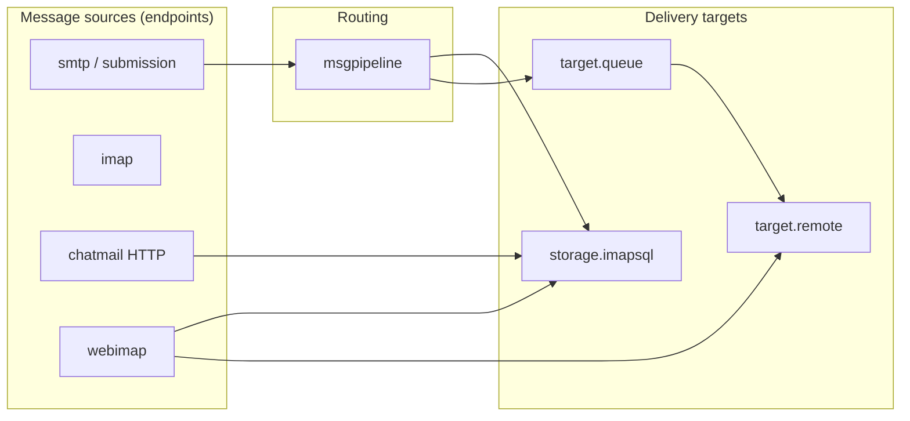

# Architecture

## Module system

Madmail is built from **modules**: Go types implementing [`framework/module.Module`](../../framework/module/module.go) (`Name()`, `InstanceName()`, `Init(*config.Map)`).

### Registration

Step-by-step server boot and config file layout: [startup-and-config.md](./startup-and-config.md).

1. Each module package has an `init()` that calls `module.Register("smtp", factory)` or `module.RegisterEndpoint(...)`.
2. `maddy.go` blank-imports endpoint/storage/target packages so factories are registered before config load.
3. `RegisterModules()` ([`maddy.go`](../../maddy.go)) walks config blocks:
   - **Endpoints** → constructed immediately, registered in instances map.
   - **Other modules** → constructed and registered by instance name; **lazy `Init`** when first referenced.
4. `initModules()` calls `Init()` on **every endpoint** and registers `EventShutdown` hooks for `io.Closer` modules.
5. Any **non-endpoint** top-level block that is never referenced via `&name` from another module’s config fails startup (“Unused configuration block”).

Non-endpoint modules (`storage.imapsql`, `target.queue`, …) call `Init()` lazily on first [`module.GetInstance`](../../framework/module/instances.go) when another module resolves `&instance`.

### Referencing modules

[`framework/config/module/modconfig.go`](../../framework/config/module/modconfig.go) resolves `auth &local_authdb`, `deliver_to &local_mailboxes`, etc.:

- `&name` → existing instance from registry.
- Inline block → construct nested module.

Interfaces are checked at resolve time (e.g. storage must implement `module.Storage` or `module.DeliveryTarget` as needed).

### Module categories

| Kind | Prefix / examples | Interface(s) |
|------|-------------------|--------------|
| Endpoint | `smtp`, `submission`, `imap`, `chatmail` | `module.Module` + listens on network |
| Storage | `storage.imapsql` | `Storage`, `DeliveryTarget`, `PlainAuth`, … |
| Target | `target.remote`, `target.queue` | `DeliveryTarget` |
| Pipeline | `msgpipeline` | `DeliveryTarget` (embedded in SMTP) |
| Check | `check.spf`, `check.dkim`, `check.pgp_encryption` | `module.Check` |
| Modifier | `modify.dkim`, envelope rewrites | `module.Modifier` |
| Table | `table.sql_table`, `table.chain` | `module.Table` |

Design rationale: [HACKING.md](../../HACKING.md), [docs/reference/modules.md](../reference/modules.md).

## Message pipeline (`internal/msgpipeline`)

Implements the routing described in [smtp-pipeline.md](../reference/smtp-pipeline.md).

**`MsgPipeline.Start`** ([`msgpipeline.go`](../../internal/msgpipeline/msgpipeline.go)):

1. Global connection/sender checks (`RunEarlyChecks` / `checkConnSender`).
2. Global modifiers on sender.
3. Select **source** block by `MAIL FROM` (`source`, `source_in`, `default_source`).
4. Per-source checks + sender modifiers.
5. Returns `msgpipelineDelivery` implementing `module.Delivery`.

**`AddRcpt`** (per recipient):

1. Global + source + destination checks (`CheckRcpt`).
2. Modifier chain: global → source → per-destination (`RewriteRcpt`).
3. Select **destination** block; may split recipients across targets.
4. `getDelivery()` → underlying target's `Start`/`AddRcpt` (e.g. `imapsql`, nested `msgpipeline`).

**`Body`**:

1. Body checks (global, source, per-destination blocks that have them).
2. If `FirstPipeline`: add `Received` header, apply check results (e.g. `Authentication-Results`).
3. Body modifiers (DKIM sign, etc.).
4. Call each underlying `Delivery.Body` with the same header/body buffer.

**`Commit` / `Abort`**: propagate to all underlying deliveries; supports `PartialDelivery` for per-recipient errors (LMTP, `target.remote`).

**DMARC** is not a separate `check.*` module: [`internal/msgpipeline/check_runner.go`](../../internal/msgpipeline/check_runner.go) runs [`internal/dmarc`](../../internal/dmarc/) after body checks when `dmarc { }` is enabled in the pipeline config ([`msgpipeline/config.go`](../../internal/msgpipeline/config.go)).

SMTP endpoints set `pipeline.FirstPipeline = true` so `Received` is added once per inbound transaction.

### Paths that bypass `msgpipeline`

Some entry points call `DeliveryTarget` on storage or remote **directly** (still using `pgp_verify` where applicable):

| Entry | Uses msgpipeline? |
|-------|-------------------|
| SMTP :25 / submission | Yes |
| `POST /mxdeliv` | No → `storage` (chatmail handler; see [chatmail.md](./chatmail.md), [pgp-verification.md](./pgp-verification.md)) |
| Exchanger inject | No → `storage` |
| WebSMTP local rcpt | No → `Storage` |
| WebSMTP remote rcpt | No → `RemoteTarget` (often `target.remote`) |
| IMAP APPEND | No → go-imap backend |

## Error model

Use [`framework/exterrors`](../../framework/exterrors/): `SMTPError` with codes, `IsTemporary()`, `TargetName` / `CheckName`, optional `Err` for `errors.Is`.

Unexpected errors should not leak server details to clients.

## Chatmail-specific layering

The **`chatmail`** endpoint ([`internal/endpoint/chatmail/`](../../internal/endpoint/chatmail/)) is an HTTP server that:

- Serves registration/share pages (`www/` embed).
- Exposes **`POST /mxdeliv`** (inbound federation).
- Hosts admin API routes and optional WebIMAP/WebSMTP.
- Runs optional Shadowsocks/Xray, exchanger pull loop (calls into `storage` — exchanger *implementation* is submodule; **injection path** is in-tree).

It does not replace SMTP/IMAP; it adds HTTP surfaces that call the same `DeliveryTarget` / storage types.

HTTP route map: [http-surfaces.md](./http-surfaces.md).

### Dynamic settings

Chatmail and endpoints read boolean/string flags from the settings DB via [`module.GetGlobalSetting`](../../framework/module/settings.go) / `IsLocalOnly` (e.g. bind SMTP/IMAP/HTTP to localhost only). The auth DB registers the provider during `Init`; lookups can lazy-init the provider module.

## Data stores

| Store | Location | Used for |
|-------|----------|----------|
| IMAP SQL DB | `imapsql.db` (sqlite) or Postgres DSN | Mailboxes, message metadata, UIDs |
| Message blobs | `storage.blob.fs` root + [`go-imap-sql` external store](../../internal/go-imap-sql/external_store.go) | LZ4-compressed RFC822 bodies on disk |
| Credentials | `credentials.db` / `pass_table` | Auth passwords |
| GORM DB / settings table | [`internal/db/`](../../internal/db/), `table.gorm` / `table.sql_table` | Settings, federation, blocklist, registration tokens, exchanger rows |
| Sharing DB | Optional sqlite (`sharing.db`) | Contact-share links when enabled |
| Queue spool | `target.queue` directory | `*.meta` + body files; time wheel schedules retries |
| Federation stats | GORM `server_stats` | Flushed from `federationtracker` every 30s |
| MTA-STS cache | RAM or `mtasts_cache/` dir | Used by `mx_auth.mtasts` |

## Other endpoints (non-SMTP mail)

| Endpoint | Role |
|----------|------|
| **`turn`** | STUN/TURN for VoIP; credentials from settings; optional `IsLocalOnly` bind |
| **`openmetrics`** | Prometheus scrape endpoint |
| **`lmtp`** | Same module as SMTP with LMTP semantics for local injection |

IMAP exposes TURN relay URL and **Iroh** relay via METADATA keys when configured ([`internal/endpoint/imap/imap.go`](../../internal/endpoint/imap/imap.go)).

## Testing

Integration tests live in [`tests/`](../../tests/) (Go) and [`tests/deltachat-test/`](../../tests/deltachat-test/) (Python; may use `chatmail-core` submodule for client behavior — not documented here).
