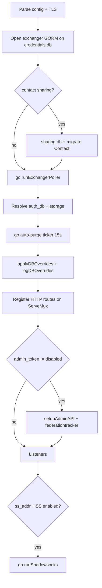

# Chatmail endpoint

The **`chatmail`** module is Madmail’s Chatmail-specific HTTP(S) server: registration, federation ingress (`/mxdeliv`), operator admin API, embedded web UI, WebIMAP/WebSMTP, optional contact sharing, exchanger polling, Shadowsocks relay, and optional ALPN multiplexing of SMTP/IMAP on the HTTPS port.

**Package:** [`internal/endpoint/chatmail/`](../../internal/endpoint/chatmail/)  
**Registration:** `module.RegisterEndpoint("chatmail", New)` in `chatmail.go` `init()`.

Out of scope here: **`admin-web/`** Svelte sources (submodule), **`chatmail-core/`**, **`exchangers/madexchanger*`** — only how Madmail embeds or calls them.

---

## Source files

| File | Role |
|------|------|
| [`chatmail.go`](../../internal/endpoint/chatmail/chatmail.go) | `Endpoint` struct, `Init`, HTTP handlers, admin wiring, ALPN, Shadowsocks, templates |
| [`exchanger.go`](../../internal/endpoint/chatmail/exchanger.go) | Background poller: `GET {exchanger}/me/full` → inject into storage |
| [`reload.go`](../../internal/endpoint/chatmail/reload.go) | Admin `/admin/reload`: patch `maddy.conf` from DB → pending file → `os.Exit(3)` |
| [`tokens.go`](../../internal/endpoint/chatmail/tokens.go) | Registration token validate/consume helpers for `/new` |
| [`mxdeliv_security.go`](../../internal/endpoint/chatmail/mxdeliv_security.go) | Recipient domain/admin checks (`ValidateAllRecipients`, etc.) |
| [`adminweb.go`](../../internal/endpoint/chatmail/adminweb.go) | Serve embedded admin SPA from [`internal/adminweb`](../../internal/adminweb/) |
| [`www/*`](../../internal/endpoint/chatmail/www/) | Embedded static site + Delta Chat web client shell (`app.html`, docs, invite) |

Tests: `tokens_test.go`, `reload_test.go`, `mxdeliv_security_test.go`.

---

## Configuration (`maddy.conf`)

Block form: `chatmail [instance] tls://…` / `tcp://…` { … }.

### Required

| Directive | Purpose |
|-----------|---------|
| `mail_domain` | Local part domain for new accounts (`user@mail_domain`) |
| `mx_domain` | Hostname in `dclogin://` / client setup (often same as MX) |
| `web_domain` | Hostname in QR / web URLs |
| `auth_db` | Instance name of `auth.pass_table` (`PlainUserDB`) |
| `storage` | Instance name of `storage.imapsql` (`ManageableStorage` + `DeliveryTarget`) |

### Common optional

| Directive | Default | Purpose |
|-----------|---------|---------|
| `username_length` | 8 | Random local part for `/new` |
| `password_length` | 16 | Random password for `/new` |
| `public_ip` | — | QR / template fallbacks when MX is IP |
| `max_message_size` | `32M` | WebIMAP upload cap |
| `language` | `en` | Docs under `www/docs/{lang}/` |
| `www_dir` | — | Override embedded `www/` (dev); empty = `//go:embed` |
| `tls { … }` | inherit global | HTTPS listener |
| `turn_off_tls` | false | Template flag for pages |
| `alpn_smtp` / `alpn_imap` | — | Module instance names for port-443 multiplexing |
| `enable_contact_sharing` | false | `/share` + `sharing.db` + `/admin/shares` |
| `sharing_driver` / `sharing_dsn` | sqlite3 / `sharing.db` | Contact slug DB |
| `admin_token` | auto | Bearer token; `disabled` turns API off |
| `admin_path` | `/api/admin` | Single JSON-RPC-style POST mount |
| `admin_web_path` | — | Prefix for embedded admin SPA (can be overridden in DB) |
| `ss_addr` / `ss_password` / `ss_cipher` | — / default pass / `aes-128-gcm` | Shadowsocks listen + crypto |
| `ss_allowed_ports` | TURN + mail ports | Ports SS may forward to on `127.0.0.1` |
| `ss_cert` / `ss_key` | `/etc/maddy/certs/…` | Xray WS/gRPC TLS |
| `debug` | false | Verbose logging |

Listen addresses come from the block header (`tls://0.0.0.0:443`, etc.). At init, DB keys `__HTTP_PORT__` / `__HTTPS_PORT__` can rewrite ports in `e.addrs` before bind ([`applyChatmailListenAddrsFromDB`](../../internal/endpoint/chatmail/reload.go)).

**Local-only bind:** For each listener, `module.IsLocalOnly(__HTTP_LOCAL_ONLY__` or `__HTTPS_LOCAL_ONLY__)` may force `127.0.0.1` ([`chatmail.go`](../../internal/endpoint/chatmail/chatmail.go) init loop).

Example block comments: [`maddy.conf`](../../maddy.conf) section 12.

---

## Init sequence



### Background work (goroutines)

| Worker | Interval / trigger | See |
|--------|-------------------|-----|
| `runExchangerPoller` | 1s (after 10s sleep) | [Exchanger pull](#exchanger-pull) |
| Auto-purge seen IMAP | 15s if `__AUTO_PURGE_SEEN__` | `storage.PurgeReadIMAPMsgs()` |
| HTTP `Serve` per listen addr | — | [goroutines.md](./goroutines.md) |
| Shadowsocks + Xray WS/gRPC | on connect | [Shadowsocks](#shadowsocks) |
| ALPN accept + `handleALPNConn` | per TLS conn | [ALPN multiplexing](#alpn-multiplexing) |
| `federationtracker.StartFlusher` | 30s | Started from `setupAdminAPI` when GORM available |

---

## HTTP route map

Routes are registered in **priority order** (specific paths before `/` catch-all). WebIMAP mounts under `/webimap` via [`webimap.Handler.Register`](../../internal/endpoint/webimap/webimap.go).

| Path | Methods | Handler | Notes |
|------|---------|---------|-------|
| `/.well-known/_domainkey/{selector}` | GET, HEAD | `handleDKIMKey` | TXT record for federation DKIM fallback |
| `/new` | GET, POST | `handleNewAccount` | Registration; see [accounts-auth.md](./accounts-auth.md) |
| `/qr` | GET | `handleQRCode` | PNG QR from `?data=` |
| `/madmail` | GET | `handleBinaryDownload` | Serves running binary (`os.Executable()`) |
| `/mxdeliv` | POST | `handleReceiveEmail` | Federation ingress |
| `/inv/` | GET, HEAD | `handleInvite` | `invite.html` (token in client JS) |
| `/webimap/*` | varies | webimap | REST + WS + send; see [http-surfaces.md](./http-surfaces.md) |
| `/app` | GET, HEAD | `handleApp` | Embedded DC web client template |
| `{admin_path}` | POST | admin `Handler` | JSON envelope API |
| `{admin_web_path}/` | GET, HEAD | `serveAdminWeb` | Embedded admin SPA |
| `/share` | GET, POST | `handleContactShare` | If `enable_contact_sharing` |
| `/docs`, `/docs/` | GET, HEAD | `handleDocs` | Operator HTML docs by language |
| `/` | GET, HEAD | `handleStaticFiles` | `www/` templates + contact slugs |

---

## Federation ingress: `POST /mxdeliv`

Wire format: [federation.md](../chatmail/federation.md). Outbound symmetric path: [`target.remote` `tryHTTP()`](../../internal/target/remote/remote.go).

### Request

- Headers: `X-Mail-From`, one or more `X-Mail-To`
- Body: full RFC 822 message (headers + body)

### Processing order

1. **Federation policy** — `federationtracker.CheckFederationPolicy` on sender domain; policy from `__FEDERATION_POLICY__` (default `ACCEPT`). Blocked → **403** `Forbidden`.
2. **Recipient security** — [`ValidateAllRecipients`](../../internal/endpoint/chatmail/mxdeliv_security.go): domain must match `mail_domain` (IP bracket forms normalized); local parts `admin`, `root`, `postmaster`, etc. rejected → per-rcpt error map.
3. **No valid rcpts** → **404** `No valid recipients`.
4. **`storage.DeliveryTarget`** — `Start` → `AddRcpt` for each validated address. **Unknown mailboxes:** logged, not added; if none added, still **200 OK** (anti-enumeration).
5. **PGP** — `pgp_verify.EnforceEncryption` on parsed header/body → **403** `Encryption Needed: Invalid Unencrypted Mail` if cleartext. See [pgp-verification.md](./pgp-verification.md).
6. **`Body` + `Commit`** → **200 OK**; `federationtracker.RecordSuccess` on sender domain.

### TLS note

[`ValidateMxDelivTLS`](../../internal/endpoint/chatmail/mxdeliv_security.go) exists and is tested, but **`handleReceiveEmail` does not call it**. In practice, production Chatmail uses **`tls://` listeners** so `/mxdeliv` is only reachable over HTTPS on those addresses. A plain **`tcp://` chatmail** instance would accept `/mxdeliv` without an in-handler TLS check.

---

## Account registration: `/new`

Documented in depth in [accounts-auth.md](./accounts-auth.md). Summary:

| Step | Behavior |
|------|----------|
| Token | Optional/required via `__REGISTRATION_TOKEN_REQUIRED__`; `?token=` or JSON `token`; validated in [`tokens.go`](../../internal/endpoint/chatmail/tokens.go) (expiry, `max_uses`, pending quota reservations) |
| Open registration | `authDB.IsRegistrationOpen()` when no token path |
| Create | Random user@`mail_domain`, blocklist check, `pass_table` + `CreateIMAPAcct`, up to 5 retries on collision |
| Token consume | Deferred: `used_token` on quota row until first login |
| GET | **302** to `dclogin://…` with IMAP/SMTP ports from RAM cache / DB |
| POST | JSON `{ "email", "password" }` |

Port/security template fields: `hydrateCache()` + `templateMailPorts()` / `templateDcloginSecurity()`.

---

## Exchanger pull

**Not** the `exchangers/madexchanger` submodule binary — Madmail polls HTTP APIs configured in the **`exchangers`** table (GORM on `credentials.db`).

```
every 1s (per enabled row, respect poll_interval):
  GET {url}/me/full
  → JSON messages[] with base64 body
  → injectMessage → storage.DeliveryTarget (no pgp_verify, no msgpipeline)
```

Admin CRUD: `POST {admin_path}` resource `/admin/exchangers`. Trust model: operator-configured pull source only.

---

## Admin API

Mounted at `admin_path` (config or `__ADMIN_PATH__`). Disabled when `admin_token disabled`.

- **Auth:** `Authorization: Bearer <token>` or query `token=`; token file `{state_dir}/admin_token` if not in config ([`ensureAdminToken`](../../internal/endpoint/chatmail/chatmail.go)).
- **Protocol:** Single **POST** per path with JSON body `{ "method", "resource", "headers", "body" }` — see [`internal/api/admin/admin.go`](../../internal/api/admin/admin.go). Handlers live under [`internal/api/admin/resources/`](../../internal/api/admin/resources/) (not in the chatmail package).

### Resources registered in `setupAdminAPI`

| Resource prefix | Purpose |
|-----------------|---------|
| `/admin/status` | Health, version, settings snapshot |
| `/admin/restart` | Schedule service restart |
| `/admin/reload` | `reloadConfig()` — patch conf + exit 3 |
| `/admin/cache/reload` | Reload auth/storage from disk |
| `/admin/storage` | State dir info |
| `/admin/registration`, `/admin/registration/jit` | Open/close registration, JIT |
| `/admin/registration-token` | Invite tokens (GORM) |
| `/admin/accounts`, `/admin/quota`, `/admin/blocklist`, `/admin/notice` | User management |
| `/admin/queue` | Outbound queue inspection |
| `/admin/settings`, `/admin/settings/*` | Ports, local-only, TURN, SS, language, proxy, dclogin, … |
| `/admin/services/*` | TURN, Iroh, SS, WS, gRPC, WebIMAP, WebSMTP, log, auto-purge, admin_web, http_proxy |
| `/admin/federation/*`, `/admin/settings/federation` | Policy + server stats |
| `/admin/exchangers` | Exchanger rows |
| `/admin/dns` | Endpoint DNS override cache |
| `/admin/shares` | Contact sharing DB (if enabled) |

Changing many settings requires **`/admin/reload`** (rewrites `maddy.conf.pending` + process exit) or systemd restart; some toggles (admin web enabled, RAM cache keys) apply immediately.

---

## Admin Web UI

[`adminweb.go`](../../internal/endpoint/chatmail/adminweb.go) serves **`internal/adminweb/build/`** (embedded at compile time). If build is missing → **503** HTML explaining rebuild.

- Path: `admin_web_path` config or `__ADMIN_WEB_PATH__`
- Per-request check: `__ADMIN_WEB_ENABLED__` → **404** when false
- SPA fallback: unknown paths → patched `index.html` with prefix rewrites for `/_app/`, assets, SvelteKit `base`

Sources are in the **`admin-web/`** submodule; this doc does not describe that UI’s components.

---

## Embedded `www/` site

- **Embed:** `//go:embed www/*` unless `www_dir` set (then read from disk).
- **Templates:** HTML pages get server data: domains, registration flags, Shadowsocks URLs, TURN, quota, language, etc. ([`handleStaticFiles`](../../internal/endpoint/chatmail/chatmail.go)).
- **`/docs`:** Maps to `www/docs/{language}/{page}.html` with fallback to `en`.
- **Contact slugs:** With sharing enabled, `GET /{slug}` resolves `sharing.db` → `contact_view.html`.
- **`/app`:** Serves embedded Delta Chat web shell (`app.html`); client logic is front-end JS in `www/`, not `chatmail-core`.

---

## Contact sharing

When `enable_contact_sharing yes`:

- **POST `/share`** — Accepts Delta Chat invite URL (`https://i.delta.chat/#…`), optional custom slug; stores in `sharing.db`.
- **GET `/{slug}`** — Public contact page (via static handler).
- **Admin** — `/admin/shares` for moderation.

Validation messages are partly Persian in handler errors (product strings).

---

## Shadowsocks

Started when `ss_addr` is set and `__SS_ENABLED__` is not `false` (default **enabled**).

| Layer | Listen | Role |
|-------|--------|------|
| Raw TCP SS | `ss_addr` | `go-shadowsocks2` → dial `127.0.0.1:{port}` only if port ∈ `ss_allowed_ports` |
| Xray gRPC | SS port + 1 | Obfuscated transport → local SS (if `__SS_GRPC_ENABLED__`) |
| Xray WebSocket | SS port + 2, path `/ss` | Same (if `__SS_WS_ENABLED__`) |

Password/cipher/port can be overridden from DB at init (`applyDBOverrides`). Admin exposes URLs / v2rayNG JSON in status templates via `getShadowsocksURL`, etc.

TURN/Iroh are **separate endpoint modules** (`internal/endpoint/turn`, IMAP directives) — not implemented inside `chatmail.go`, but toggled via the same admin API.

---

## ALPN multiplexing

When the chatmail listener is **TLS** and `alpn_smtp` / `alpn_imap` name running endpoint modules:

```text
Accept TLS conn → sniff ALPN (or default HTTP)
  "smtp" → internal smtp.Serve (with TLS wrapper)
  "imap" → internal imap.Serve
  else   → http.Server (HTTPS)
```

Respects **local-only** DB flags for SMTP/IMAP/HTTPS on external IPs ([`handleALPNConn`](../../internal/endpoint/chatmail/chatmail.go)). Details: [goroutines.md](./goroutines.md), [http-surfaces.md](./http-surfaces.md).

---

## Settings cache and reload

| Mechanism | What it updates |
|-----------|-----------------|
| `hydrateCache()` | Language, registration flags, mail ports, dclogin security, default quota — read on hot paths |
| `applyDBOverrides()` | SS password/cipher/addr, HTTP(S) listen ports at startup |
| `reloadConfig()` | Regex-patch `maddy.conf` from DB → `{state_dir}/{binary}.conf.pending`; then `restartService()` exit **3** |
| Admin `SetSetting` callbacks | Invalidate relevant cache fields immediately |

Full port/key mapping table: [`reload.go` `configOverrides`](../../internal/endpoint/chatmail/reload.go).

---

## Dependencies (other main-tree packages)

| Package | Used for |
|---------|----------|
| [`internal/endpoint/webimap`](../../internal/endpoint/webimap/) | `/webimap` REST, WebSocket, WebSMTP |
| [`internal/api/admin`](../../internal/api/admin/) | Operator API framework |
| [`internal/pgp_verify`](../../internal/pgp_verify/) | `/mxdeliv` encryption gate |
| [`internal/federationtracker`](../../internal/federationtracker/) | Policy + delivery stats |
| [`internal/endpoint_cache`](../../internal/endpoint_cache/) | `/admin/dns` |
| [`internal/db`](../../internal/db/) | Exchanger, Contact, RegistrationToken models |
| [`internal/auth/pass_table`](../../internal/auth/pass_table/) | Accounts + settings DB |

---

## Related docs

| Topic | Document |
|-------|----------|
| Mail ingress/egress | [message-incoming.md](./message-incoming.md), [message-outgoing.md](./message-outgoing.md) |
| PGP policy | [pgp-verification.md](./pgp-verification.md) |
| Accounts / JIT / tokens | [accounts-auth.md](./accounts-auth.md) |
| HTTP route summary | [http-surfaces.md](./http-surfaces.md) |
| Boot + `maddy.conf` | [startup-and-config.md](./startup-and-config.md) |
| User-facing federation | [federation.md](../chatmail/federation.md) |
