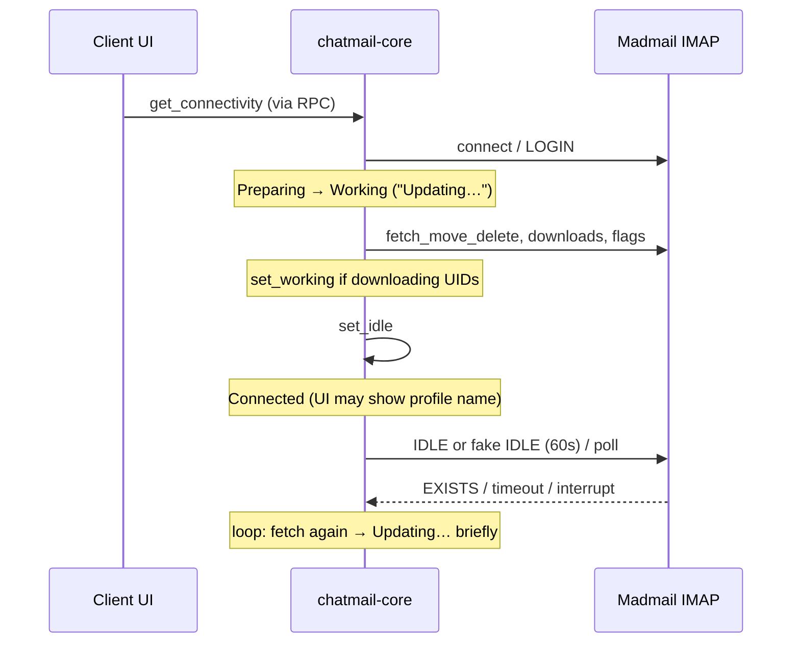

# Connectivity and the “Updating…” state

The status badge **“Updating…”** (stock string `DC_STR_UPDATING` / `StockMessage::Updating`) is **not** implemented in the Madmail Go server. It is computed on the **client device** by **chatmail-core** (vendored as `madmail/chatmail-core/`) and shown by Delta Chat / WebX / any UI that calls `get_connectivity()` over JSON-RPC.

Madmail’s role is to run a correct **IMAP/SMTP** endpoint so the core’s scheduler can connect, sync, and reach **idle**. Misconfigured or broken IMAP behavior on the server is a common reason the client **never** leaves “Updating…”.

**Primary sources (chatmail-core):**

| Area | Path |
|------|------|
| State machine + UI mapping | [`chatmail-core/src/scheduler/connectivity.rs`](../../chatmail-core/src/scheduler/connectivity.rs) |
| IMAP login / fetch / `set_working` | [`chatmail-core/src/imap.rs`](../../chatmail-core/src/imap.rs) |
| Inbox loop, `set_idle`, IDLE | [`chatmail-core/src/scheduler.rs`](../../chatmail-core/src/scheduler.rs), [`chatmail-core/src/imap/idle.rs`](../../chatmail-core/src/imap/idle.rs) |
| JSON-RPC API | [`chatmail-core/deltachat-jsonrpc/src/api.rs`](../../chatmail-core/deltachat-jsonrpc/src/api.rs) |
| Event | `ConnectivityChanged` in [`chatmail-core/src/events/payload.rs`](../../chatmail-core/src/events/payload.rs) |

**Madmail server (IMAP behavior that affects clients):**

| Area | Path |
|------|------|
| `auto_logout`, deadline floor for IDLE | [`internal/endpoint/imap/imap.go`](../../internal/endpoint/imap/imap.go) |
| Regression test for stuck “updating” | [`tests/imap_connection_lifecycle_test.go`](../../tests/imap_connection_lifecycle_test.go) |

---

## What the UI shows

`Context::get_connectivity()` returns one of four **ranges** (worst mailbox wins when several IMAP boxes exist — see [aggregation](#aggregation-across-folders-and-transports)):

| Value range | Enum | Typical UI |
|-------------|------|------------|
| 1000–1999 | `Connectivity::NotConnected` | “Not connected” / red |
| 2000–2999 | `Connectivity::Connecting` | “Connecting…” / yellow |
| **3000–3999** | **`Connectivity::Working`** | **“Updating…”** / spinner |
| ≥ 4000 | `Connectivity::Connected` | “Connected” (desktop) or **profile name** (mobile — idle is the normal state) |

The string **“Updating…”** is used in the **detailed** connectivity HTML for IMAP when the per-folder state is `Preparing` or `Working` (not for SMTP; SMTP uses “Sending…” for `Working`).

---

## Internal state machine (chatmail-core)

Each IMAP inbox and the SMTP pseudo-connection keep a `DetailedConnectivity` value. It is mapped to the coarse `Connectivity` enum for `get_connectivity()`:

```text
Detailed state          → get_connectivity()   → IMAP detail string
─────────────────────────────────────────────────────────────────────
Error                   → NotConnected         → localized error
Uninitialized           → NotConnected         → "Not started"
Connecting              → Connecting           → "Connecting…"
Preparing               → Working              → "Updating…"   ← right after IMAP LOGIN
Working                 → Working              → "Updating…"   ← while downloading
InterruptingIdle        → Working              → "Updating…"   ← IDLE broken, work pending
Idle                    → Connected            → "Connected"
```

Important design choice in core: **`Preparing` is intentionally mapped to `Working`**, so users see “Updating…” immediately after login instead of “Connected” before sync finishes:

```80:85:madmail/chatmail-core/src/scheduler/connectivity.rs
            // At this point IMAP has just connected,
            // but does not know yet if there are messages to download.
            // We still convert this to Working state
            // so user can see "Updating..." and not "Connected"
            // which is reserved for idle state.
            DetailedConnectivity::Preparing => Connectivity::Working,
```

`all_work_done()` is `true` only in `Idle` or `Error` — not while `Preparing` or `Working`. Tests and `wait_for_all_work_done()` rely on that.

---

## When “Updating…” **starts**

| Trigger | `set_*` | Where |
|---------|---------|--------|
| IMAP TCP/login begins | `set_connecting` | `imap.rs` `connect()` |
| IMAP LOGIN succeeds | `set_preparing` | `imap.rs` after `ImapConnected` event |
| At least one UID is being fetched in a batch | `set_working` | `imap.rs` `fetch_new_msg_batch()` when `uids_fetch` non-empty |
| SMTP is sending queued mail | `set_working` (SMTP side only; aggregate may still be Working) | `smtp.rs` |
| `maybe_network()` while folder was `Idle` | internal → `InterruptingIdle` (still **Working** at UI level) | `connectivity.rs` `idle_interrupted()` |

Quota refresh logs “Updating quota.” in the server log but **does not** change `DetailedConnectivity`; it only emits `ConnectivityChanged` so `get_connectivity_html()` can refresh quota bars (`quota.rs`).

---

## When “Updating…” **ends** (normal path)

For **incoming mail (IMAP)**, the badge leaves “Updating…” when the inbox loop finishes one **sync pass** and calls **`set_idle`** — **before** entering IMAP IDLE (or fake idle).

Sequence in one inbox iteration (`scheduler.rs`):



Concrete steps inside `inbox_fetch_idle()` → `fetch_idle()`:

1. Optional quota update (≤ once per minute per transport).
2. `fetch_move_delete()` — prefetch/download new mail, moves, deletes.
3. `download_known_post_messages_without_pre_message()`, `download_msgs()`.
4. `sync_seen_flags()` (errors logged, do not block idle).
5. **`connection.connectivity.set_idle(ctx)`** → UI should show **Connected** (or profile name).
6. Enter **IMAP IDLE** (RFC 2177), or **fake idle** (60 s sleep) if IDLE unsupported/disabled.

While the session sits in **IDLE**, detailed state is `Idle` → **not** “Updating…”.

The next mail or interrupt ends IDLE, runs fetch again, and briefly returns to **Preparing/Working** until `set_idle` runs again.

### API the client must use

| Call / event | Purpose |
|--------------|---------|
| `get_connectivity(account_id)` | Returns `3000`–`3999` while “Updating…” |
| `ConnectivityChanged` event | UI should **re-query** `get_connectivity()` (and optionally `get_connectivity_html()`) |
| `maybe_network()` | Hints core that network is back; marks idle folders `InterruptingIdle` so sync runs again |
| `wait_for_all_work_done()` | Blocks until all folders + SMTP report `all_work_done()` (tests, not typical UI) |

Madmail Go code **does not** implement or proxy these APIs; they live entirely in the client process (Delta Chat + embedded `chatmail-core` / `deltachat-rpc`).

---

## Aggregation across folders and transports

`get_connectivity()` collects each mailbox’s `ConnectivityStore` and takes the **minimum** (worst) value:

```243:253:madmail/chatmail-core/src/scheduler/connectivity.rs
    pub fn get_connectivity(&self) -> Connectivity {
        let stores = self.connectivities.lock().clone();
        let mut connectivities = Vec::new();
        for s in stores {
            let connectivity = s.get_basic();
            connectivities.push(connectivity);
        }
        connectivities
            .into_iter()
            .min()
            .unwrap_or(Connectivity::NotConnected)
    }
```

So **one** stuck inbox on a multi-folder or multi-transport account keeps the whole account on **“Updating…”** (or worse) until that folder reaches `Idle`.

---

## Madmail server: what we control

Madmail does not set client connectivity flags. It only affects whether the core can complete a sync pass and call `set_idle`.

### IMAP `auto_logout` and IDLE

go-imap enforces **`MinAutoLogout` = 30 minutes**. If `imap { auto_logout … }` is set **below** 30m, Madmail **does not** shorten read deadlines below that floor, so Delta Chat IDLE is not broken by aggressive TCP timeouts:

```116:120:madmail/internal/endpoint/imap/imap.go
	// go-imap enforces a minimum of MinAutoLogout (30m) for inactivity. If we
	// let operators cap deadlines below that, SetDeadline is truncated (e.g.
	// 2m) and IMAP IDLE (RFC 2177) and keep-alives for clients like Delta Chat
	// break: repeated timeouts, "updating" with no real progress, reconnect
	// thrash. Never shorten a deadline to less than the IMAP server minimum.
```

See `TestIMAP_AutoLogoutBelowMin_DoesNotDropIdleConnection` in [`tests/imap_connection_lifecycle_test.go`](../../tests/imap_connection_lifecycle_test.go).

### Other server-side factors

| Factor | Effect on client “Updating…” |
|--------|--------------------------------|
| Slow/large messages | Longer in `Working` during `fetch_new_msg_batch` |
| IMAP errors / dropped connections | `fetch_idle` fails **before** `set_idle`; loop reconnects; can flicker or stay on Updating/Connecting |
| Missing or broken IDLE | Core uses **fake idle** (60 s); more periodic full syncs, more time in Preparing/Working |
| Ban/reload (`SIGUSR2`) | [`closeConnsForBlocklistedIMAPUsers`](../../internal/endpoint/imap/imap.go) closes sessions; client reconnects |
| Storage latency / lock contention | Longer fetch pass |
| Quota / many folders | Extra work before `set_idle` |

Core-side IDLE client timeout: **`IDLE_TIMEOUT` = 5 minutes** without server traffic (`imap/idle.rs`); server keepalives (e.g. Dovecot “Still here”) should arrive more often. Madmail’s go-imap backend should emit appropriate IDLE behavior when extensions are enabled.

---

## When the client **still** shows “Updating…”

These are the main situations where `get_connectivity()` stays in **3000–3999** even though the user expects “done”.

### 1. Sync pass never reaches `set_idle`

`set_idle` runs only at the **end** of `fetch_idle()`. If anything **before** that returns `Err` (IMAP protocol error, timeout, TLS reset, folder select failure), **`set_idle` is not called**.

**Madmail fork fix (scheduler):** On `inbox_fetch_idle` error, the inbox loop calls `connection.connectivity.set_err(&ctx, …)` so `get_connectivity()` becomes **`NotConnected`** and the UI shows the error instead of staying on **“Updating…”** during reconnect/backoff (up to ~120 s). See [`scheduler.rs`](../../chatmail-core/src/scheduler.rs) `inbox_loop` error arm.

**Symptoms (if fix not deployed):** Spinner for a long time; connectivity HTML may still show green dot with “Updating…” for that host.

**Check:** Client/core logs for `Failed inbox fetch_idle`, IMAP errors; server IMAP logs; network path.

### 2. Endless reconnect thrash (server or network)

Repeated connect → `Preparing` → disconnect before `set_idle` looks like **permanent “Updating…”** or alternating Connecting/Updating.

**Common Madmail misconfig:** `auto_logout` intended to be short — mitigated by deadline floor, but other proxies/firewalls may still kill idle TCP.

### 3. Continuous download work

Large backlog, many UIDs, or `download_msgs` / post-message paths keep the loop busy. `set_working` is set when batches download; user stays on Updating until the whole `fetch_idle` completes.

### 4. One bad folder in a multi-mailbox account

Worst-state wins: inbox idle but another watched folder stuck in `Preparing`/`Working` → account still **Updating**.

### 5. `maybe_network()` / `InterruptingIdle`

When the OS tells the app the network returned, core marks idle folders `InterruptingIdle`. User-facing level stays **Working** until the next successful fetch and `set_idle`. No extra `ConnectivityChanged` is emitted for that internal transition alone; the next state change still comes from normal `set_*` calls.

### 6. IO stopped or scheduler not started

If `start_io` failed or IO was stopped, connectivity stores may be empty or `Uninitialized` → **Not connected**, not Updating. Paused IO (`SchedulerState::pause`) stops the scheduler until guards drop.

### 7. UI not handling `ConnectivityChanged`

If the client caches the label and **does not** call `get_connectivity()` after event **2100** / `ConnectivityChanged`, the badge can be **stale** even though core is already `Connected`. That is a **client bug**, not server state.

### 8. Confusion with log line “Updating quota.”

Server log / `Info` event `src/quota.rs:129: Transport N: Updating quota.` is **quota refresh**, not the stock UI string. Quota update triggers `ConnectivityChanged` for the HTML view only.

---

## Error and edge paths (quick reference)

| Condition | Typical `get_connectivity()` | User-visible detail |
|-----------|------------------------------|---------------------|
| Login failed | `NotConnected` | Error from `set_err` |
| `maybe_network_lost()` | `NotConnected` | “Connection lost” |
| Connected, in IDLE | `Connected` | Profile name / “Connected” in HTML |
| Just logged in, syncing | `Working` | “Updating…” |
| Downloading messages | `Working` | “Updating…” |
| SMTP sending | Inbox may be `Connected`; aggregate can be `Working` if SMTP worse | Mixed in HTML |

SMTP **does not** use the “Updating…” string; it uses “Sending…” when `Working`.

---

## Debugging checklist

**On the client (core logs / RPC):**

1. Call `get_connectivity(account_id)` — is it `3000–3999`?
2. Open `get_connectivity_html(account_id)` — which transport/folder line says “Updating…”?
3. Listen for `ConnectivityChanged` and re-query after each event.
4. Look for `ImapConnected`, `Failed inbox fetch_idle`, `IMAP-fake-IDLE`, `Idle has NewData`.

**On Madmail:**

1. Confirm `imap` block: `auto_logout` not fighting IDLE (see test above).
2. IMAP logs / `io_debug` for disconnect reasons during sync.
3. Message size, folder count, storage errors.
4. After ban: expect disconnect and client reconnect.

**Sanity:** After a quiet period with no new mail, one successful idle cycle should yield **`get_connectivity() >= 4000`** until the next sync or network interrupt.

---

## Affected files inventory

Every path below may influence **“Updating…”**, **IMAP IDLE**, or **how long the client stays in `Connectivity::Working`**. Paths are relative to the **`madmail/`** tree unless noted.

**Regenerate a single-file bundle** (this doc + all listed sources + all project `docs/**/*.md`):

```bash
bash docs/code/build-context-connectivity.sh
```

Output: [`docs/code/context-connectivity.txt`](./context-connectivity.txt).

### Tier legend

| Tier | Meaning |
|------|---------|
| **A** | Defines connectivity state, API, events, or stock string “Updating…” |
| **B** | Inbox/SMTP loop, IMAP session, fetch/idle — determines when `set_idle` runs |
| **C** | Madmail IMAP stack, storage NOTIFY, tests — server-side IDLE/sync behavior |
| **D** | Bindings, clients, automated tests — observe or drive connectivity |
| **E** | Tangential — log text “updating”, docs, or distant mail path (longer sync) |

---

### A — chatmail-core: connectivity model and API

| File | Tier | Role |
|------|------|------|
| [`chatmail-core/src/scheduler/connectivity.rs`](../../chatmail-core/src/scheduler/connectivity.rs) | A | `DetailedConnectivity`, `Connectivity`, `set_*`, `get_connectivity()`, HTML, `all_work_done`, `idle_interrupted`, `maybe_network_lost` |
| [`chatmail-core/src/stock_str.rs`](../../chatmail-core/src/stock_str.rs) | A | `StockMessage::Updating` / `updating()` → localized **“Updating…”** |
| [`chatmail-core/src/context.rs`](../../chatmail-core/src/context.rs) | A | Re-exports `Connectivity`; `connectivities` mutex; `wait_for_all_work_done()` |
| [`chatmail-core/src/events/payload.rs`](../../chatmail-core/src/events/payload.rs) | A | `EventType::ConnectivityChanged`, `ImapConnected`, `ImapInboxIdle` |
| [`chatmail-core/deltachat-jsonrpc/src/api.rs`](../../chatmail-core/deltachat-jsonrpc/src/api.rs) | A | `get_connectivity`, `get_connectivity_html`, `maybe_network` RPC |
| [`chatmail-core/deltachat-jsonrpc/src/api/types/events.rs`](../../chatmail-core/deltachat-jsonrpc/src/api/types/events.rs) | A | JSON-RPC `ConnectivityChanged` event mapping |
| [`chatmail-core/deltachat-ffi/src/lib.rs`](../../chatmail-core/deltachat-ffi/src/lib.rs) | A | `dc_get_connectivity`, `dc_get_connectivity_html`, event id 2100 |
| [`chatmail-core/deltachat-ffi/deltachat.h`](../../chatmail-core/deltachat-ffi/deltachat.h) | A | C ABI: `DC_STR_UPDATING`, connectivity ranges, `DC_EVENT_CONNECTIVITY_CHANGED` |
| [`chatmail-core/deltachat-repl/src/cmdline.rs`](../../chatmail-core/deltachat-repl/src/cmdline.rs) | A | REPL `connectivity` command → writes HTML snapshot |
| [`chatmail-core/deltachat-repl/src/main.rs`](../../chatmail-core/deltachat-repl/src/main.rs) | D | Registers `connectivity` in help |
| [`chatmail-core/deltachat-rpc-server/src/main.rs`](../../chatmail-core/deltachat-rpc-server/src/main.rs) | D | RPC process hosting JSON-RPC (events to UI) |
| [`chatmail-core/src/config.rs`](../../chatmail-core/src/config.rs) | A | `DisableIdle`, proxy flags → emit `ConnectivityChanged` on change |
| [`chatmail-core/src/accounts.rs`](../../chatmail-core/src/accounts.rs) | A | `maybe_network` / `maybe_network_lost` across accounts |

---

### B — chatmail-core: scheduler and IMAP sync loop

| File | Tier | Role |
|------|------|------|
| [`chatmail-core/src/scheduler.rs`](../../chatmail-core/src/scheduler.rs) | B | `inbox_loop`, `inbox_fetch_idle`, `fetch_idle`, **`set_idle`**, `maybe_network`, IO start/stop → `ConnectivityChanged` |
| [`chatmail-core/src/imap.rs`](../../chatmail-core/src/imap.rs) | B | `set_connecting` / `set_preparing` / `set_working` / `set_err`; connect, `fetch_move_delete`, `fetch_new_messages`, downloads |
| [`chatmail-core/src/imap/idle.rs`](../../chatmail-core/src/imap/idle.rs) | B | RFC IDLE + `fake_idle` (60s); `IDLE_TIMEOUT` (5 min) |
| [`chatmail-core/src/imap/session.rs`](../../chatmail-core/src/imap/session.rs) | B | Session commands: fetch, idle handle, folder select |
| [`chatmail-core/src/imap/select_folder.rs`](../../chatmail-core/src/imap/select_folder.rs) | B | Folder select / UIDVALIDITY (sync prerequisites) |
| [`chatmail-core/src/imap/client.rs`](../../chatmail-core/src/imap/client.rs) | B | TCP/TLS connect to server (login path) |
| [`chatmail-core/src/imap/capabilities.rs`](../../chatmail-core/src/imap/capabilities.rs) | B | IDLE / COMPRESS / QUOTA capability detection |
| [`chatmail-core/src/imap/imap_tests.rs`](../../chatmail-core/src/imap/imap_tests.rs) | D | Unit tests around IMAP session |
| [`chatmail-core/src/smtp.rs`](../../chatmail-core/src/smtp.rs) | B | SMTP `set_connecting` / `set_working` / `set_idle` (aggregate connectivity) |
| [`chatmail-core/src/quota.rs`](../../chatmail-core/src/quota.rs) | B | Quota fetch before idle; **`ConnectivityChanged`** (HTML refresh, not state) |
| [`chatmail-core/src/download.rs`](../../chatmail-core/src/download.rs) | B | Deferred / large message downloads during sync pass |
| [`chatmail-core/src/net.rs`](../../chatmail-core/src/net.rs) | B | `TIMEOUT` used when leaving IDLE (vs `IDLE_TIMEOUT`) |
| [`chatmail-core/src/configure.rs`](../../chatmail-core/src/configure.rs) | B | `start_io()` after account setup (scheduler must run) |
| [`chatmail-core/src/context/context_tests.rs`](../../chatmail-core/src/context/context_tests.rs) | D | Core tests touching scheduler/connectivity |

---

### B — chatmail-core: message ingest (extends “Working” duration)

| File | Tier | Role |
|------|------|------|
| [`chatmail-core/src/receive_imf.rs`](../../chatmail-core/src/receive_imf.rs) | E | Parses fetched mail into DB during IMAP download (slow path = longer Updating) |
| [`chatmail-core/src/imex/transfer.rs`](../../chatmail-core/src/imex/transfer.rs) | E | Import/export may call `wait_for_all_work_done()` via context |

---

### C — Madmail server (Go): IMAP endpoint and storage

| File | Tier | Role |
|------|------|------|
| [`internal/endpoint/imap/imap.go`](../../internal/endpoint/imap/imap.go) | C | Listener, **`auto_logout`**, `deadlineCapConn` / `MinAutoLogout`, ban reload closes sessions |
| [`internal/go-imap-sql/delivery.go`](../../internal/go-imap-sql/delivery.go) | C | Delivery + IMAP update notifications (IDLE wakeups) |
| [`internal/go-imap-sql/backend.go`](../../internal/go-imap-sql/backend.go) | C | IMAP backend wiring |
| [`internal/go-imap-sql/mailbox.go`](../../internal/go-imap-sql/mailbox.go) | C | Mailbox state; session cleanup (see lifecycle doc) |
| [`internal/go-imap-sql/user.go`](../../internal/go-imap-sql/user.go) | C | Per-user IMAP session hooks |
| [`internal/go-imap-sql/flags.go`](../../internal/go-imap-sql/flags.go) | C | Flag updates (sync_seen_flags path on client) |
| [`internal/go-imap-mess/mailbox.go`](../../internal/go-imap-mess/mailbox.go) | C | Message store / updates for IMAP |
| [`internal/go-imap-mess/sequpdate.go`](../../internal/go-imap-mess/sequpdate.go) | C | Sequence updates (EXISTS / FETCH visibility) |
| [`internal/cli/ctl/install.go`](../../internal/cli/ctl/install.go) | C | Install templates often set `imap { auto_logout … }` |
| [`internal/cli/ctl/maddy.conf.j2`](../../internal/cli/ctl/maddy.conf.j2) | C | Default `imap` / `storage.imapsql` blocks in deployments |
| [`maddy.conf`](../../maddy.conf) | C | Example `imap` endpoint configuration |
| [`framework/hooks/hooks.go`](../../framework/hooks/hooks.go) | C | `EventReload` → IMAP session teardown on ban |
| [`internal/endpoint/chatmail/chatmail.go`](../../internal/endpoint/chatmail/chatmail.go) | E | HTTP/chatmail; indirect (same process, mail delivery → IMAP EXISTS) |
| [`internal/endpoint/webimap/`](../../internal/endpoint/webimap/) | E | WebIMAP alternative client path (not Delta Chat badge, same storage) |
| [`internal/target/remote/remote.go`](../../internal/target/remote/remote.go) | E | Outbound delivery latency before mail appears in INBOX |

**Dependency (not in-tree):** `github.com/foxcpp/go-imap` — `MinAutoLogout`, `Server.Serve`, per-connection goroutines ([`docs/imap-connection-lifecycle.md`](../imap-connection-lifecycle.md)).

---

### D — Tests and tooling

| File | Tier | Role |
|------|------|------|
| [`tests/imap_connection_lifecycle_test.go`](../../tests/imap_connection_lifecycle_test.go) | D | **`TestIMAP_AutoLogoutBelowMin_DoesNotDropIdleConnection`** — stuck “updating” regression |
| [`tests/deltachat-test/scenarios/test_12_smtp_imap_idle.py`](../../tests/deltachat-test/scenarios/test_12_smtp_imap_idle.py) | D | SMTP → IMAP IDLE notification |
| [`tests/cmlxc/src/relay_minitest/scenarios/test_12_smtp_imap_idle.py`](../../tests/cmlxc/src/relay_minitest/scenarios/test_12_smtp_imap_idle.py) | D | Relay variant of IDLE e2e |
| [`tests/deltachat-test/scenarios/test_01_account_creation.py`](../../tests/deltachat-test/scenarios/test_01_account_creation.py) | D | Account + IMAP setup |
| [`tests/deltachat-test/scenarios/test_13_concurrent_profiles.py`](../../tests/deltachat-test/scenarios/test_13_concurrent_profiles.py) | D | Concurrent IMAP clients |
| [`tests/deltachat-test/scenarios/test_07_federation.py`](../../tests/deltachat-test/scenarios/test_07_federation.py) | D | Federation delivery → sync |
| [`tests/deltachat-test/main.py`](../../tests/deltachat-test/main.py) | D | Test harness |
| [`tests/deltachat-test/cmping.py`](../../tests/deltachat-test/cmping.py) | D | Connectivity probe helper |
| [`tests/test-client/main.go`](../../tests/test-client/main.go) | D | Minimal IMAP connectivity handshake |
| [`scripts/goroutine_idle_experiment.sh`](../../scripts/goroutine_idle_experiment.sh) | D | IMAP idle / goroutine experiment script |
| [`chatmail-core/python/tests/test_1_online.py`](../../chatmail-core/python/tests/test_1_online.py) | D | **`test_connectivity`** — WORKING ↔ CONNECTED transitions |
| [`chatmail-core/python/tests/test_3_offline.py`](../../chatmail-core/python/tests/test_3_offline.py) | D | Offline / IO stop |
| [`chatmail-core/python/tests/test_4_lowlevel.py`](../../chatmail-core/python/tests/test_4_lowlevel.py) | D | Low-level IMAP / IDLE tests |
| [`chatmail-core/python/tests/test_0_complex_or_slow.py`](../../chatmail-core/python/tests/test_0_complex_or_slow.py) | D | Slow sync scenarios |
| [`chatmail-core/deltachat-rpc-client/tests/test_something.py`](../../chatmail-core/deltachat-rpc-client/tests/test_something.py) | D | RPC tests (may touch IO) |
| [`chatmail-core/deltachat-rpc-client/tests/test_multitransport.py`](../../chatmail-core/deltachat-rpc-client/tests/test_multitransport.py) | D | Multi-transport connectivity HTML |
| [`chatmail-core/deltachat-rpc-client/tests/test_folders.py`](../../chatmail-core/deltachat-rpc-client/tests/test_folders.py) | D | Folder sync |
| [`chatmail-core/deltachat-jsonrpc/typescript/test/online.ts`](../../chatmail-core/deltachat-jsonrpc/typescript/test/online.ts) | D | TS online / connectivity tests |

---

### D — Client bindings (UI must use these)

| File | Tier | Role |
|------|------|------|
| [`chatmail-core/python/src/deltachat/account.py`](../../chatmail-core/python/src/deltachat/account.py) | D | `get_connectivity()`, `get_connectivity_html()` |
| [`chatmail-core/python/src/deltachat/events.py`](../../chatmail-core/python/src/deltachat/events.py) | D | `wait_for_connectivity`, `wait_for_connectivity_change` |
| [`chatmail-core/python/src/deltachat/testplugin.py`](../../chatmail-core/python/src/deltachat/testplugin.py) | D | Test fixtures / event tracker |
| [`chatmail-core/deltachat-rpc-client/src/deltachat_rpc_client/account.py`](../../chatmail-core/deltachat-rpc-client/src/deltachat_rpc_client/account.py) | D | RPC account wrapper |
| [`chatmail-core/deltachat-rpc-client/src/deltachat_rpc_client/deltachat.py`](../../chatmail-core/deltachat-rpc-client/src/deltachat_rpc_client/deltachat.py) | D | Top-level RPC client |
| [`chatmail-core/deltachat-rpc-client/src/deltachat_rpc_client/const.py`](../../chatmail-core/deltachat-rpc-client/src/deltachat_rpc_client/const.py) | D | `DC_CONNECTIVITY_*` constants |
| [`chatmail-core/deltachat-rpc-client/src/deltachat_rpc_client/rpc.py`](../../chatmail-core/deltachat-rpc-client/src/deltachat_rpc_client/rpc.py) | D | Event stream |
| [`chatmail-core/deltachat-rpc-client/src/deltachat_rpc_client/client.py`](../../chatmail-core/deltachat-rpc-client/src/deltachat_rpc_client/client.py) | D | Multi-account RPC |
| [`chatmail-core/deltachat-rpc-client/src/deltachat_rpc_client/pytestplugin.py`](../../chatmail-core/deltachat-rpc-client/src/deltachat_rpc_client/pytestplugin.py) | D | Pytest plugin |

**Note:** Delta Chat / WebX UI code lives **outside** this repo; those apps embed `chatmail-core` and must handle `ConnectivityChanged`.

---

### E — Tangential (grep “updating” / connectivity wording, not the badge)

| File | Tier | Why listed |
|------|------|------------|
| [`chatmail-core/src/sql.rs`](../../chatmail-core/src/sql.rs) | E | Migration error text “Updating Delta Chat failed” |
| [`chatmail-core/src/reaction.rs`](../../chatmail-core/src/reaction.rs) | E | Spec comment “Updating reactions” |
| [`chatmail-core/src/provider/data.rs`](../../chatmail-core/src/provider/data.rs) | E | Provider hint mentions “connectivity issues” |
| [`chatmail-core/src/peer_channels.rs`](../../chatmail-core/src/peer_channels.rs) | E | P2P “connectivity” (unrelated to IMAP badge) |
| [`chatmail-core/CHANGELOG.md`](../../chatmail-core/CHANGELOG.md) | E | Historical connectivity changes |
| [`Makefile`](../../Makefile) | E | “Updating local instance” install target |
| [`internal/target/remote/security.go`](../../internal/target/remote/security.go) | E | Log “updating MTA-STS cache” |

Submodule **not** in default `build-context-connectivity.sh` glob: `admin-web/` (no connectivity API).

---

### Documentation (project)

| File | Tier | Role |
|------|------|------|
| [`docs/code/connectivity-updating.md`](./connectivity-updating.md) | A | This document |
| [`docs/code/README.md`](./README.md) | — | Index |
| [`docs/code/message-incoming.md`](./message-incoming.md) | C | Mail → storage → IMAP NOTIFY |
| [`docs/code/runtime.md`](./runtime.md) | C | Reload, signals, IMAP ban close |
| [`docs/code/modules.md`](./modules.md) | C | `go-imap-sql`, IDLE |
| [`docs/code/startup-and-config.md`](./startup-and-config.md) | C | Boot, `imap` module load |
| [`docs/code/overview.md`](./overview.md) | — | Repo map |
| [`docs/code/architecture.md`](./architecture.md) | — | Module system |
| [`docs/code/chatmail.md`](./chatmail.md) | E | HTTP endpoint (delivery side) |
| [`docs/code/goroutines.md`](./goroutines.md) | C | Listener / worker goroutines |
| [`docs/imap-connection-lifecycle.md`](../imap-connection-lifecycle.md) | C | IMAP TCP/session lifecycle |
| [`docs/chatmail/e2e_test.md`](../chatmail/e2e_test.md) | D | E2E catalog incl. IDLE test |
| [`docs/reference/endpoints/imap.md`](../reference/endpoints/imap.md) | C | `imap` directive reference |
| [`docs/reference/storage/imapsql.md`](../reference/storage/imapsql.md) | C | Storage behind IMAP |
| [`docs/internals/specifications.md`](../internals/specifications.md) | C | RFC 2177 IDLE |
| [`docs/chatmail/webimap.md`](../chatmail/webimap.md) | E | WebSocket / WebIMAP (network caveats) |
| [`docs/chatmail/quota.md`](../chatmail/quota.md) | E | Server quota vs core quota HTML |
| [`docs/chatmail/RELAY.md`](../chatmail/RELAY.md) | E | “network connectivity” troubleshooting |
| Remaining [`docs/**/*.md`](../index.md) | — | Embedded in full context bundle (see script) |

All other `docs/**/*.md` files are included in **`context-connectivity.txt`** so agents have full project doc context when debugging this issue.

---

## Related docs (quick links)

- [message-incoming.md](./message-incoming.md) — how mail reaches storage (IMAP IDLE mentioned).
- [runtime.md](./runtime.md) — process signals, IMAP reload on ban.
- [imap-connection-lifecycle.md](../imap-connection-lifecycle.md) — Madmail IMAP goroutines and disconnect.
- E2E: [docs/chatmail/e2e_test.md](../chatmail/e2e_test.md) — IMAP IDLE scenario.
- User-facing IMAP: [docs/chatmail/webimap.md](../chatmail/webimap.md) (WebIMAP path; native clients use standard IMAP).
