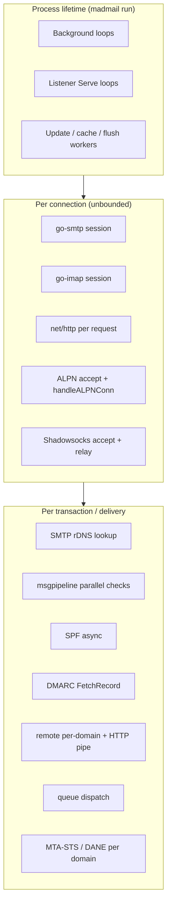

# Goroutine inventory

Catalog of **explicit `go` statements** in the main Madmail tree (excluding git submodules and `*_test.go`). Third-party servers (`github.com/emersion/go-smtp`, `github.com/foxcpp/go-imap`) spawn additional per-connection goroutines inside their `Serve` loops; those are summarized at the end.

For process lifecycle and shutdown, see [runtime.md](./runtime.md).

## Lifecycle categories



| Category | Started when | Stops when | Typical count |
|----------|--------------|------------|---------------|
| **Background** | Module `Init` / storage open | Process exit (no explicit stop on some loops) | Fixed, ~15–25 at steady state |
| **Listener** | Endpoint binds address | `Close()` / listener closed | 1 per bound address per protocol |
| **Per-connection** | `Accept` / HTTP request | Connection close | Scales with clients |
| **Per-work-unit** | MAIL/DATA, queue slot, outbound domain | Work completes | Bursty |

## Process and signals

| Location | Goroutine | Purpose | Shutdown |
|----------|-----------|---------|----------|
| [`maddy.go`](../../maddy.go) `initDebug` | pprof HTTP server | `ListenAndServe` on `--debug.pprof` | Process exit |
| [`signal.go`](../../signal.go) | Nested `handleSignals` | Second SIGINT/SIGTERM → `os.Exit(1)` | N/A (exits process) |
| [`signal_nonposix.go`](../../signal_nonposix.go) | Same pattern | Windows/plan9 | N/A |

Main thread blocks in `handleSignals()` until first shutdown signal, then runs `hooks.EventShutdown` ([`maddy.go`](../../maddy.go) `moduleMain`).

## Endpoints (listeners)

Each bound address starts one long-lived `go func() { serv.Serve(l) }` (or ALPN multiplex loop).

| Module | File | Goroutine | Notes |
|--------|------|-----------|-------|
| **smtp** | [`internal/endpoint/smtp/smtp.go`](../../internal/endpoint/smtp/smtp.go) | `setupListeners` → `endp.serv.Serve(l)` | One per listener; `listenersWg` on shutdown |
| **imap** | [`internal/endpoint/imap/imap.go`](../../internal/endpoint/imap/imap.go) | Same pattern | `Close()` waits on `listenersWg` |
| **chatmail** | [`internal/endpoint/chatmail/chatmail.go`](../../internal/endpoint/chatmail/chatmail.go) | HTTP(S) `e.serv.Serve` per address | Optional ALPN path below |
| **openmetrics** | [`internal/endpoint/openmetrics/om.go`](../../internal/endpoint/openmetrics/om.go) | Metrics HTTP | `listenersWg` |
| **turn** | [`internal/endpoint/turn/turn.go`](../../internal/endpoint/turn/turn.go) | TURN `Listen` per address | Stops with endpoint `Close` |

### Chatmail HTTP — ALPN multiplex (TLS single port)

When SMTP/IMAP modules are colocated on the chatmail TLS listener ([`serveALPNMultiplexed`](../../internal/endpoint/chatmail/chatmail.go)):

| Goroutine | Role |
|-----------|------|
| SMTP `Serve(smtpL)` | Internal SMTP on sniffed connections |
| IMAP `Serve(imapL)` | Internal IMAP on sniffed connections |
| HTTP `Serve(tls.NewListener(httpL, …))` | Chatmail admin, mxdeliv, static, etc. |
| Main accept loop | `Accept` → **`go handleALPNConn`** per TCP connection |

`handleALPNConn` peeks ALPN (`smtp` / `imap` / default HTTP) and hands the connection to the right channel.

### Chatmail — optional Shadowsocks / Xray

Started from chatmail `Init` when configured ([`chatmail.go`](../../internal/endpoint/chatmail/chatmail.go), [chatmail.md](./chatmail.md)):

| Goroutine | Role | Spawns |
|-----------|------|--------|
| `runShadowsocks` → `runShadowsocksInternal` | Raw TCP SS on `ss_addr` | Accept loop |
| Accept loop | `for { Accept → go handler }` | **Per client** |
| Per-client handler | Decode target, dial local port | **`go io.Copy(remote, cConn)`** for one direction; main goroutine does reverse copy |
| `runXrayGRPC` / `runXrayWS` | Embedded Xray transports | Long-lived (implementation in same file) |

## Chatmail background workers

| Location | Function | Interval / trigger | Purpose |
|----------|----------|-------------------|---------|
| [`exchanger.go`](../../internal/endpoint/chatmail/exchanger.go) | `runExchangerPoller` | 1s ticker (after 10s sleep) | Poll enabled exchangers, inject mail via pipeline |
| [`chatmail.go`](../../internal/endpoint/chatmail/chatmail.go) | anonymous loop | 15s | Auto-purge read IMAP messages when enabled |

## Federation and admin

| Location | Goroutine | Purpose |
|----------|-----------|---------|
| [`federationtracker/tracker.go`](../../internal/federationtracker/tracker.go) | `StartFlusher` | Every 30s UPSERT federation stats to DB (started from chatmail init when GORM available) |
| [`api/admin/admin.go`](../../internal/api/admin/admin.go) | `NewHandler` | Every 5m prune stale admin API rate-limit map entries |
| [`api/admin/resources/status.go`](../../internal/api/admin/resources/status.go) | `RestartHandler` | After POST `/admin/restart`: sleep 500ms → `systemctl restart` |

## Message pipeline (inbound checks)

| Location | When | Goroutine | Purpose |
|----------|------|-----------|---------|
| [`msgpipeline/check_runner.go`](../../internal/msgpipeline/check_runner.go) | Each `runAndMergeResults` | One per `CheckState` in the batch | Run checks in parallel; merge auth results / headers under mutex |
| [`check/spf/spf.go`](../../internal/check/spf/spf.go) | `CheckConnection` (async mode) | SPF DNS evaluation | Result on `spfFetch` channel |
| [`dmarc/verifier.go`](../../internal/dmarc/verifier.go) | `FetchRecord` | DMARC DNS policy lookup | Result on `fetchCh` |

## Outbound delivery

| Location | When | Goroutine | Purpose |
|----------|------|-----------|---------|
| [`target/remote/remote.go`](../../internal/target/remote/remote.go) | `BodyNonAtomic` | **One per recipient domain** | HTTP `/mxdeliv` then SMTP fallback; updates `federationtracker` |
| [`target/remote/remote.go`](../../internal/target/remote/remote.go) | `doHTTPRequestURL` | Pipe writer | Stream RFC822 header + body into `io.Pipe` for `http.Client` |
| [`target/remote/security.go`](../../internal/target/remote/security.go) | `mtastsDelivery.PrepareDomain` | MTA-STS policy fetch | `future` for `CheckMX` |
| [`target/remote/security.go`](../../internal/target/remote/security.go) | `daneDelivery.PrepareConn` | TLSA lookup via extended resolver | `future` for TLS handshake |
| [`target/remote/security.go`](../../internal/target/remote/security.go) | `StartUpdater` → `updater` | 12h MTA-STS cache refresh | **Not started from `Init` in production** — only tests call `StartUpdater()` today |

### Queue

| Location | Goroutine | Purpose |
|----------|-----------|---------|
| [`target/queue/timewheel.go`](../../internal/target/queue/timewheel.go) | `tick()` | Single scheduler; fires `dispatch` at retry time |
| [`target/queue/queue.go`](../../internal/target/queue/queue.go) | `dispatch` → `go func()` | **One per due queue slot** (semaphore-limited) | Open spool, call downstream target, reschedule or drop |

`deliveryWg` on the queue module is waited during shutdown so in-flight dispatches can finish.

## SMTP session (per connection)

| Location | When | Goroutine | Purpose |
|----------|------|-----------|---------|
| [`endpoint/smtp/smtp.go`](../../internal/endpoint/smtp/smtp.go) | `newSession` if resolver configured | `fetchRDNSName` | Reverse DNS for `ConnState.RDNSName` (`future`); cancelled on session end |

go-smtp runs the session state machine in the **connection goroutine** (library); madmail only adds rDNS.

## Storage (imapsql + go-imap-sql)

| Location | Condition | Goroutine | Purpose |
|----------|-----------|-----------|---------|
| [`storage/imapsql/imapsql.go`](../../internal/storage/imapsql/imapsql.go) | `retention > 0` | `cleanupLoop` | Hourly `PruneMessages` |
| same | `unused_account_retention > 0` | `cleanupUnusedAccountsLoop` | Hourly unused account prune |
| same | always after quota init | `flushMessageCounters` | Every 30s persist sent/received/outbound counters |
| same | `enable_update_pipe` | update push loop | `select` inbound external updates / outbound `Push` to unix or Postgres pubsub |
| [`go-imap-sql/backend.go`](../../internal/go-imap-sql/backend.go) | sqlite driver | `sqliteOptimizeLoop` | Every 5h `PRAGMA optimize`; stopped via `sqliteOptimizeLoopStop` on `Close` |

### IMAP replication pipe

| Component | Goroutines |
|-----------|------------|
| [`updatepipe/unix_pipe.go`](../../internal/updatepipe/unix_pipe.go) | `Listen`: accept loop; **`go readUpdates` per peer** |
| [`updatepipe/pubsub/pq.go`](../../internal/updatepipe/pubsub/pq.go) | Forward `pq.Listener.Notify` → app channel |
| [`updatepipe/pubsub_pipe.go`](../../internal/updatepipe/pubsub_pipe.go) | Consume pubsub messages, parse into `mess.Update` |

## TLS, tables, limits, SMTP pool

| Module | File | Goroutine | Purpose |
|--------|------|-----------|---------|
| **tls.file** | [`internal/tls/file.go`](../../internal/tls/file.go) | `reloadTicker` | Minute tick reload certs from disk |
| **tls.autocert** | [`internal/tls/autocert.go`](../../internal/tls/autocert.go) | HTTP-01 challenge server | Port 80 ACME |
| **table.file** | [`internal/table/file.go`](../../internal/table/file.go) | `reloader` | 15s mtime check + `EventReload` force |
| **limits** | [`internal/limits/limiters/rate.go`](../../internal/limits/limiters/rate.go) | `fill` | Token bucket refill per rate limiter instance |
| **smtpconn.pool** | [`internal/smtpconn/pool/pool.go`](../../internal/smtpconn/pool/pool.go) | `cleanUpTick` | Minute stale connection sweep |
| same | | `go conn.Close()` | Non-blocking close during cleanup / return when pool full |

## WebIMAP (HTTP JSON + WebSocket)

| Location | When | Goroutine | Purpose |
|----------|------|-----------|---------|
| [`endpoint/webimap/webimap.go`](../../internal/endpoint/webimap/webimap.go) | List/fetch handlers | `ListMessages` on channel | Avoid blocking HTTP handler on IMAP backend |
| [`endpoint/webimap/websocket.go`](../../internal/endpoint/webimap/websocket.go) | WS session | Read loop | Parse JSON commands; main goroutine runs push/ping tickers |
| same | `fetchMessageBody` | Short-lived fetch | Single message body for WS `fetch` |

## Authentication

| Location | When | Goroutine | Purpose |
|----------|------|-----------|---------|
| [`auth/pass_table/table.go`](../../internal/auth/pass_table/table.go) | Successful auth with legacy hash | `SetUserPassword` | Opportunistic re-hash to default algorithm (fire-and-forget) |

## CLI (short-lived process)

Not part of `madmail run`, but present in-tree:

| Location | Purpose |
|----------|---------|
| [`internal/cli/ctl/imap.go`](../../internal/cli/ctl/imap.go) | `msgs list` / `msgs dump`: background `ListMessages` while main reads channel |

## Debug / tools

| Binary | Goroutine |
|--------|-----------|
| [`cmd/maddy-profile/main.go`](../../cmd/maddy-profile/main.go) | pprof listener |

## Third-party connection goroutines

These are **not** `go` in madmail sources but dominate connection counts:

| Library | Behavior |
|---------|----------|
| **go-smtp** `Server.Serve` | One goroutine per accepted connection; session handlers run there ([`smtp.go`](../../internal/endpoint/smtp/smtp.go) comments on `Close` vs lock) |
| **go-imap** `imapserver.Server.Serve` | One goroutine per connection; commands sequential per session |
| **net/http** | Per-request goroutine from `http.Server` (chatmail, admin API, mxdeliv, webimap, openmetrics) |

## Shutdown interaction

On first terminating signal:

1. `handleSignals` returns → `hooks.EventShutdown`.
2. Endpoints `Close()`: close listeners, `listenersWg.Wait()`, `go-smtp`/`http` shutdown.
3. Queue: `deliveryWg` waits active dispatch goroutines.
4. Modules with explicit stop: TLS file ticker, smtp pool `cleanupStop`, MTA-STS `Close` (if updater was started), go-imap-sql `sqliteOptimizeLoopStop`.

Background loops without stop channels (**cleanup**, **flush counters**, **exchanger poller**, **auto purge**, **federation flusher**, **file table reloader**, **rate limit fill**) rely on **process exit**.

## Quick reference — production `go` sites

```
maddy.go                          debug pprof
signal.go / signal_nonposix.go    forced exit on 2nd signal
endpoint/smtp/smtp.go             Serve listener, fetchRDNSName
endpoint/imap/imap.go             Serve listener
endpoint/chatmail/chatmail.go     exchanger, purge, Serve, shadowsocks, ALPN, handleALPNConn
endpoint/openmetrics/om.go        Serve listener
endpoint/webimap/webimap.go       IMAP ListMessages (HTTP)
endpoint/webimap/websocket.go     WS read loop, fetch helper
internal/msgpipeline/check_runner.go   parallel checks
internal/check/spf/spf.go         async SPF
internal/dmarc/verifier.go        async DMARC fetch
internal/target/queue/timewheel.go     tick
internal/target/queue/queue.go    dispatch worker
internal/target/remote/remote.go  per-domain delivery, HTTP pipe
internal/target/remote/security.go   MTA-STS updater*, per-domain MTA-STS, DANE TLSA
internal/storage/imapsql/imapsql.go  cleanup, flush, update pipe
internal/go-imap-sql/backend.go   sqlite optimize
internal/federationtracker/tracker.go  DB flusher
internal/auth/pass_table/table.go password rehash
internal/api/admin/admin.go       rate-limit cleanup
internal/api/admin/resources/status.go  delayed restart
internal/tls/file.go, autocert.go
internal/table/file.go
internal/limits/limiters/rate.go
internal/smtpconn/pool/pool.go
internal/updatepipe/*.go
```

\* `StartUpdater` exists but is not invoked from module `Init` in the current tree.

## Related docs

- [message-incoming.md](./message-incoming.md) — where per-session work runs
- [message-outgoing.md](./message-outgoing.md) — queue and remote goroutine timing
- [http-surfaces.md](./http-surfaces.md) — HTTP handlers (net/http per request)
- [runtime.md](./runtime.md) — locks, limits, hooks
