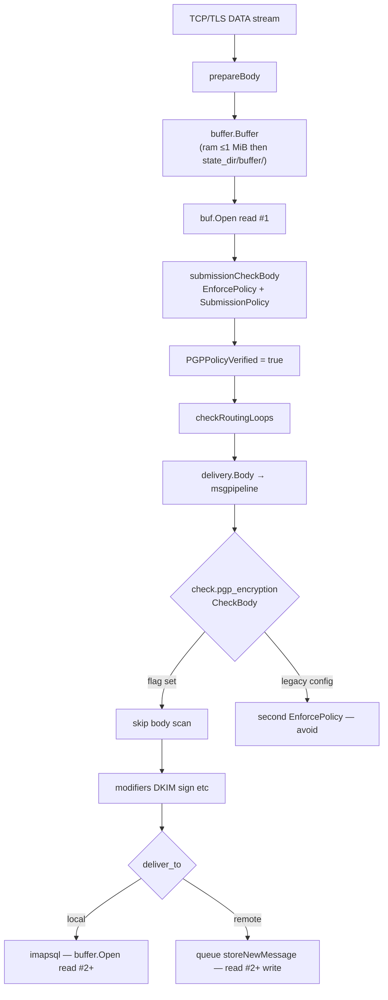

# Message checks vs message pipeline — architecture audit

How **policy gates** (`pgp_verify`) relate to **msgpipeline checks** (`check.*` modules), where the design is consistent, and where further optimization is possible.

Companion docs: [pgp-verification.md](./pgp-verification.md), [performance.md](./performance.md), [message-incoming.md](./message-incoming.md), [message-outgoing.md](./message-outgoing.md).

## Executive summary

| Finding | Status |
|---------|--------|
| Submission duplicate PGP body scan (`check.pgp_encryption` after DATA) | **Solved** — `MsgMetadata.PGPPolicyVerified` + `migrate-pgp-config` |
| Socket → disk → policy → pipeline design | **Working as intended** on submission |
| Remaining wins | **I/O dedup** (queue copy, IMAP `ReadAll`), **LMTP/WebSMTP flag parity**, not another PGP algorithm pass |

The expensive part on large mail is **full-body reads**, not which discard implementation `walkOpenPGPPackets` uses. One sequential PGP scan per accept path is the correct target.

---

## End-to-end flow (submission SMTP)



**Files:** [`session.go`](../../internal/endpoint/smtp/session.go) (`Data`, `prepareBody`), [`submission.go`](../../internal/endpoint/smtp/submission.go), [`msgpipeline.go`](../../internal/msgpipeline/msgpipeline.go), [`pgp_encryption.go`](../../internal/check/pgp_encryption/pgp_encryption.go).

### msgpipeline `Body` order

1. **Global checks** `checkBody`
2. **Source block checks** (submission `check { }` in config)
3. **Per-recipient block checks** (after modifiers split)
4. `GenerateReceived` (first pipeline only)
5. `applyResults` (auth results headers)
6. **Modifiers** `RewriteBody` (global → source → per-rcpt) — may re-read body
7. **Target** `delivery.Body` (storage / queue / nested pipeline)

PGP policy at SMTP DATA runs **before** step 1. Pipeline checks see the same `buffer.Buffer` but open **new** readers — each `body.Open()` is another full sequential read from disk/RAM.

---

## Two enforcement layers (intentional split)

| Layer | When | API | Extra rules |
|-------|------|-----|-------------|
| **Endpoint gate** | SMTP DATA, LMTP DATA, mxdeliv, WebSMTP, IMAP APPEND | `EnforcePolicy` or `EnforceEncryption` | Submission: `SubmissionPolicy` (From/Sender vs envelope, RCPT format) |
| **Pipeline check** | `msgpipeline` `CheckBody` | `check.pgp_encryption` → `EnforcePolicy` | Same body rules if flag not set; config `allow_secure_join`, passthrough lists |

They are **not duplicates** when configured correctly:

- **Submission** should use endpoint `pgp_*` directives only (install template).
- **`check.pgp_encryption`** in submission `check { }` is legacy; migration removes it.

---

## `PGPPolicyVerified` matrix

| Entry path | Sets flag? | Pipeline `pgp_encryption` skip? | Notes |
|------------|------------|----------------------------------|-------|
| **Submission** `:587`/`:465` | **Yes** ([`submissionCheckBody`](../../internal/endpoint/smtp/submission.go)) | Yes | Primary chatmail path |
| **Inbound SMTP** `require_pgp yes` | **Yes** ([`session.go` DATA](../../internal/endpoint/smtp/session.go)) | Yes | Uncommon on :25 |
| **LMTP** `require_pgp yes` | **Yes** | Yes | Same as SMTP DATA ([`session.go` LMTPData](../../internal/endpoint/smtp/session.go)) |
| **`POST /mxdeliv`** | N/A (no pipeline) | N/A | Single `EnforceEncryption`; [`MemoryBuffer`](../../internal/endpoint/chatmail/chatmail.go) |
| **WebSMTP** | **Yes** | Yes | Set on `msgMeta` in [`deliverToTarget`](../../internal/endpoint/webimap/websmtp.go) |
| **IMAP APPEND** | N/A | N/A | Wrapper always calls `EnforceEncryption`; no `MsgMetadata` from SMTP |
| **Exchanger inject** | N/A | N/A | **No** `pgp_verify` — trusted path |

### LMTP / WebSMTP parity (done)

After successful `EnforcePolicy` on LMTP DATA, `s.msgMeta.PGPPolicyVerified = true` (same as SMTP DATA).

WebSMTP sets `PGPPolicyVerified: true` on `msgMeta` in `deliverToTarget` because `deliverMessage` already ran `EnforceEncryption`.

---

## Policy API inconsistencies (subtle)

| Call site | Function | From/envelope check |
|-----------|----------|---------------------|
| Submission DATA | `EnforcePolicy` + `SubmissionPolicy` | `RequireFromMatchesEnvelope`, `ValidateRecipientFormat` |
| Inbound `require_pgp` | `EnforcePolicy` + `inboundPGPPolicy` | **No** From/envelope (passthrough + body only) |
| `check.pgp_encryption` | `EnforcePolicy` | `RequireFromMatchesEnvelope: true` always |
| mxdeliv / WebSMTP / IMAP | `EnforceEncryption` → `PolicyFromOptions` | No From/envelope (WebSMTP does its own Sender check) |

**Not a bug** for mxdeliv (federation envelope in HTTP headers). **Submission** is stricter by design.

`checkFromMatchesEnvelope` uses **`Sender`** when present, else **`From`** (RFC 5322 multi-author).

---

## Per-path I/O and CPU profile

| Path | Buffer model | PGP scans (stock config) | Dominant cost after dedup |
|------|--------------|--------------------------|---------------------------|
| Submission armored 30 MiB | File spill + multiple `Open()` | **1** | Base64 armor + disk reads; queue copy |
| Submission binary | Same | **1** | Disk reads; queue copy |
| mxdeliv | Single `bodyData` slice | **1** | One memcpy from HTTP; no pipeline |
| IMAP APPEND | **`io.ReadAll`** entire message | **1** | **Full RAM copy** + parse + store read |
| WebSMTP | `[]byte` in memory | **1** (+ pipeline if misconfigured) | Memory + delivery target |
| Port 25 inbound (default) | Pipeline only | **0** at SMTP | Federation uses mxdeliv for PGP |
| Exchanger | Injected | **0** | Trust boundary |

Benchmark reference (package tests): armored ~8 ms / 5 MiB, binary ~0.7 ms / 5 MiB, armored ~200 ms / 100 MiB — see `go test ./internal/pgp_verify/ -bench=.`.

---

## Optimization paths (ranked)

### A. Already done (keep)

1. **`PGPPolicyVerified`** — skip `check.pgp_encryption` body scan on submission.
2. **`migrate-pgp-config`** — move policy to endpoint `pgp_*`, remove duplicate check block.
3. **`pgp_verify` streaming** — no full-message `[]byte` for crypto; armor/header hardening.

### B. High value, architectural

| # | Change | Effect |
|---|--------|--------|
| B1 | **LMTP**: set `PGPPolicyVerified` after `require_pgp` pass | **Done** |
| B2 | **WebSMTP**: set `PGPPolicyVerified` on `msgMeta` after gate | **Done** |
| B3 | **Queue `storeNewMessage`** | **Done** — `FileBuffer.LinkAt` hardlink when same filesystem, else `io.Copy` |
| B4 | **IMAP APPEND** | **Done** — `buffer.SpillReader` + stream verify/store (`appendLiteral`) |

### C. Medium value, localized

| # | Change | Effect |
|---|--------|--------|
| C1 | Fix stale comments in `session.go` (“EnforceEncryption” → `EnforcePolicy`) | Docs only |
| C2 | **mxdeliv / WebSMTP** use `EnforcePolicy` + explicit `Policy` if envelope rules needed later | Consistency |
| C3 | Bulk armor stripper (chunk scan vs per-line) | Further armored bench gains |

### D. Low value / rejected

| # | Change | Result |
|---|--------|--------|
| D1 | `discardBytes` + `sync.Pool` vs `io.CopyN(Discard)` | Benchmarked **not faster** |
| D2 | Second PGP scan “optimization” without removing check | Wrong layer — use flag/migration |

### E. Operational (no code)

- Run `madmail migrate-pgp-config` on old installs.
- Do not enable `pgp_encryption` inside submission `check { }`.
- Cap `max_message_size`; fast disk for `{state_dir}/buffer`.
- Prefer binary PGP/MIME from clients (no base64) — large win vs armored.

---

## Inconsistencies checklist

| Item | Severity | Action |
|------|----------|--------|
| ~~LMTP `require_pgp` without `PGPPolicyVerified`~~ | — | **Fixed** |
| ~~WebSMTP without `PGPPolicyVerified`~~ | — | **Fixed** |
| `session.go` comment says `EnforceEncryption` | Low | Update comment |
| `performance.md` “two PGP scans” on migrated config | Low | Clarify “if legacy config” |
| ~~IMAP `ReadAll` before verify~~ | — | **Fixed** (`SpillReader` + file spill) |
| Exchanger no PGP | By design | Document trust model |
| Inbound :25 no PGP vs mxdeliv PGP | By design | Chatmail federation model |

---

## Configuration truth table (chatmail install)

| Surface | PGP enforced? | Mechanism |
|---------|---------------|-----------|
| Submission | Always | `submissionCheckBody` + `pgp_*` |
| mxdeliv | Always | `handleReceiveEmail` |
| Port 25 SMTP | Usually **no** | `require_pgp` off; peers use HTTPS |
| IMAP APPEND | Always (wrapper) | `encryptionWrapperUser` |
| WebSMTP | Always | `deliverMessage` gate |
| Pipeline `pgp_encryption` | Should be **absent** on submission after migration | Skip via flag if present |

---

## Related commands

```bash
# Config migration (remove duplicate check block)
madmail migrate-pgp-config --config /path/to/maddy.conf

# Measure checker CPU/allocs
go test ./internal/pgp_verify/ -run TestMeasureEnforceEncryption_Iterations -v
go test ./internal/pgp_verify/ -run TestMeasureEnforceEncryption_100MiB -v -timeout=30m

# Regenerate full context bundle
bash docs/code/build-context.sh
```

## Source index

| Path | Role |
|------|------|
| [`framework/module/msgmetadata.go`](../../framework/module/msgmetadata.go) | `PGPPolicyVerified` |
| [`internal/endpoint/smtp/session.go`](../../internal/endpoint/smtp/session.go) | DATA / LMTP |
| [`internal/endpoint/smtp/submission.go`](../../internal/endpoint/smtp/submission.go) | Submission policy |
| [`internal/check/pgp_encryption/`](../../internal/check/pgp_encryption/) | Pipeline check |
| [`internal/msgpipeline/msgpipeline.go`](../../internal/msgpipeline/msgpipeline.go) | Check ordering |
| [`internal/confutil/migrate_submission_pgp.go`](../../internal/confutil/migrate_submission_pgp.go) | Config migration |
| [`internal/endpoint/chatmail/chatmail.go`](../../internal/endpoint/chatmail/chatmail.go) | mxdeliv |
| [`internal/endpoint/webimap/websmtp.go`](../../internal/endpoint/webimap/websmtp.go) | WebSMTP |
| [`internal/endpoint/imap/imap.go`](../../internal/endpoint/imap/imap.go) | IMAP APPEND |
