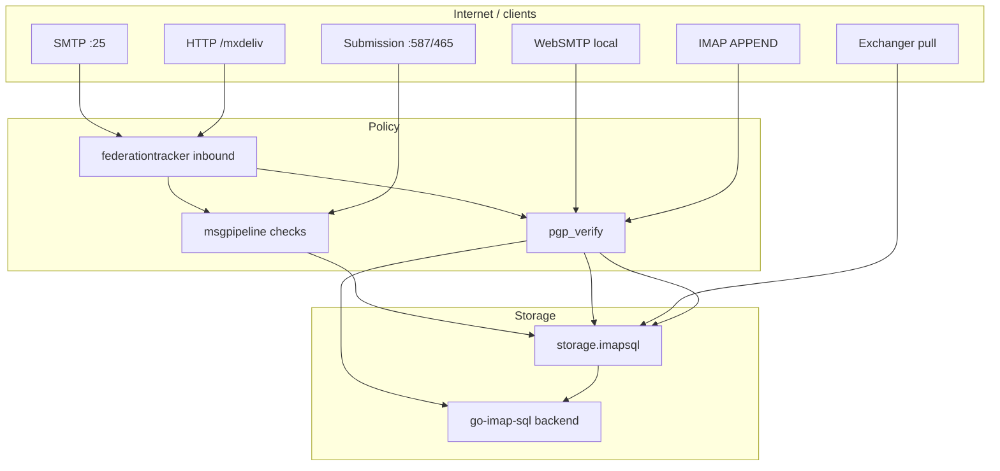

# Incoming message flow

This document traces how mail **enters** the server and lands in `storage.imapsql` (or is rejected). All paths converge on `module.DeliveryTarget` / `Delivery` unless noted.

Server must be past `initModules()` (listeners up); boot order: [startup-and-config.md](./startup-and-config.md).

## Summary diagram



---

## 1. Inbound SMTP (port 25)

**Files:** [`internal/endpoint/smtp/smtp.go`](../../internal/endpoint/smtp/smtp.go), [`session.go`](../../internal/endpoint/smtp/session.go)

### Connection → session

1. `Endpoint.Init` builds `go-smtp` server, attaches `MsgPipeline` from config, rate limits, optional `require_pgp` (off in stock [`maddy.conf`](../../maddy.conf) unless you enable it).
2. New connection → `Session` with `module.ConnState` (remote IP, TLS, later AUTH).
3. Optional **early checks** on AUTH: `pipeline.RunEarlyChecks`.

### MAIL FROM → delivery start

Call chain:

```
Session.Mail / Session.Rcpt (deferred)
  → startDelivery()
      → federationtracker.CheckFederationPolicy (inbound, non-submission)
      → limits.TakeMsg
      → pipeline.Start(ctx, msgMeta, mailFrom)   // msgpipeline
```

`startDelivery` is in [`session.go`](../../internal/endpoint/smtp/session.go) (~287–316): federation check → `limits.TakeMsg` → `pipeline.Start`. Federation rejection happens **before** the pipeline starts.

### RCPT TO

```
Session.Rcpt
  → delivery.AddRcpt(ctx, cleanTo, opts)   // msgpipeline → per-destination targets
```

Pipeline may reject unknown users, enforce SPF/DKIM/DMARC (checks in config), rewrite aliases (`replace_rcpt`), then `imapsql.AddRcpt`.

### DATA

```
Session.Data
  → prepareBody()           // header parse, size limits, submission tweaks
  → [submission] submissionCheckBody / [inbound] require_pgp → pgp_verify
  → checkRoutingLoops()
  → delivery.Body(header, buf)
  → delivery.Commit()
  → IncrementReceivedMessages (inbound only)
```

**PGP gate (inbound SMTP):** Only if the `smtp` endpoint sets `require_pgp yes` — then `pgp_verify.EnforceEncryption` at DATA ([`session.go`](../../internal/endpoint/smtp/session.go)). Stock Chatmail config does **not** set this on port 25; federation inbound PGP is enforced on **`/mxdeliv`** instead. Full matrix: [pgp-verification.md](./pgp-verification.md).

Typical config ([`maddy.conf`](../../maddy.conf)): port 25 `default_source` → `deliver_to &local_routing` → `&local_mailboxes`.

---

## 2. Authenticated submission (local delivery leg)

Submission uses the **same** `Session` type with `endp.submission == true`.

For **local recipients**, pipeline delivers to `&local_routing` → `storage.imapsql` (same as inbound).

For **remote recipients**, submission pipeline usually `deliver_to &remote_queue` (not “incoming” to local storage). See [message-outgoing.md](./message-outgoing.md).

---

## 3. HTTP MX-Deliv (`POST /mxdeliv`)

**Files:** [`internal/endpoint/chatmail/chatmail.go`](../../internal/endpoint/chatmail/chatmail.go) (`handleReceiveEmail`), [`mxdeliv_security.go`](../../internal/endpoint/chatmail/mxdeliv_security.go)

Federation peer (or `target.remote` on another Madmail) POSTs:

- Headers: `X-Mail-From`, one or more `X-Mail-To`
- Body: full RFC822 message

Call chain:

```
handleReceiveEmail
  → federationtracker.CheckFederationPolicy (sender domain)
  → ValidateAllRecipients (domain + blocked local parts)
  → storage.(DeliveryTarget).Start(msgMeta, mailFrom)
  → AddRcpt per validated recipient (unknown users may be dropped silently; 200 OK anyway)
  → parse body → pgp_verify.EnforceEncryption
  → delivery.Body → Commit
```

TLS: production setups use `chatmail tls://…` listeners. `ValidateMxDelivTLS` in `mxdeliv_security.go` is tested but **not** called from `handleReceiveEmail` — see [chatmail.md](./chatmail.md#federation-ingress-post-mxdeliv).

User-facing wire format: [federation.md](../chatmail/federation.md).

**Symmetric outbound:** [`internal/target/remote/remote.go`](../../internal/target/remote/remote.go) `tryHTTP()` POSTs to `https://<domain>/mxdeliv` before SMTP fallback.

---

## 4. Exchanger message pull

**File:** [`internal/endpoint/chatmail/exchanger.go`](../../internal/endpoint/chatmail/exchanger.go). Overview: [chatmail.md § Exchanger pull](./chatmail.md#exchanger-pull).

The chatmail endpoint can pull messages from an external exchanger service and inject them:

```
injectMessage
  → storage.(DeliveryTarget).Start
  → AddRcpt (each To)
  → parse base64 body → Body → Commit   # no pgp_verify call
  → IncrementReceivedMessages
```

**No `pgp_verify` on exchanger inject** — policy assumes the pull path is trusted. See [pgp-verification.md](./pgp-verification.md).

Background poller: [`runExchangerPoller`](../../internal/endpoint/chatmail/exchanger.go) (1s ticker, respects per-exchanger `PollInterval`, pulls for `mail_domain` only).

The exchanger **wire API** is implemented in submodule `exchangers/madexchanger`; the **delivery injection** (`injectMessage` → `storage.Start`) is main-tree only.

---

## 5. WebIMAP / WebSMTP (inbound local only)

**Files:** [`internal/endpoint/webimap/websmtp.go`](../../internal/endpoint/webimap/websmtp.go), [`webimap.go`](../../internal/endpoint/webimap/webimap.go)

WebSMTP is for **sending**; for **incoming local mail** only the local-recipient branch matters:

```
deliverMessage (POST /webimap/send or WebSocket "send")
  → parse RFC822, verify From matches authenticated user
  → pgp_verify.EnforceEncryption
  → recipients on MailDomain → deliverToTarget(Storage)
  → remote domains → RemoteTarget (outbound; see message-outgoing.md)
```

WebIMAP read paths (`/webimap/messages`, WebSocket poll) use IMAP `ListMessages` against storage — no `DeliveryTarget.Start`. Routes: [http-surfaces.md](./http-surfaces.md).

**Does not use `msgpipeline`** for either local or remote WebSMTP legs.

---

## 6. IMAP APPEND

**File:** [`internal/endpoint/imap/imap.go`](../../internal/endpoint/imap/imap.go) (~845)

Users can append messages directly to a mailbox. Before append:

```
pgp_verify.EnforceEncryption(header, body, Options{})
```

Then go-imap backend stores via `storage.imapsql` / `go-imap-sql` (no SMTP pipeline).

---

## 7. Local storage: `storage.imapsql`

**Files:** [`internal/storage/imapsql/delivery.go`](../../internal/storage/imapsql/delivery.go), [`imapsql.go`](../../internal/storage/imapsql/imapsql.go)

Call chain for each accepted recipient:

```
Storage.Start
  → imapsql.Backend.NewDelivery()
delivery.AddRcpt
  → deliveryNormalize (auth map)
  → optional JIT CreateIMAPAcct (settings flag)
  → Backend.AddRcpt(accountName, per-user header stub)
delivery.Body
  → quota check per recipient
  → optional IMAPFilter (folder/flags)
  → quarantine → Junk mailbox if msgMeta.Quarantine
  → Return-Path header, BodyParsed (compress + MIME cache)
delivery.Commit
  → imapsql transaction commit
  → IMAP IDLE notifications (after commit)
```

Low-level persistence: [`internal/go-imap-sql/delivery.go`](../../internal/go-imap-sql/delivery.go) (`processParsedBodyOnce`, blob store, compression).

---

## 8. Checks and quarantine (cross-cutting)

| Mechanism | When | Package |
|-----------|------|---------|
| SPF/DKIM/DMARC/require_tls | msgpipeline `Check*` | `internal/check/` |
| `check.pgp_encryption` | msgpipeline `CheckBody` (optional; install template) | `internal/check/pgp_encryption/` |
| `pgp_verify.EnforceEncryption` | mxdeliv (always), IMAP APPEND (always), WebSMTP, SMTP if `require_pgp` / submission | [`pgp-verification.md`](./pgp-verification.md) |
| Federation inbound policy | Before `pipeline.Start` on SMTP :25; mxdeliv handler | `internal/federationtracker/policy.go` |
| Rate limits | Per-IP / per-domain | `internal/limits/` |

### Federation policy (inbound SMTP)

[`CheckFederationPolicy`](../../internal/federationtracker/policy.go) runs on **inbound SMTP :25** (`startDelivery`, non-submission) and on **`POST /mxdeliv`** (`handleReceiveEmail`). Global mode from settings (`ACCEPT` vs `REJECT`) plus in-memory domain rules (blocklist under ACCEPT, allowlist under REJECT). TLS requirements for mxdeliv are separate ([`mxdeliv_security.go`](../../internal/endpoint/chatmail/mxdeliv_security.go)).

---

## 9. Metrics and logging

- Inbound SMTP success: `module.IncrementReceivedMessages()` ([`framework/module/msgcounter.go`](../../framework/module/msgcounter.go)).
- Federation: structured logs `[federation] received via SMTP` / mxdeliv lines in session and chatmail handlers.
- Prometheus: SMTP session metrics in `internal/endpoint/smtp` (e.g. `startedSMTPTransactions`).

---

## 10. Chatmail HTTP (non-mail)

Registration (`/new`), static www, admin API, TURN discovery, and DKIM well-known URLs do not use the delivery pipeline. Mail-related HTTP is `/mxdeliv` and WebIMAP/WebSMTP above. Full route list: [http-surfaces.md](./http-surfaces.md).

---

## Quick reference: entry point → storage

| Entry | Routing | First storage touch |
|-------|---------|---------------------|
| SMTP :25 | `msgpipeline` → configured target | `imapsql` via `DeliveryTarget` |
| Submission (local rcpt) | same | same |
| `/mxdeliv` | Direct `storage.Start` | `imapsql` |
| Exchanger pull | `injectMessage` → `storage.Start` | `imapsql` |
| WebSMTP (local rcpt) | `deliverToTarget(Storage)` | `imapsql` |
| IMAP APPEND | Endpoint wrapper → backend append | `go-imap-sql` / `imapsql` (PGP in `imap` endpoint) |
