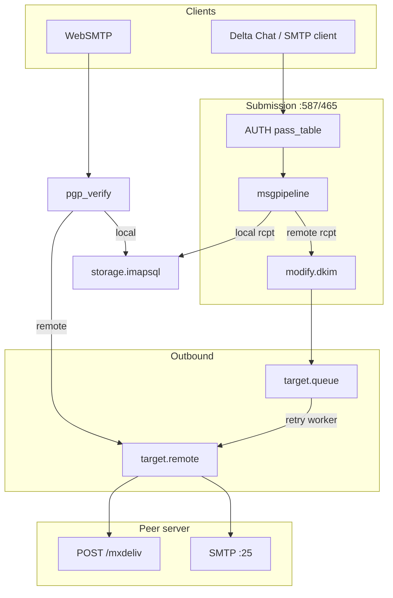

# Outgoing message flow

Outgoing mail leaves the server through **submission** (client-initiated), **queue retry** (async), and **remote delivery** (SMTP and/or HTTP `/mxdeliv`). Local-only sends still go through submission → pipeline → `imapsql` and are documented under the local branch below.

How submission/queue/remote modules are wired in config: [startup-and-config.md](./startup-and-config.md) §2.5.

## Summary diagram



---

## 1. SMTP submission

**Files:** [`internal/endpoint/smtp/smtp.go`](../../internal/endpoint/smtp/smtp.go) (`submission` module name sets `endp.submission = true`), [`session.go`](../../internal/endpoint/smtp/session.go)

### Authentication

```
Session.Auth / AuthPlain
  → pipeline.RunEarlyChecks
  → saslAuth (pass_table + auth_map normalize)
  → connState.AuthUser set
```

Blocklisted users: SMTP AUTH connections can be closed on reload (see [runtime.md](./runtime.md)).

### MAIL / RCPT / DATA

Same session state machine as inbound, with differences:

| Stage | Submission behavior |
|-------|---------------------|
| `startDelivery` | No inbound federation policy on sender domain |
| `prepareBody` | `submissionPrepare` may adjust headers/metadata |
| DATA | **Always** runs `submissionCheckBody` → `EnforcePolicy` once; sets `PGPPolicyVerified` so pipeline `pgp_encryption` skips a second body scan ([performance.md](./performance.md)) |
| `prepareBody` | Buffers full message (`buffer auto` → disk above 1 MiB default) before any check |
| Commit metrics | `IncrementSentMessages` on successful DATA commit (not `IncrementReceivedMessages`) |
| Federation touch | `federationtracker.Touch` on sender domain at MAIL (outbound tracking) |

### Pipeline routing (typical Chatmail)

From [`maddy.conf`](../../maddy.conf):

```
source $(local_domains) {
    check { authorize_sender, require_tls }
    # pgp_* on submission block (not pgp_encryption in check)
    destination postmaster $(local_domains) {
        deliver_to &local_routing    → imapsql
    }
    default_destination {
        modify { dkim ... }
        deliver_to &remote_queue
    }
}
```

**Call chain for remote mail:**

```
Session.Data
  → prepareBody (write full message to buffer file)
  → submissionCheckBody (read buffer: PGP structure scan)
  → msgpipeline.Body (checks; DKIM modifier — no second PGP scan if PGPPolicyVerified)
  → queue.Start / AddRcpt / Body / Commit (queue copies buffer to spool file)
```

**Call chain for local mail:**

```
  → msgpipeline → imapsql delivery (same as incoming local delivery)
```

---

## 2. Message queue (`target.queue`)

**File:** [`internal/target/queue/queue.go`](../../internal/target/queue/queue.go)

Package doc summarizes behavior: spool to disk, retry with backoff, per-recipient failure classification, optional DSN via nested `msgpipeline`.

### Accepting mail (submission path)

```
Queue.Start
  → create on-disk queue file + metadata
Queue.AddRcpt / Body / Commit
  → persist envelope + body buffer
  → schedule delivery job on time wheel
```

`Commit` on the queue returns success to the client even though remote delivery is asynchronous.

### On-disk layout

Under the queue `location` directory (state dir):

- `{id}.meta` — JSON metadata (envelope, retry times, per-recipient status)
- Body buffer file referenced from metadata

The [`TimeWheel`](../../internal/target/queue/timewheel.go) runs one `tick()` goroutine; due slots spawn [`dispatch`](../../internal/target/queue/queue.go) workers (semaphore-limited).

### Delivery worker

For each scheduled message:

```
dispatch (goroutine)
  → openMessage / use cached meta
  → Target.Start (downstream, usually target.remote)
  → AddRcpt for pending recipients only
  → Body or BodyNonAtomic (partial errors)
  → classify errors: exterrors.IsTemporaryOrUnspec
  → reschedule failed temp recipients OR mark permanent fail
  → after max tries: generate NDN via dsnPipeline (if configured)
```

`Commit` on the queue returns **250 to the submission client** before any worker runs. After a successful downstream delivery, the queue worker calls `module.IncrementOutboundMessages()` ([`queue.go`](../../internal/target/queue/queue.go)).

Queue implements `DeliveryTarget`; it is **not** a message source for clients.

---

## 3. Remote delivery (`target.remote`)

**File:** [`internal/target/remote/remote.go`](../../internal/target/remote/remote.go)

### Start / AddRcpt

```
Target.Start → remoteDelivery
AddRcpt
  → group recipients by domain (rcptsByDomain)
  → limits.TakeDest per domain
```

### Body: parallel per domain

```
remoteDelivery.Body
  → BodyNonAtomic(StatusCollector)
      → per domain goroutine:
          1. tryHTTP (HTTPS then HTTP) → POST /mxdeliv
          2. on failure: SMTP to MX (connection pool)
      → federationtracker queue/success/failure stats
```

HTTP construction (`buildMxDelivURL`): default path `/mxdeliv`; optional `endpoint_rewrite` from DB/settings.

### TLS / MX policy

Configured via `mx_auth` block: DANE, MTA-STS, local min TLS levels ([`internal/target/remote/security.go`](../../internal/target/remote/security.go)).

`endpoint_cache` can override MX/host resolution from GORM DB before DNS.

### Partial delivery

`remoteDelivery` implements `PartialDelivery`; per-recipient errors are reported through `StatusCollector`. Non-atomic commit: callers must handle duplicate delivery risk on temp failures (documented in `multipleErrs`).

---

## 4. WebSMTP outbound

**File:** [`internal/endpoint/webimap/websmtp.go`](../../internal/endpoint/webimap/websmtp.go)

`deliverMessage` splits recipients by `MailDomain`:

- **Local** → `Storage` (`DeliveryTarget`) — writes to `imapsql` (no DKIM/msgpipeline).
- **Remote** → `RemoteTarget` from `module.GetInstance("outbound_delivery")` — in stock configs this is the instance name of **`target.remote outbound_delivery`** (not the queue). Submission uses `&remote_queue` → `target.queue` → `target.remote`; WebSMTP skips the queue unless you point `outbound_delivery` at a queue module explicitly.

Each leg uses `deliverToTarget`: `Start` → `AddRcpt` → `Body` → `Commit` on the chosen target.

PGP enforcement runs before split. **No `msgpipeline`**: no `authorize_sender`, no automatic DKIM signing on WebSMTP. Operators who need signing should route clients through SMTP submission instead.

If `RemoteTarget` is `target.queue`, remote WebSMTP mail is queued like submission; if it is `target.remote`, delivery is synchronous over HTTP/SMTP from the HTTP handler goroutine.

---

## 5. Downstream SMTP target

**File:** [`internal/target/smtp/smtp_downstream.go`](../../internal/target/smtp/smtp_downstream.go)

Delivers to a fixed SMTP server (LMTP/submission relay), used in some configs instead of MX lookup. Implements `DeliveryTarget` for `deliver_to smtp tcp://...` style blocks.

---

## 6. Checks on outbound path

| Check | Where |
|-------|--------|
| `authorize_sender` | submission `check` in source block |
| `require_tls` | submission checks |
| `pgp_encryption` | optional pipeline `CheckBody` (From/RCPT checks + passthrough lists); see [pgp-verification.md](./pgp-verification.md) |
| DKIM signing | `modify.dkim` in `default_destination` before `remote_queue` |

Signing modifies body/headers in pipeline **before** queue serializes the message.

---

## 7. Federation outbound (operator view)

Code path: `target.remote` → `tryHTTP` → peer `chatmail.handleReceiveEmail`.

Operator docs: [federation.md](../chatmail/federation.md), [federation_manager.md](../chatmail/federation_manager.md).

Tracker: [`internal/federationtracker/`](../../internal/federationtracker/) records success/failure, queue depth, policy.

---

## 8. What is *not* in this tree

- **Delta Chat client SMTP** stack lives in submodule `chatmail-core` (`src/smtp/`). The server-side counterpart is submission + queue + remote above.
- **madexchanger** submodule implements bridge APIs; Madmail pulls via `exchanger.go` only.

---

## Quick reference: outbound call chain

| Step | Function / module |
|------|-------------------|
| Client sends | `submission.Session.Data` |
| Route & sign | `msgpipeline` → `modify.dkim` |
| Enqueue | `queue.Commit` |
| Send | `queue` worker → `remote.BodyNonAtomic` |
| Deliver | `tryHTTP` or SMTP `connectionForDomain` → `conn.Data` |
