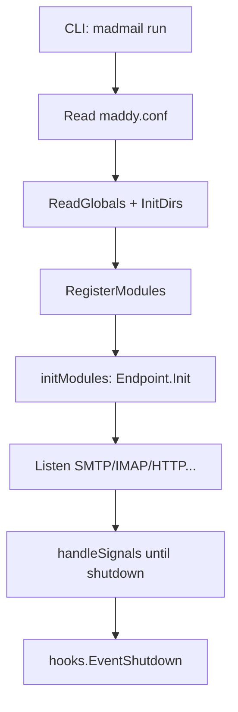

# Overview

Madmail is a fork of [Maddy Mail Server](https://github.com/foxcpp/maddy): a composable all-in-one mail server written in Go, extended for **Chatmail** (JIT accounts, PGP-only mail, HTTP federation, admin API, Shadowsocks/TURN, etc.).

## Binaries and entry points

| Binary / command | Source | Role |
|------------------|--------|------|
| `madmail run` | [`maddy.go`](../../maddy.go) → `Run()` → `moduleMain()` | Long-running server: parse config, register modules, `Init()` endpoints, block on signals |
| `madmail` subcommands | [`internal/cli/`](../../internal/cli/) | Account management, install, federation, `imap-*`, config reload signals, etc. |
| `debug_maddy.go` | build tag / dev | Debug entry (see file) |

Server startup sequence (simplified):

Side-effect imports in [`maddy.go`](../../maddy.go) register module factories before config is parsed:

| Import path | Registers |
|-------------|-----------|
| `internal/auth/pass_table` | `auth.pass_table` |
| `internal/check/*` | SPF, DKIM, DNS stateless checks, authorize_sender, pgp_encryption, require_tls |
| `internal/endpoint/chatmail`, `imap`, `openmetrics`, `smtp`, `turn` | Network endpoints |
| `internal/modify`, `modify/dkim` | Modifiers |
| `internal/storage/imapsql`, `blob/fs` | Storage + blob |
| `internal/table` | Table modules |
| `internal/target/queue`, `remote`, `smtp` | Delivery targets |
| `internal/tls`, `tls/acme` | TLS loaders |

Full registry: [modules.md](./modules.md#config-module-registry).

**Lazy initialization:** Top-level config blocks create module instances at parse time, but **`Init()` runs on first `&reference`** via [`module.GetInstance`](../../framework/module/instances.go). **Endpoints** are `Init()`’d eagerly in `initModules()`. Any top-level block never referenced is a **startup error**.

## Configuration

Short summary; full boot sequence, module dependency graph, and settings DB: **[startup-and-config.md](./startup-and-config.md)**.

- **Static:** `maddy.conf` — parsed once at startup ([`cfgparser`](../../framework/cfgparser/), [`ReadGlobals`](../../maddy.go)).
- **Dynamic:** settings rows in the auth DB (`__KEY__` strings) — read at runtime via [`GetGlobalSetting`](../../framework/module/settings.go).
- **References:** `&instance_name` triggers lazy [`GetInstance`](../../framework/module/instances.go) → `Init()`.
- **Endpoints** init eagerly and start listeners; see startup doc §1.4.

Annotated reference config: [`maddy.conf`](../../maddy.conf).

## Core abstraction: delivery

Almost all mail movement uses two interfaces in [`framework/module/delivery_target.go`](../../framework/module/delivery_target.go):

- **`DeliveryTarget.Start(ctx, msgMeta, mailFrom)`** → **`Delivery`**
- **`Delivery`**: `AddRcpt` → `Body` → `Commit` (or `Abort`)

`MsgMetadata` ([`framework/module/msgmetadata.go`](../../framework/module/msgmetadata.go)) carries connection info, message ID, TLS flags, quarantine state, etc.

**Message pipeline** ([`internal/msgpipeline/`](../../internal/msgpipeline/)) is itself a `DeliveryTarget`: it runs checks/modifiers and fans out to configured targets (`storage.imapsql`, `target.queue`, …).

## Top-level directories (main tree)

| Path | Purpose |
|------|---------|
| `framework/` | Shared config, logging, DNS, buffers, module interfaces |
| `internal/endpoint/` | Protocol servers: `smtp`, `imap`, `chatmail`, `webimap`, `turn`, `openmetrics` |
| `internal/target/` | Delivery targets: `remote`, `queue`, `smtp` (downstream), skeleton |
| `internal/storage/` | `imapsql` storage module, blob backends |
| `internal/go-imap-sql/` | IMAP/SQL backend (messages on disk + DB metadata) |
| `internal/msgpipeline/` | Configurable routing pipeline |
| `internal/check/`, `internal/modify/` | Policy checks and header/body modifiers |
| `internal/auth/`, `internal/authz/` | SASL, pass_table, normalization |
| `internal/api/admin/` | HTTP admin API (mounted by chatmail — [chatmail.md](./chatmail.md)) |
| `internal/cli/ctl/` | `madmail` management commands |
| `internal/db/` | GORM models (settings, federation, blocklist, …) |
| `docs/` | User and operator documentation (not `docs/code/`) |

See [modules.md](./modules.md) for a fuller package index.

## CLI (`madmail` without `run`)

Management commands live in [`internal/cli/ctl/`](../../internal/cli/ctl/) and attach via `maddycli.AddSubcommand`. They typically open SQLite/Postgres directly (credentials, imapsql, settings) and may signal a running daemon (`reloadRunningDaemons`, SIGUSR2).

| Command | Purpose |
|---------|---------|
| `run` | Start server ([`maddy.go`](../../maddy.go)) |
| `install` / `uninstall` | Deploy systemd + generate config |
| `upgrade` / `update` | Binary upgrade |
| `create-user` | Random account + credentials |
| `accounts` | status, info, create, ban, delete, bulk |
| `creds` | List/manage credentials |
| `ban-list`, `blocklist` | Blocklist management |
| `delete` | Remove account |
| `imap-acct` | IMAP account admin |
| `imap-mboxes`, `imap-msgs` | Mailbox/message CLI |
| `federation` | Policy rules CLI |
| `endpoint-cache` (`dns-cache`) | Outbound override cache |
| `exchanger` | Exchanger rows |
| `registration-tokens` | Token CRUD |
| `queue` | Inspect/manage spool |
| `status` | Server/connection status (`online` tracking) |
| `admin-token`, `admin-web` | Admin API/UI |
| `port`, `reload`, `submission-access` | Runtime settings |
| `webimap`, `websmtp` | Enable/disable HTTP mail APIs |
| `sharing` | Contact-share links |
| `language` | UI language |
| `hash` | Password hash helper |
| `html-export`, `html-serve` | Customize www templates |

Account semantics: [accounts-auth.md](./accounts-auth.md).

`madmail run` is the only long-running server entry; see [runtime.md](./runtime.md) for signals and reload.
