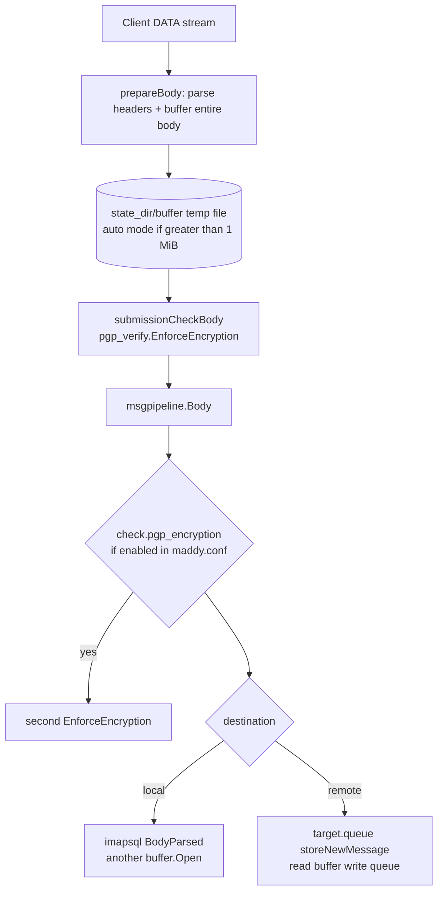

# Performance — large SMTP uploads

Notes on **CPU and I/O** when clients send large messages (e.g. ~30 MiB) over **SMTP submission** (`:587` / `:465`). Applies to the main Madmail tree only.

## Symptom

During **DATA**, CPU usage spikes while the message is received and accepted. Size is near `max_message_size` (default **32 MiB** in [`smtp` endpoint config](../../internal/endpoint/smtp/smtp.go) and install template).

This is expected to some degree: the server **buffers the full message**, runs **PGP structure validation** (streaming, but still reads the ciphertext), and often **copies** the blob again for the queue or mailbox. It is not a single-pass upload-to-disk path.

---

## Submission DATA pipeline



**Files:** [`internal/endpoint/smtp/session.go`](../../internal/endpoint/smtp/session.go) (`Data`, `prepareBody`), [`submission.go`](../../internal/endpoint/smtp/submission.go), [`internal/msgpipeline/msgpipeline.go`](../../internal/msgpipeline/msgpipeline.go), [`internal/check/pgp_encryption/pgp_encryption.go`](../../internal/check/pgp_encryption/pgp_encryption.go).

---

## Why CPU spikes on encrypted large mail

### 1. Full-message buffering (I/O + memory)

[`prepareBody`](../../internal/endpoint/smtp/session.go) reads the **entire** DATA payload into a [`buffer.Buffer`](../../framework/buffer/buffer.go):

| `buffer` mode | Behavior for 30 MiB message |
|---------------|------------------------------|
| **`auto`** (default) | Allocates **1 MiB** slice, then [`BufferInFile`](../../framework/buffer/file.go) → `io.Copy` rest to `{state_dir}/buffer/` |
| `fs` | Direct write to temp file |
| `ram` | Whole message in RAM (worse for large mail) |

So the server always does at least **one full write** of the message during receive.

### 2. PGP verification reads the ciphertext again (CPU)

Submission **always** calls [`submissionCheckBody`](../../internal/endpoint/smtp/submission.go) → [`pgp_verify.EnforceEncryption`](../../internal/pgp_verify/pgp_verify.go) on a **fresh** `body.Open()` stream.

For `multipart/encrypted`, validation:

- Parses MIME parts (small overhead).
- On part 2 (`application/octet-stream`), runs **`walkOpenPGPPackets`**: scans the **entire** armored base64 or binary OpenPGP stream, discarding packet bodies with `io.CopyN` / `io.Discard`.

The implementation is **streaming** (no full-message `[]byte` for crypto), but a **~30 MiB** message still implies **~30 MiB+ of reads** from disk and **base64 decode work** on the armor path — that shows up as a **CPU spike**, not just disk wait.

See [pgp-verification.md](./pgp-verification.md) § Performance.

### 3. Single PGP check (submission)

Install template enforces PGP on the **submission endpoint** (`pgp_allow_secure_join`, `pgp_passthrough_*`, one `EnforcePolicy` at DATA). `MsgMetadata.PGPPolicyVerified` skips a second scan if `check.pgp_encryption` is still present in an old config.

Do **not** add `pgp_encryption { … }` inside submission `check { }` — that duplicates work without adding policy.

### 4. Extra copies after acceptance

| Next step | Extra I/O |
|-----------|-----------|
| **Remote** (`deliver_to &remote_queue`) | [`storeNewMessage`](../../internal/target/queue/queue.go): hardlink from `state_dir/buffer` when possible, else copy to `{queue}/{id}.body` |
| **Local** (`imapsql`) | [`delivery.Body`](../../internal/storage/imapsql/delivery.go) → `BodyParsed` opens buffer again |
| **DKIM sign** (outbound default) | Modifier may read body again depending on implementation |

A **30 MiB** remote send can therefore touch **on the order of 100–150 MiB** disk traffic before the client gets `250 OK`. With migrated chatmail config there is **one** PGP scan at DATA; legacy configs that still have `pgp_encryption` in submission `check { }` pay a **second** scan until `madmail migrate-pgp-config` is applied. See [message-checks-pipeline.md](./message-checks-pipeline.md).

---

## What does *not* cause the spike

| Myth | Reality |
|------|---------|
| “PGP decrypts the mail” | Server only checks **MIME + OpenPGP packet framing**, no decryption |
| “Cleartext uploads scan 30 MiB before reject” | Wrong `Content-Type` → **reject from headers** without reading body ([`EnforceEncryption`](../../internal/pgp_verify/pgp_verify.go)) |
| “mxdeliv optimized path” | HTTP mxdeliv uses a **single** `bodyData` slice and one `EnforceEncryption` pass ([`handleReceiveEmail`](../../internal/endpoint/chatmail/chatmail.go)); different from SMTP buffer + pipeline |

---

## Tuning and operations

| Knob | Effect |
|------|--------|
| `max_message_size` | Cap upload size on `submission` / `smtp` blocks |
| `buffer fs /path` or `buffer auto 4M` | Change spill threshold / directory (use fast disk or tmpfs for `{state_dir}/buffer`) |
| Avoid `pgp_encryption` inside submission `check { }` | Prevents duplicate scan on old configs (see §3) |
| `io_debug yes` on SMTP | **Avoid in production** — extra logging on the DATA path |
| Client | Prefer smaller attachments or chunked strategies; encrypted blob size ≈ raw size + armor overhead |

Profiling: look for `pgp_verify.walkOpenPGPPackets`, `buffer.BufferInFile`, `io.Copy` in queue `storeNewMessage` during a large DATA.

## Measuring the checker (`pgp_verify`)

The policy gate is testable and instrumented in-tree:

| API | Use |
|-----|-----|
| [`MeasureEnforceEncryption`](../../internal/pgp_verify/metrics.go) | One run → `RunStats` (duration, mallocs, heap) |
| [`MeasureEnforcePolicy`](../../internal/pgp_verify/metrics.go) | Same for full submission policy |
| `go test ./internal/pgp_verify/ -run TestMeasureEnforceEncryption_Iterations -v` | Logs per-iteration throughput for 1/5/30 MiB |
| `go test ./internal/pgp_verify/ -bench=. -benchmem` | Go benches (`Armored1/5/30/100MB`, `Binary5/100MB`, cleartext reject) |

**Deduped submission:** after a successful `submissionCheckBody`, `MsgMetadata.PGPPolicyVerified` is set so `check.pgp_encryption` skips a second full-body scan in the pipeline.

```bash
go test ./internal/pgp_verify/ -bench=BenchmarkEnforceEncryption_Armored5MB -benchmem -run=^$
```

---

## Related docs

- [message-checks-pipeline.md](./message-checks-pipeline.md) — checks vs pipeline, `PGPPolicyVerified`, optimization roadmap
- [pgp-verification.md](./pgp-verification.md) — what `EnforceEncryption` does
- [message-outgoing.md](./message-outgoing.md) — submission → pipeline → queue
- [startup-and-config.md](./startup-and-config.md) — `max_message_size`, buffer directive
