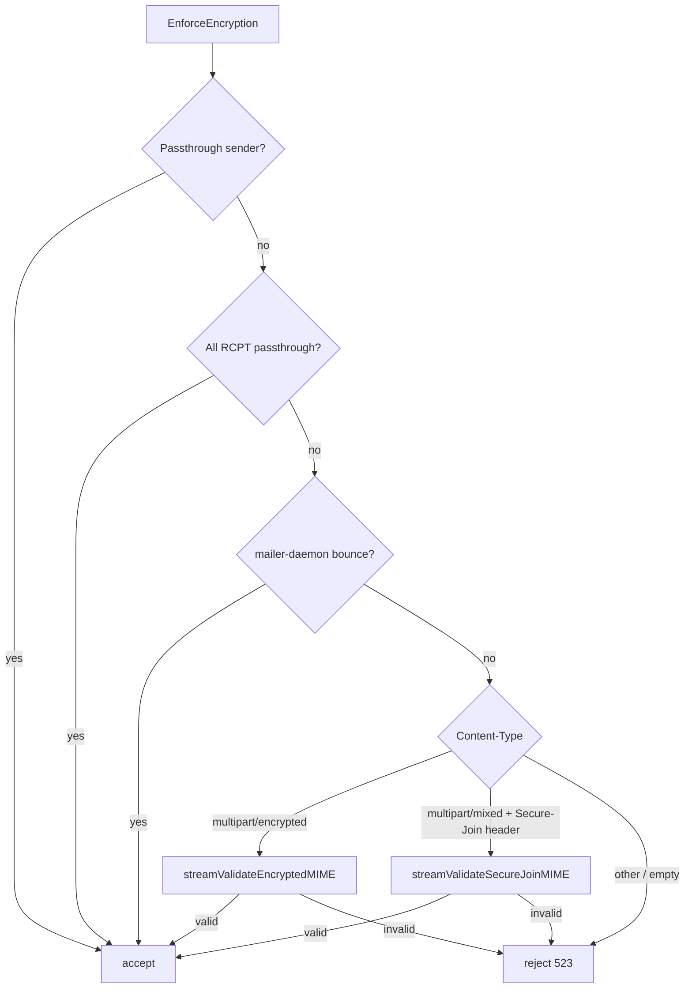

# PGP / encryption verification (`pgp_verify`)

How Madmail enforces **PGP-only** mail in the main tree. This is **not** full OpenPGP decryption: the server validates **MIME structure** and **OpenPGP packet framing** only ([`internal/pgp_verify/pgp_verify.go`](../../internal/pgp_verify/pgp_verify.go)).

User-facing policy overview: [`docs/chatmail/only_pgp_mails.md`](../chatmail/only_pgp_mails.md).

## Central API

| Function | Role |
|----------|------|
| **`EnforcePolicy(header, body, policy)`** | Full gate: envelope/header rules + body scan — use on submission |
| **`EnforceEncryption(header, body, opts)`** | Body policy + passthrough/bounce (`PolicyFromOptions`) |
| **`MeasureEnforceEncryption` / `MeasureEnforcePolicy`** | One-shot timing + alloc stats for tests ([`metrics.go`](../../internal/pgp_verify/metrics.go)) |
| `IsAcceptedMessage` | Wrapper with empty `Options` (tests / legacy) |
| `IsValidEncryptedMessage` | PGP/MIME-only probe |
| `IsSecureJoinMessage` | Secure-Join-only probe |

Rejection uses shared **`errRejectUnencrypted`**: SMTP **523** / enhanced **5.7.1**, message `Encryption Needed: Invalid Unencrypted Mail`. HTTP mxdeliv maps this to **403** with the same text.

## Decision order (`EnforceEncryption`)



### 1. Passthrough (`Options`)

| Field | Effect |
|-------|--------|
| `PassthroughSenders` | Exact match on `MailFrom` (case-insensitive) → skip all checks |
| `PassthroughRecipients` | **Every** RCPT must match (exact or `@domain` suffix) → skip checks |

**Passthrough** on submission uses endpoint directives `pgp_passthrough_senders` / `pgp_passthrough_recipients` (install template), evaluated in **`submissionCheckBody`** before any body scan.

### 2. Mailer-daemon bounces (`isAllowedBounce`)

All of the following are required:

- Envelope `MailFrom` starts with `mailer-daemon@`
- `Auto-Submitted` present and not `no`
- `Content-Type` starts with `multipart/report`
- MIME `From` parses as `mailer-daemon@…` (anti-spoof)

IMAP APPEND uses `Options{}` — **no envelope**, so bounces cannot use this path on APPEND.

### 3. PGP/MIME (`multipart/encrypted`)

RFC 3156 structure validated by **`streamValidateEncryptedMIME`**:

1. Exactly **two** MIME parts.
2. Part 1: `application/pgp-encrypted` body exactly `Version: 1` (after trim).
3. Part 2: `application/octet-stream` passed to **`streamValidateOpenPGPPayload`**:
   - ASCII armor (`-----BEGIN PGP MESSAGE-----`) stripped and base64-decoded streaming, **or**
   - raw binary OpenPGP packets.
4. Packet walk (**`walkOpenPGPPackets`**): zero or more **PKESK (1)** / **SKESK (3)**, then exactly one **SEIPD (18)** consuming rest of stream. New-format packet headers only (`tag & 0xC0 == 0xC0`).

Malformed crypto is treated as **reject** (523), not a transient 451 — avoids remote retry loops.

### Performance (large messages)

`EnforceEncryption` does **not** decrypt mail and does **not** load the whole body into one `[]byte`. It still **reads** the encrypted MIME part end-to-end:

- **`multipart/encrypted`:** part 2 is walked packet-by-packet (`walkOpenPGPPackets`); armored mail goes through a streaming base64 decoder.
- **Wrong type / cleartext:** rejected from `Content-Type` **without** reading the body.

On **SMTP submission**, the body is usually already on disk ([`buffer` auto mode](../../internal/endpoint/smtp/smtp.go) spills messages larger than 1 MiB to `{state_dir}/buffer/`). Each `body.Open()` + `EnforceEncryption` is a **full sequential read** of that file.

Stock install runs **one** body scan at submission DATA; optional `check.pgp_encryption` in the pipeline is skipped when `PGPPolicyVerified` is set. See [performance.md](./performance.md).

### 4. Secure-Join handshake (unencrypted)

Only when:

- Header `Secure-Join` starts with `vc-` or `vg-` (case-insensitive), **and**
- `Content-Type: multipart/mixed` with a **single** `text/plain` part whose body starts with `secure-join:` (after whitespace trim).

Example body line from tests: `secure-join: vc-request` ([`enforce_test.go`](../../internal/pgp_verify/enforce_test.go)).

`check.pgp_encryption` can set `allow_secure_join no` to strip Secure-Join headers before calling `EnforceEncryption` (PGP/MIME only).

## Two enforcement layers (do not confuse)

| Layer | Config / code | What it does |
|-------|----------------|--------------|
| **Session / HTTP / IMAP** | `require_pgp` on `smtp`, `submissionCheckBody`, mxdeliv, WebSMTP, IMAP wrapper | Calls `pgp_verify.EnforceEncryption` directly at DATA/APPEND/HTTP |
| **Pipeline check** | `check.pgp_encryption { … }` inside `msgpipeline` / submission `check { }` | Same `EnforceEncryption` in `CheckBody` **plus** From≠MAIL FROM and RCPT format checks |

They are **not** interchangeable:

- **`check.pgp_encryption`** is optional in `maddy.conf` (commented out in sample [`maddy.conf`](../../maddy.conf); enabled by `madmail install` via [`maddy.conf.j2`](../../internal/cli/ctl/maddy.conf.j2) when `RequirePGPEncryption` is true).
- **Submission** runs **`EnforcePolicy`** once at DATA via `submissionCheckBody` and sets **`MsgMetadata.PGPPolicyVerified`**; `check.pgp_encryption` skips a second body scan when that flag is set ([performance.md](./performance.md)).

### Passthrough caveat

Install template wires passthrough lists on the **submission** block (`pgp_passthrough_*`), not inside `check.pgp_encryption`. Manual configs can still use either style; avoid duplicating both.

## Per entry point (main tree)

| Entry | When checked | `pgp_verify.Options` | Notes |
|-------|----------------|----------------------|--------|
| **Submission** :587/465 | SMTP `DATA`, always | `MailFrom`, `Recipients` | `submissionCheckBody`; independent of `require_pgp` |
| **SMTP inbound** :25 | SMTP `DATA` | `MailFrom`, `Recipients` | Only if endpoint `require_pgp yes` — **not** set in sample `maddy.conf` |
| **LMTP** | `LMTPData` | same as inbound | Honors `require_pgp`; sets `PGPPolicyVerified` on success |
| **`POST /mxdeliv`** | Before `delivery.Body` | `MailFrom`, `validatedTo` | Always enforced; HTTP 403 on failure |
| **WebSMTP** | `deliverMessage` | `MailFrom` (= auth user), `Recipients` | Before local/remote split |
| **IMAP APPEND** | `encryptionWrapperUser.CreateMessage` | **empty** `Options{}` | **Always** wrapped for every IMAP user ([`imap.go`](../../internal/endpoint/imap/imap.go)); no passthrough/bounce |
| **`madmail imap-msgs add`** | Before append | `Recipients: [username]` | CLI helper |
| **Exchanger pull** | — | **Not called** | [`injectMessage`](../../internal/endpoint/chatmail/exchanger.go) goes straight to storage — trust exchanger |
| **msgpipeline only** | `CheckBody` | Full opts from `check.pgp_encryption` | Includes passthrough lists + optional `allow_secure_join` |

## Config reference

### `smtp` / `submission` endpoint

```text
submission tls://0.0.0.0:465 tcp://0.0.0.0:587 {
    # Chatmail install: enforced at DATA (one scan) — not check.pgp_encryption
    pgp_allow_secure_join yes
    pgp_passthrough_senders user@example.org
    pgp_passthrough_recipients @backup.example.org
}

smtp tcp://0.0.0.0:25 {
    require_pgp yes    # optional inbound; same pgp_* passthrough knobs
}
```

### `check.pgp_encryption` (inside pipeline `check { }`, optional)

```text
pgp_encryption {
    require_encryption yes
    allow_secure_join yes
    passthrough_senders user@example.org
    passthrough_recipients @backup.example.org
}
```

| Directive | Default | Meaning |
|-----------|---------|---------|
| `require_encryption` | yes | If no, check module is a no-op |
| `allow_secure_join` | yes | If no, Secure-Join headers stripped before verify |
| `passthrough_senders` | — | List of MAIL FROM allowed cleartext |
| `passthrough_recipients` | — | All RCPT must match for cleartext |

Install flag: `--require-pgp-encryption` sets submission `pgp_*` directives ([`maddy.conf.j2`](../../internal/cli/ctl/maddy.conf.j2)), not `pgp_encryption` in `check { }`.

**Existing servers** with `pgp_encryption` inside submission `check { }`:

```bash
madmail migrate-pgp-config --config /etc/maddy/maddy.conf
madmail reload
```

`madmail reload` (admin API) also applies this migration when writing the pending config file.

## Runtime position in SMTP DATA

```text
prepareBody → buffer body
  → [submission] submissionCheckBody → EnforcePolicy → PGPPolicyVerified
  → [inbound + require_pgp] EnforcePolicy → PGPPolicyVerified
  → checkRoutingLoops
  → delivery.Body → msgpipeline (pgp_encryption skips body if PGPPolicyVerified)
  → delivery.Commit
```

## What is *not* verified

- Signature validity, key trust, or decryption success
- S/MIME or inline PGP (`multipart/signed` only, etc.)
- Cleartext except Secure-Join handshake shape
- Exchanger-injected messages (no `pgp_verify` call)

## Source files

| Path | Role |
|------|------|
| [`internal/pgp_verify/pgp_verify.go`](../../internal/pgp_verify/pgp_verify.go) | Core logic |
| [`internal/pgp_verify/*_test.go`](../../internal/pgp_verify/) | Policy tests + adversarial cases |
| [`internal/check/pgp_encryption/`](../../internal/check/pgp_encryption/) | Pipeline wrapper |
| [`internal/endpoint/smtp/submission.go`](../../internal/endpoint/smtp/submission.go) | Submission gate |
| [`internal/endpoint/smtp/session.go`](../../internal/endpoint/smtp/session.go) | DATA / LMTP gates |
| [`internal/endpoint/chatmail/chatmail.go`](../../internal/endpoint/chatmail/chatmail.go) | mxdeliv |
| [`internal/endpoint/webimap/websmtp.go`](../../internal/endpoint/webimap/websmtp.go) | WebSMTP |
| [`internal/endpoint/imap/imap.go`](../../internal/endpoint/imap/imap.go) | APPEND wrapper |

## Related docs

- [message-incoming.md](./message-incoming.md) — where gates run on accept paths
- [message-outgoing.md](./message-outgoing.md) — submission outbound
- [performance.md](./performance.md) — large upload CPU/I/O
- [startup-and-config.md](./startup-and-config.md) — when modules load
