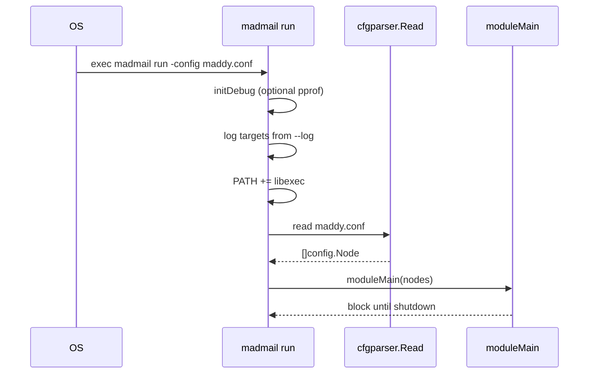
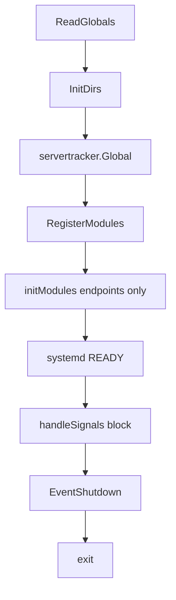
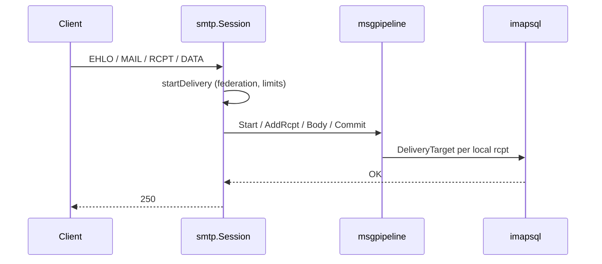
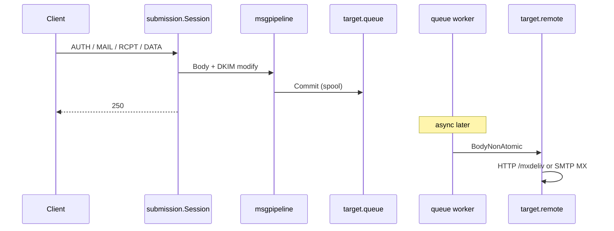
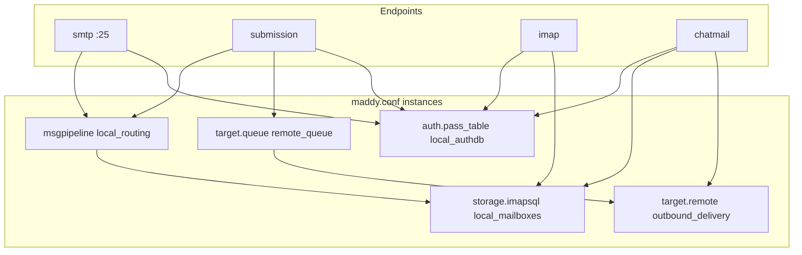

# Startup, runtime lifecycle, and configuration

End-to-end flow from **`madmail run`** through steady-state operation and shutdown, plus how **`maddy.conf`** and the settings DB fit together. Main tree only (no submodules).

**Related:** [message-incoming.md](./message-incoming.md), [message-outgoing.md](./message-outgoing.md), [goroutines.md](./goroutines.md), [runtime.md](./runtime.md).

---

## 1. Runtime flow from the beginning

### 1.1 Before `main`: package `init()`

When the process starts, Go runs `init()` in every imported package **before** `main`:

| Step | What happens |
|------|----------------|
| Module factories | Blank imports in [`maddy.go`](../../maddy.go) call `module.Register` / `RegisterEndpoint` for SMTP, IMAP, storage, checks, targets, chatmail, TLS, tables, … |
| CLI commands | [`internal/cli/ctl/*.go`](../../internal/cli/ctl/) call `maddycli.AddSubcommand` for `install`, `accounts`, etc. |
| Checks (stateless) | e.g. `require_tls` registers via `RegisterStatelessCheck` in `init()` |

No network listeners yet; only registration tables are populated.

### 1.2 `madmail run` — CLI entry

**Function:** [`Run`](../../maddy.go) (`urfave/cli` action for `run`).



| Order | Code | Effect |
|-------|------|--------|
| 1 | `LogOutputOption` | Attach stderr/syslog/etc. |
| 2 | `initDebug` | Optional pprof HTTP goroutine |
| 3 | `os.Setenv(PATH, libexec:…)` | Helper binaries on PATH |
| 4 | `parser.Read(config file)` | Parse config → tree of `config.Node` |
| 5 | `moduleMain(cfg)` | Server lifetime (below) |

Config path: global `--config` flag / `MADDY_CONFIG` env (see [`framework/config`](../../framework/config/)).

### 1.3 `moduleMain` — server bootstrap

**Function:** [`moduleMain`](../../maddy.go).



#### Phase A — Globals and directories

1. **`ReadGlobals(cfg)`** — Consumes top-level directives (`state_dir`, `runtime_dir`, `hostname`, `tls`, `log`, `auth_map`, …). Remaining nodes become **module blocks**.
2. **`InitDirs()`** — Creates `state_dir` and `runtime_dir`, verifies writable, **`chdir(state_dir)`** so relative paths in config (e.g. `credentials.db`) resolve under state.

#### Phase B — Construct module instances

3. **`RegisterModules(globals, modBlocks)`** — For each config block:
   - If name is an **endpoint** (`smtp`, `imap`, `chatmail`, …): construct immediately, `RegisterInstance`.
   - Else: construct named module (`storage.imapsql`, `target.queue`, …), register instance + aliases.
   - **Does not call `Init()`** on non-endpoints yet.

#### Phase C — Initialize endpoints (listeners start here)

4. **`initModules(globals, endpoints, mods)`**:
   - For each **endpoint**: `Instance.Init(cfg)` — this is when the server becomes live.
   - Registers `hooks.EventShutdown` → `Close()` for modules implementing `io.Closer`.
   - Verifies every non-endpoint top-level block was **referenced**; otherwise startup fails (“Unused configuration block”).

**Lazy `Init`:** When an endpoint’s `Init` calls `module.GetInstance("&local_mailboxes")`, that storage module’s `Init` runs **now** (first reference). Same for `auth &local_authdb`, `target &outbound_delivery`, nested `limits`, etc.

#### Phase D — Steady state

5. **`systemdStatus(SDReady)`** — “Listening for incoming connections…”
6. **`handleSignals()`** — Blocks main goroutine until SIGINT/SIGTERM/SIGHUP (POSIX also handles SIGUSR1/2 in a loop before exit signal).

#### Phase E — Shutdown

7. After first terminating signal: **`hooks.RunHooks(EventShutdown)`** — closes listeners, SMTP/IMAP/HTTP servers, queue, TLS tickers, …
8. Process exits.

### 1.4 What each endpoint does in `Init()` (typical Chatmail)

Order among endpoints follows **config file order** in `maddy.conf` (not a hardcoded priority).

| Endpoint | `Init` highlights | Listeners / background work |
|----------|-------------------|---------------------------|
| **`storage.imapsql`** | DB migrate, quota/blocklist cache, optional cleanup goroutines, `RegisterBlocklistChecker`, settings provider if via pass_table | No port; used by others |
| **`auth.pass_table`** | Opens credentials DB, `RegisterSettingsProvider` | No port |
| **`target.remote`** / **`target.queue`** | TLS client, mx_auth, spool dir, time wheel | Queue starts `tick()` goroutine when queue inits |
| **`smtp` :25** | Inline `msgpipeline.New` from unknown children; `setupListeners` → `go serv.Serve` | TCP :25 |
| **`submission`** | Same + mandatory AUTH | :465 / :587 |
| **`imap`** | `GetInstance(storage)`, `GetInstance(auth)`; `setupListeners` | :993 / :143 |
| **`chatmail`** | GORM (exchanger, federation), `GetInstance(auth/storage)`, HTTP mux, admin API, WebIMAP; optional ALPN + Shadowsocks goroutines | HTTP(S) |
| **`turn`** | TURN server | UDP/TCP TURN port |
| **`openmetrics`** | Metrics HTTP | Optional scrape port |

**Chatmail `Init` dependency chain** ([`chatmail.go`](../../internal/endpoint/chatmail/chatmail.go)):

```
cfg.Process → open exchanger GORM → go runExchangerPoller
           → GetInstance(auth_db)   → pass_table Init (settings provider)
           → GetInstance(storage)   → imapsql Init
           → register HTTP routes, setupAdminAPI
           → federationtracker Init/Hydrate/StartFlusher (if GORM)
           → bind listeners (per-address go serv.Serve or ALPN loop)
```

**SMTP `Init` dependency chain** ([`smtp.go`](../../internal/endpoint/smtp/smtp.go)):

```
setConfig → sasl auth providers, limits, tls
         → msgpipeline.New(globals, unknown)   // inline source/destination/checks
         → setupListeners → go Serve per address
```

The **`msgpipeline` block** `local_routing` in config is a **separate registered instance**, initialized when first referenced via `deliver_to &local_routing` inside the inline pipeline config attached to `smtp`/`submission`.

### 1.5 Steady state: one inbound SMTP message (runtime)

After listeners are up, mail handling does **not** re-read `maddy.conf`. Flow on **main connection goroutine** (go-smtp):



See [message-incoming.md](./message-incoming.md) for mxdeliv, exchanger, WebSMTP, IMAP APPEND (different entry points, same storage target).

### 1.6 Steady state: one outbound submission (runtime)



See [message-outgoing.md](./message-outgoing.md).

### 1.7 Reload vs restart (runtime)

| Mechanism | Re-reads `maddy.conf`? | What updates |
|-----------|------------------------|--------------|
| **SIGUSR2** | No | Blocklist, quota cache, file tables, TLS certs, pass_table caches |
| **Admin `/admin/cache/reload`** | No | Selected caches |
| **Admin `/admin/reload` / `madmail reload`** | May schedule systemd restart | Full config graph |
| **Process restart** | Yes | Everything |

Details: [runtime.md](./runtime.md).

---

## 2. Configuration

### 2.1 Sources of truth (two layers)

| Layer | File / store | When read | What it controls |
|-------|----------------|-----------|------------------|
| **Static** | `maddy.conf` (or install template) | At startup only | Module graph, ports, pipelines, TLS loaders, limits |
| **Dynamic** | Settings DB (`table.sql_table` / GORM in `pass_table`) | At runtime via `GetSetting` / `GetGlobalSetting` | Registration open, JIT, WebIMAP on/off, local-only binds, federation policy, ports |

Changing dynamic settings does **not** rebuild the module graph; changing `maddy.conf` requires **restart** (except SIGUSR2 partial reloads for caches/certs).

### 2.2 Config file syntax

**Parser:** [`framework/cfgparser`](../../framework/cfgparser/).

| Feature | Syntax | Notes |
|---------|--------|-------|
| Directives | `name arg0 arg1` | Top-level or inside blocks |
| Blocks | `name args { … }` | Module definitions |
| Macros | `$(name) = value` | Expanded before module parse; used in `maddy.conf` for domains |
| Environment | `{env:VAR}` | Substituted from OS env; missing vars stripped |
| Line continuation | `\` at EOL | |
| Imports / snippets | `import`, snippet blocks | See `imports.go` for split configs |

**Example macros** (from [`maddy.conf`](../../maddy.conf)):

```
$(hostname) = mail.example.org
$(primary_domain) = example.org
$(local_domains) = $(primary_domain)
state_dir /var/lib/maddy
```

### 2.3 Global directives (`ReadGlobals`)

Parsed in [`ReadGlobals`](../../maddy.go) — must appear as **top-level** nodes before module blocks (unknown globals stay in `modBlocks` if mis-placed).

| Directive | Purpose |
|-----------|---------|
| `state_dir` | Persistent data root; process **cwd** after init |
| `runtime_dir` | PID files, IMAP update unix sockets |
| `hostname` | SMTP EHLO, TLS, DKIM context |
| `autogenerated_msg_domain` | Generated Message-IDs |
| `tls { … }` | Default server TLS for endpoints that inherit |
| `tls_client { … }` | Outbound TLS defaults |
| `log` | Default log sink |
| `debug` | Global debug logging |
| `auth_map` / `auth_map_normalize` | Address normalization tables |
| `storage_perdomain` / `auth_perdomain` | Multi-domain mode |
| `auth_domains` | Allowed auth domains list |

### 2.4 Module block anatomy

General form:

```
<module_type> <instance_name> [aliases...] {
    <directives and nested blocks>
}
```

**Reference** another instance:

```
auth &local_authdb
storage &local_mailboxes
deliver_to &local_routing
target &outbound_delivery
```

**Inline** nested module (constructed and `Init`’d when parent parses):

```
check {
    require_tls
    dkim
}
limits {
    all rate 20 1s
}
```

### 2.5 Stock Chatmail dependency graph

Typical references in [`maddy.conf`](../../maddy.conf) (simplified):



| Instance | Referenced by |
|----------|----------------|
| `local_authdb` | `submission`, `imap`, `chatmail` (`auth_db`) |
| `local_mailboxes` | `local_routing`, `imap`, `chatmail` (`storage`) |
| `local_routing` | `smtp` / `submission` `deliver_to` for local domains |
| `remote_queue` | `submission` `default_destination` |
| `outbound_delivery` | `remote_queue.target`, WebIMAP `GetInstance("outbound_delivery")` |

### 2.6 Endpoint-specific config (where to look)

| Block | Config lives in | Pipeline config |
|-------|-----------------|-----------------|
| `smtp tcp://…` | Same block’s children | **Inline** in `smtp` block (`source` / `default_source` / `check`) |
| `submission tls://…` | Same | **Inline** + `auth &local_authdb` |
| `msgpipeline local_routing` | Own block | Used via `deliver_to &local_routing` |
| `imap tls://…` | `auth`, `storage`, TURN/iroh directives | N/A (IMAP protocol) |
| `chatmail tls://…` | `mail_domain`, `auth_db`, `storage`, `tls`, ALPN, SS | HTTP paths (not msgpipeline); see [chatmail.md](./chatmail.md) |

SMTP/submission call `msgpipeline.New(cfg.Globals, unknown)` on **leftover** child nodes after `setConfig` processes known directives ([`smtp.go`](../../internal/endpoint/smtp/smtp.go) ~392).

### 2.6.1 PGP-only policy (config + runtime)

| Knob | Config location | Runtime effect |
|------|-----------------|----------------|
| `require_pgp yes` | `smtp` / `lmtp` block | `EnforceEncryption` on SMTP/LMTP DATA |
| `pgp_encryption { … }` | `check { }` inside smtp/submission/msgpipeline | Pipeline `CheckBody` + passthrough lists |
| (built-in) | `submission` endpoint | `submissionCheckBody` always at DATA |
| (built-in) | `imap` endpoint | APPEND always wrapped |
| (built-in) | `chatmail` | `/mxdeliv` always checks PGP |

Install template ([`maddy.conf.j2`](../../internal/cli/ctl/maddy.conf.j2)) sets `pgp_allow_secure_join` / `pgp_passthrough_*` on the **submission** block when `RequirePGPEncryption` is true (one DATA scan); it does **not** set `require_pgp` on port 25. Full behavior: [pgp-verification.md](./pgp-verification.md).

### 2.7 Settings DB (runtime overrides)

**Provider:** [`auth.pass_table`](../../internal/auth/pass_table/table.go) registers `RegisterSettingsProviderInstance` + `RegisterSettingsProvider` in `Init`.

**Readers:**

- `module.GetGlobalSetting(key)` — may lazy-init `local_authdb`
- `module.IsLocalOnly(key)` — bind service to 127.0.0.1
- Chatmail `applyDBOverrides()` — caches ports, feature flags at init; some admin updates refresh cache

Keys use `__NAME__` convention (e.g. `__WEBIMAP_ENABLED__`, `__SMTP_LOCAL_ONLY__`). Full list: admin routes in [http-surfaces.md](./http-surfaces.md), semantics in [accounts-auth.md](./accounts-auth.md).

**Install** (`madmail install`) writes both `maddy.conf` and initial settings rows ([`internal/cli/ctl/install.go`](../../internal/cli/ctl/install.go)).

### 2.8 Paths relative to `state_dir`

After `chdir(state_dir)`:

| Config path | Typical file |
|-------------|----------------|
| `credentials.db` | Auth passwords + settings |
| `imapsql.db` | Mailbox metadata |
| Blob store | Under state (via imapsql / go-imap-sql) |
| `mtasts_cache/` | MTA-STS cache |
| DKIM keys | `dkim_keys/` or install layout |
| Queue spool | `queue/` directory from `target.queue` config |

### 2.9 CLI config vs server config

| Command | Config use |
|---------|------------|
| `madmail run` | Full parse + server |
| `madmail install` | Generates `maddy.conf` + DB |
| `madmail reload` | DB overrides + systemd restart |
| `madmail imap-*`, `accounts`, … | `--cfg-block` / `--state-dir`; opens DB directly, **no** full server |

---

## 3. Quick navigation

| Question | Read |
|----------|------|
| How does mail enter? | [message-incoming.md](./message-incoming.md) |
| How does mail leave? | [message-outgoing.md](./message-outgoing.md) |
| All goroutines? | [goroutines.md](./goroutines.md) |
| All modules? | [modules.md](./modules.md) |
| HTTP URLs? | [http-surfaces.md](./http-surfaces.md) |
| Example every directive | [`maddy.conf`](../../maddy.conf) |
| PGP / encryption policy | [pgp-verification.md](./pgp-verification.md) |
| Chatmail HTTP / admin | [chatmail.md](./chatmail.md) |
| Large SMTP upload CPU | [performance.md](./performance.md) |
